## {{page.title}}

**July 2021**

[AV Forum Summary Report in PDF format]({{ site.baseurl }}/files/presentations/usab-av-forum-summary-report.pdf)

### Important Note

*The U.S. Access Board presented a series of virtual events entitled "Inclusive Design of Autonomous Vehicles: A Public Dialogue" in March and April 2021 for the purpose of exchanging facts and information about autonomous vehicle (AV) accessibility, and to hear thoughts from individuals on how to ensure that autonomous vehicles are accessible to and usable by persons with disabilities.*

*The speakers who participated in these sessions, and whose presentations are summarized in this report, were invited to share information related to the accessible design of AVs.  The views expressed by these presenters are their own; they do not represent the views of the Access Board, and readers should not assume endorsement by the federal government of any referenced product, service, organization, or technical solution.*

### Table of Contents

- [Introduction](#introduction)
- [Accessibility for Passengers with Mobility Disabilities: Part 1](#accessibility-for-passengers-with-mobility-disabilities-part-1)
- [Accessibility for Passengers with Mobility Disabilities: Part 2](#accessibility-for-passengers-with-mobility-disabilities-part-2)
- [Accessibility for Passengers with Sensory and Cognitive Disabilities: Part 1](#accessibility-for-passengers-with-sensory-and-cognitive-disabilities-part-1)
- [Accessibility for Passengers with Sensory and Cognitive Disabilities: Part 2](#accessibility-for-passengers-with-sensory-and-cognitive-disabilities-part-2)
- [Summary of Comments from AV Online Dialogue](#summary-of-comments-from-av-online-dialogue)

## Introduction

Self-driving cars, shuttles, and other vehicles stand to revolutionize transportation and potentially expand transit options for people with disabilities.  In the spring of 2021, the U.S. Access Board, in partnership with other federal agencies, conducted a series of virtual meetings on making autonomous vehicles (AVs) accessible to passengers with disabilities.  The Department of Labor's Office of Disability Employment Policy, the Department of Health and Human Service's Administration for Community Living, and other agencies joined the Board in this initiative.  This report summaries the Board's forum and the information, ideas, and comments provided in the sessions and on the discussion platform. 

The four-part series provided an open forum where members of the public and stakeholders shared information on designing AVs that are inclusive of everyone, including passengers with mobility, sensory, or cognitive disabilities.  Each 90-minute  session featured presentations by invited speakers who shared information and research results on design considerations and accessibility solutions.  After the presentations, members of the public had the opportunity to ask questions and to share comments, recommendations, and ideas.  The sessions were conducted through a webinar (ZoomGov) platform and recorded.  Recordings and other materials are available on the Board's [website](./forums.html). 

The sessions covered:

- Accessibility for Passengers with Mobility Disabilities: Part 1 (March 10)
- Accessibility for Passengers with Mobility Disabilities: Part 2 (March 24)
- Accessibility for Passengers with Sensory and Cognitive Disabilities: Part 1 (April 7)
- Accessibility for Passengers with Sensory and Cognitive Disabilities: Part 2 (April 21)

In addition, an online discussion platform (ePolicyWorks) provided further opportunity for dialogue and information sharing following the webinar sessions.  This discussion forum was active during the series and remained so until two weeks after the last session. 

## Accessibility for Passengers with Mobility Disabilities: Part 1

<figure class="img-right">
  
  <figcaption style="text-align:center">
    <em>Greg Fehribach</em>
  </figcaption>
</figure>
    
U.S. Access Board Chair **Greg Fehribach** opened the forum and stated, "these vehicles can also open up a whole new world of travel options for people with disabilities, but only if they are able to get into them and use them."  He also noted that, as with any new technology or innovation, "it is critical that inclusivity is integrated into design and development from the outset."

Fehribach then introduced a message from Secretary of Transportation **Pete Buttigieg** who emphasized the need to make AVs both safe and accessible for people with disabilities and remove barriers to transportation resources at large.

<figure class="center">
  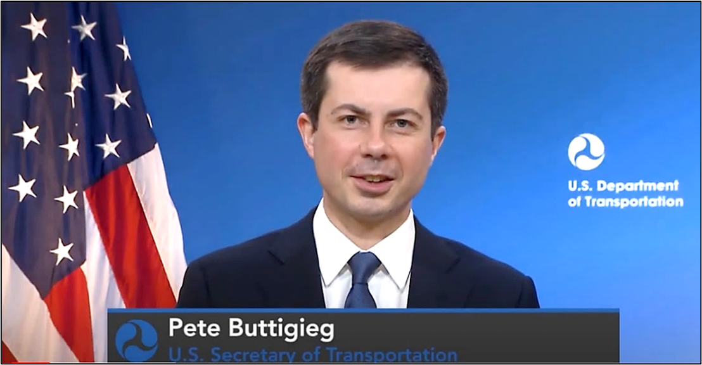
  <figcaption style="text-align:center">
    <em><q>We have an opportunity to incorporate access, equity and accessibility for all from the beginning of our coming major policy and technology decisions.</q></em>  
     Secretary Pete Buttigieg  
     U.S. Department of Transportation  
  </figcaption>
</figure>
<figure class="img-left">
  
  <figcaption style="text-align:center">
    <em>Robin Hutcheson</em>
  </figcaption>
</figure>

He was followed by Department of Transportation (DOT) Deputy Assistant Secretary for Safety Policy **Robin Hutcheson** who called attention to accessible transportation as pivotal to employment, education, health care, housing, and community living.  "Making vehicles and infrastructure safe and accessible to everyone and, most importantly, making vehicles and infrastructure safe for people with disabilities from the outset is so critical," she remarked.

### ADA Accessibility Guidelines and Standards for Transportation Vehicles
{: .clear }

<figure class="img-right">
  
  <figcaption style="text-align:center">
    <em>Randall Duchesneau</em>
  </figcaption>
</figure>

The session program focused on accessibility for passengers with mobility disabilities in boarding and exiting vehicles.  **Randall Duchesneau**, an Accessibility Specialist at the U.S. Access Board, provided an overview of the accessibility guidelines for transportation vehicles the Board issued under the Americans with Disabilities Act (ADA).  The Board published the original [ADA Accessibility Guidelines for Transportation Vehicles]({{ site.baseurl }}/ada/vehicles/) in 1991, one year after the law's passage.  They address buses, vans, rail cars, and other transportation vehicles.  These guidelines serve as the basis for standards DOT uses to enforce the ADA.  In 2016, the Board updated the sections of the [guidelines covering buses and vans]({{ site.baseurl }}/guidelines-standards/vehicles/update-buses-vans/guidelines-text/).  DOT has not yet implemented these updated provisions as enforceable standards.

The ADA vehicle guidelines do not specifically address AVs but may be applicable or informative to certain types of AVs.  DOT, not the Board, has the authority to determine which vehicles and transit systems are covered by the ADA and subject to its vehicle standards.  Duchesneau highlighted various provisions in the Board's vehicle guidelines solely as a resource or reference in addressing accessible design. 

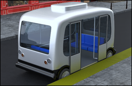{: .img-right }

The ADA guidelines for buses and vans address various features, including:

- walking surfaces;
- vehicles ramps, bridge plates, and lifts;
- level boarding;
- steps;
- doorways; and
- illumination.

Under the guidelines, vehicles must provide accessible boarding and alighting through either a ramp or bridge plate, lift, or level boarding.  At least one means of access must be able to deploy to the roadway so that access is provided where no curb or level boarding platform is present or during an emergency.

<figure class="img-left">
  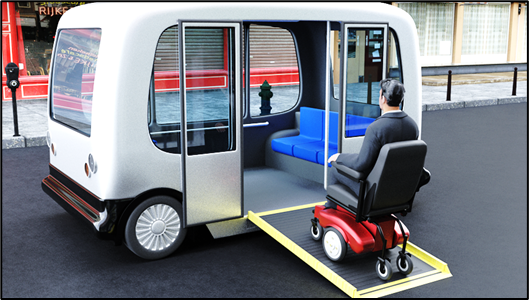
  <figcaption style="text-align:center">
    <em>The ADA Guidelines require ramps to have a clear width of at least 30 inches, edge guards at least 2 inches high and visual contrast striping along the perimeter of the ramp.</em>
  </figcaption>
</figure>
  
Level boarding is the best way to provide access where vehicle floor heights can be coordinated with boarding platforms.  The gap between the boarding platform and the vehicle is limited to 2 inches so that casters and crutch tips do not get trapped.  Otherwise, a ramp or bridge plate is needed to span the gap.  Vertical differentials between both surfaces cannot exceed 5/8 inch.  "Kneeling" vehicles with automated self-adjusting ride heights could achieve level boarding at various boarding platforms.  Specifications also address the surfaces of ramps, bridge plates, lifts, and vehicle floors, including slip-resistance, openings, and surface discontinuities. 

Ramps are permitted to fold or telescope and need to support either 300 or 600 pounds depending on the length of the ramp and have manual operational capability in case of power failure.  Lifts must permit users the option of boarding the platform either toward or away from the vehicle and comply with the Federal Motor Vehicle Safety Standards.

Doorways must open to a clear width of at least 32 inches and have a contrasting color stripe along the bottom that marks the edge of the doorway.  A minimum vertical clearance of 56 inches is required for smaller vehicles, and up to 68 inches for larger vehicles.  Shielded lights should be provided that can illuminate ramps and doorways with a minimum of two foot candles and boarding areas, with a minimum of one foot candle.

### Presentation: Research on Vehicle Ramps by the Center for Inclusive Design and Environmental Access

<figure class="img-right">
  
  <figcaption style="text-align:center">
    <em>Dr. Victor Paquet</em>
  </figcaption>
</figure>

**Dr. Victor Paquet** of the [Center for Inclusive Design and Environmental Access](http://idea.ap.buffalo.edu/) (IDeA Center) at the University at Buffalo presented results of two vehicle ramp research studies that focused on the effects of ramp slope and multi-segment ramp configuration on human performance during ascension and descension for people with disabilities including users of manual wheelchairs, power wheelchairs, scooters, white canes, and other walking aids under ideal laboratory environmental conditions.

The first study investigated the effects of ramp slope on human performance during ramp ascent and descent.  Each research participant ascended and descended ramps of different slopes, including those with a rise to run of 1:12, 1:8, 1:6, and 1:4.  Unsurprisingly, ramp ascent times and perceived exertion decreased as slope decreased.  Ramp slopes of 1:8 and 1:12 were the easiest for all user groups, while the 1:4 slope and 1:6 slope hampered 33% and 15% of users from independently completing ascent, respectively.  Power wheelchair users, individuals with visual impairments, and other ambulation aid users rated descent, or going down steep ramps, more difficult than going up.  

<figure class="img-right">
  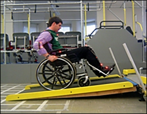
  <figcaption style="text-align:center">
    <em>A study participant tests a ramp with  
    a 1:8 slope using a manual wheelchair.</em>
  </figcaption>
</figure>

The second study investigated the effects of a different multi-segmented ramp configuration.  Test conditions simulated a three-segment ramp deployed to below street level, street level, a 3.3-inch curb, 4.5-inch curb, 6-inch curb, and 8-inch curb.  Slopes for the middle segment of the ramp were approximately 1:6 for street level and below street level conditions and negligible for deployment to curbs.  Slopes for the bottom segment of the ramp ranged from approximately 1:5 for below street level conditions to 1:15 for the 8-inch curb condition.  

Ramp ascent times for manual wheelchair and scooter users were lower as slope decreased.  Ramps deployed to the curb had the lowest ascent times.  Ease of ramp use trended higher for ramp conditions involving curbs for each of the user groups, with 6-inch and 8-inch curbs rated as moderately easy in all user groups.  20% of manual wheelchair users required assistance even for the 4.5-inch curb condition.  Three-segment ramp alleviated many of the grade break problems and slope problems of early 2-segment or solid designs. 

In summary, the IDeA Center's project supports a maximum slope for vehicle ramps of 1:6, with less severe slopes preferred to support independent ascent of manual wheelchair users.  With a 1:6 maximum slope at street level, any environmental improvement, such as the use of curbs, will support easier entry and exit.

### Presentation: National Mobility Equipment Dealers Association and BraunAbility

{: .img-right }

**Amy Schoppman**, Director of Governmental Affairs at the [National Mobility Equipment Dealers Association](https://nmeda.org) (NMEDA), spoke briefly about the need to work collectively to ensure that the associated complexities and challenges of AVs are addressed for accessibility and inclusivity.  She introduced the next speaker, **Kevin Frayne** who is Director of Advanced Mobility Solutions at [BraunAbility](https://www.braunability.com/us/en.html), which is one of NMEDA's member companies. 

Frayne discussed accessible ramps, challenges with underfloor batteries, and innovative flooring solutions.  He noted that autonomous vehicles are not forthcoming but operating at the present moment.  Working with Navya, a company specializing in the design and construction of AVs, BraunAbility recently developed an ADA ramp solution as part of a pilot project in a Detroit neighborhood and medical center.  

<figure class="img-right">
  
  <figcaption style="text-align:center">
    <em>Kevin Frayne</em>
   </figcaption>
</figure>

Accessible solutions are often contingent upon the geometry of the vehicle.  For example, an inordinately high paratransit van has to use a lift, but vehicles that can achieve a 10-inch or, preferably, an 8-inch step-in height can use a ramp.  Frayne noted that lifts do not lend themselves to full autonomous operation.  Moreover, wheelchair users in the disability advocacy community are pushing for the normalcy of ramps.  Thus, the ideal solution for an AV would be a step-in design that can support a ramp angle.

Frayne pointed out a significant challenge created by the fact that autonomous vehicles tend to be electric vehicles (EVs), and automotive architecture that uses under-floor batteries can impede wheelchair access because they are typically structural and fixed.  Placement of batteries in the floor establishes a low center of gravity but this placement makes it challenging to achieve a step-in height of 8 to 10 inches suitable for a ramp solution.  Additionally, underfloor batteries tend to preclude easily attaching lifts, ramps, or wheelchair securement systems inside the vehicle because of the importance and vitality of them to an AV's overall system.

Frayne noted that BraunAbility has developed a number of solutions for AV accessible elements.  For example, BraunAbility has 20 mm flooring solutions that are bondable to an interior vehicle floor.  This solution overlays above the batteries and provides a new surface for the attachment of lifts, ramps, and wheelchair securement solutions.  Ramps are available that can attach to the floor.  BraunAbility is finalizing ultrathin in-floor ramp solutions that would be a 50 mm slab above the battery but below the floor. 

While the ADA standards also have a 56-inch minimum interior height, BraunAbility has created vehicles in the range of 59 to 61 inches.  Raising the height is not only desired but also more practical on a daily basis. 

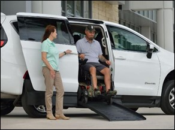{: .img-right }

Frayne concluded by underscoring the need to innovate for both the present moment and the future, particularly regarding step-in, geometry, and batteries.  BraunAbility continues to conduct research and create solutions with its recent opening of the Global Innovation Lab in Carmel, Indiana, that will work with Purdue to accelerate market shaping innovation in EVs, AVs, sensing, and Internet of things (IoT).

### Public Comments and Questions - Session 1
{: .clear }

{: .img-right }

Following the presentations, a public forum allowed attendees to offer comments or pose questions on various topics related to the session.  Several commenters urged researchers and designers to consider accessibility in relation to the whole AV "ecosystem" and cover infrastructure design and the interaction or interoperability with vehicles with a "complete trip" paradigm.  One speaker specifically called attention to rural areas and ramp deployment in areas without sidewalks.

Comments also addressed access for passengers with mobility disabilities.  One attendee asked how passengers will exit vehicles in the event of a power failure, including unlocking securement systems and deploying vehicle ramps and lifts.  Others noted the need to ensure access for passengers who use powered devices and provide sufficient clearances to accommodate all types of mobility aids.  One attendee inquired about the possibility of ramp deployment according to app-based user profiles.

Speakers also addressed accessibility for other types of disabilities, including passengers who are blind or have low vision in locating vehicles, people with dementia, and those who have balance issues. 

### References - Session 1

[Session Recording](https://www.youtube.com/watch?v=xI1j1V1SyjE "external link") Presentations: [PowerPoint]({{ site.baseurl }}/files/presentations/usab-av-forum-2021-03-10.pptx) (23 MB) [PDF]({{ site.baseurl }}/files/presentations/usab-av-forum-2021-03-10.pdf)  (4 MB)

## Accessibility for Passengers with Mobility Disabilities: Part 2

<figure class="img-right">
  
  <figcaption style="text-align:center">
    <em>Dr. Sachin Dev Pavithran</em>
  </figcaption>
</figure>

The second session continued discussion of accessibility for passengers with mobility disabilities and focused on maneuvering and securement in vehicles. 

U.S. Access Board Executive Director **Sachin Pavithran** opened the program.  He noted, "As a blind person myself, I look forward to the day when accessible transportation is a conversation of the past where all transportation is accessible.  And autonomous vehicles could be an answer to some of those innovations that could take place." 

He then introduced **Jennifer Sheehy** who is the Acting Director of [Office of Disability Employment Policy](https://www.dol.gov/agencies/odep) (ODEP).  ODEP was an active partner on this forum and hosted the dialog platform that was open throughout the series. 

<figure class="img-left">
  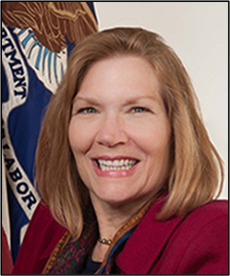
  <figcaption style="text-align:center">
    <em>Jennifer Sheehy</em>
  </figcaption>
</figure>

*"Many people don't realize that transportation is one of the most important and, perhaps, least appreciated components of employment success for people with disabilities.  After all, the best employment program or job opportunity means nothing and provides little benefit if people cannot access reliable transportation to work."*  
Jennifer Sheehy  
Acting Director, ODEP

### ADA Accessibility Guidelines and Standards for Transportation Vehicles
{: .clear }

<figure class="img-right">
  
  <figcaption style="text-align:center">
    <em>Scott Windley</em>
  </figcaption>
</figure>

**Scott Windley**, an Accessibility Specialist with the U.S. Access Board, reviewed existing guidelines for transportation vehicles issued by the Board under the ADA.  The [ADA Accessibility Guidelines for Transportation Vehicles]({{ site.baseurl }}/ada/vehicles/) (1991) cover buses, vans, rail cars, and other transportation vehicles and serve as the basis for enforceable standards implemented by DOT.  The Board [updated]({{ site.baseurl }}/guidelines-standards/vehicles/update-buses-vans/guidelines-text/) sections of the guidelines covering buses and vans in 2016, but these provisions are not yet included in DOT's enforceable standards.

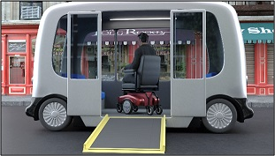{: .img-left }

In addition to requirements for boarding and alighting access, the vehicle guidelines address:

- walking surfaces;
- accessible routes;
- wheelchair space; and
- securement systems.

<figure class="img-right">
  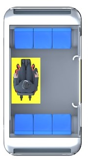
  <figcaption style="text-align:center">
    <em>The ADA Guidelines require buses and vans to provide wheelchair spaces and securement systems.</em>
  </figcaption>
</figure>

These provisions specify sufficient clearances that allow passengers using wheelchairs and power chairs to proceed from vehicle entry to designated wheelchair spaces, position for securement within the space, and exit the vehicle.  Wheelchair turning space is recommended, though not required, to provide greater maneuverability and usability. 

Wheelchair spaces must be at least 30 inches wide and 48 inches long.  An accessible route from the vehicle door must adjoin or overlap one unobstructed side of each wheelchair space.  A securement system is required that typically is required to front-facing securement. 

### Presentation: Robotic Research Projects: New Flyer and Paralift

<figure class="img-right">
  
  <figcaption style="text-align:center">
    <em>Bryan Brilhart</em>
  </figcaption>
</figure>

**Bryan Brilhart**, Director of Operations at [Robotic Research](https://www.roboticresearch.com), gave a presentation on Robotic Research projects related to autonomous vehicles.  Robotic Research is a technology company and developer of autonomous systems for numerous military and commercial applications.

Brilhart discussed various applications of Robotic Research technology, including a project that involved the development of a precision docking system for an electric automated bus released earlier this year (New Flyer's Excelsior AV™).  The system enables the bus to pull up to boarding platforms within very close tolerances in a repeatable process for safe, level boarding at every stop.  Another application of its technology is an autonomous system in a Local Motors low-speed shuttle.

<figure class="img-right">
  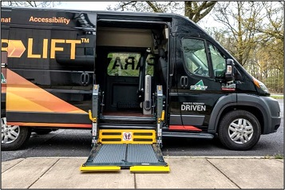
  <figcaption style="text-align:center">
    <em>Robotic Research's Paralift™ System</em>
  </figcaption>
</figure>

Robotic Research also developed an automatic loading and securement system, named Paralift™.  Designed to workwith various types of vehicles, it allows passengers using wheelchairs to enter and exit vehicles independently.  The system uses Light Detection and Ranging (LIDAR) to generate 3D maps of surroundings.  It also detects the presence of passengers and the position of a ramp or lift, ensures area under the ramp or lift is clear before lowering, and halts operation if there is an obstruction.

Key features of the Paralift system include:

- Vehicle doors and a hydraulic lift activate automatically by using sensors that scan the environment, including curbs;
- Automated door opening and wheelchair lift system that waits for the passenger to board the lift, verifies safety surrounding the lift, and then raises the lift to the boarding level of the vehicle;
- Automated securement system, made by [Q'Straint](https://www.qstraint.com), that activates after the passenger enters the vehicle once the wheelchair is in position, passengers can press a button and the securement system will secure the chair in place;
- User-controlled options where users can control the system with buttons or through an app on their personal device; and
- Voice-automated controls that allow passengers to hear what is going on with what the process is. 

<figure class="img-left">
  
  <figcaption style="text-align:center">
    <em>Q'Straint's QUANTUM securement system</em>
  </figcaption>
</figure>

Brilhart closed his presentation by discussing the Q'Straint's [QUANTUM](https://www.qstraint.com/quantum/) securement system, which is intended to accommodate various types and sizes.  It uses a pair of arms to clamp onto the wheels of a wheelchair to secure it in place.  A three-point seat belt system (NHTSA crash-tested) is designed to rapidly and automatically secure passengers.

### Presentation: University of Michigan Transportation Research Institute Project on Automated Wheelchair Tiedown and Occupant Restraint System
{: .clear }

<figure class="img-right">
  
  <figcaption style="text-align:center">
    <em>Miriam Manary</em>
  </figcaption>
</figure>
<figure class="img-right">
  
  <figcaption style="text-align:center">
    <em>Dr. Kathleen Klinich</em>
  </figcaption>
</figure>

**Dr. Kathleen Klinich** and **Miriam Manary** of the [University of Michigan's Transportation Research Institute](https://umtri.umich.edu/) (UMTRI) gave a presentation on research that is underway to develop an automated wheelchair tiedown and occupant restraint system.  Funded by National Highway Traffic Safety Administration, the [project](https://umtri.umich.edu/research/projects/development-of-an-automated-wheelchair-tiedown-and-occupant-restraint-system/)  will test a "universal docking interface geometry" (UDIG) that features an anchorage system in the vehicle that can be used with any wheelchair equipped with the attachment hardware, similar in concept to a semi-truck trailer hitch.  While this kind of technology has been available, field tested, and evaluated for decades, it has not been widely implemented because it needs to be installed extensively on both wheelchairs and in vehicles.  The need for independent docking options may have renewed interest in such a solution. 

Klinich and Manary's project, which started in October 2019, will develop an automated wheelchair docking station and seat belt through a combination of computational models, assessments of usability by volunteers, and dynamic sled testing.  Klinich and Manary are currently using crash test modelling to determine the best place to position the wheelchair relative to the anchorage system and the positioning of shoulder and lap belt anchors.  Additionally, they are evaluating the potential benefits of an airbag restraint for occupants using wheelchairs.

  <figure class="img-left">
    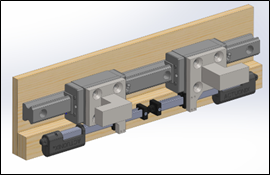
    <figcaption style="text-align:center">
      <em>Universal docking interface geometry (UDIG)</em>
    </figcaption>
  </figure>
  <figure class="img-right">
    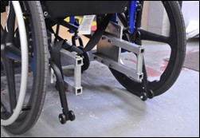
    <figcaption style="text-align:center">
      <em>Wheelchair attachment for UDIG system.</em>
    </figcaption>
  </figure>
   

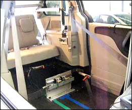{: .img-right }

Klinich and Manary designed a prototype with attachments for both manual and power wheelchairs.  Both attachment styles have a vertical bar spaced in between the rear wheels.  Users back their wheelchair into the station and align the attachments on their wheelchair against the docking system which has two hooks that deploy outward and connect to the attachments.

While the geometry for the vertical components is specified, the method for attachment would differ depending upon the structure of the wheelchair itself.  Klinich and Manary noted that securement near the hooks would aid in using the four-point strap tiedown because those parts of the wheelchair have been crash-tested and should be durable and sturdy enough to work with the attachment system.  The next phase of their research will involve minimizing the size of the attachments and better integration of them with the design of wheelchairs.  The presentation included a video showing how the docking and seat belt system operates.

Klinich and Manary expect to complete the project in June 2021 and plan to have a virtual open house on August 5 to share findings from the study, including the results of the volunteer tests and sled testing.  Further information will be posted on UMTRI's website. 

### Presentation: Research on Vehicle Interior Seating Layout and Wheelchair Securement by the Center for Inclusive Design and Environmental Access

<figure class="img-right">
  
  <figcaption style="text-align:center">
    <em>Dr. Jordana Maisel</em>
  </figcaption>
</figure>

**Dr. Jordana L. Maisel** co-directs research at the [Center for Inclusive Design and Environmental Access](http://idea.ap.buffalo.edu) (IDeA Center) at the University of Buffalo, which has been engaged in over a decade of research related to accessible public transportation.  She shared information on research the IDeA Center has conducted on wheelchair maneuvering and securement on fixed route buses that may be pertinent to AVs.

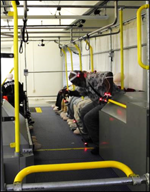{: .img-left }

One [study](http://idea.ap.buffalo.edu/2019/04/05/improving-bus-interior-design/) used full-scale simulated buses to assess the impact of interior bus seating layouts on movement and usability for individuals who use wheeled mobility devices, who are blind or have low vision, or who use walking aids.  The project involved three bus layouts and mannequins to explore reconfigurable seating layouts and simulate crowding conditions.  The study included 90 participants (48 wheeled mobility device users, 18 individuals who are blind or have low vision, and 24 walking aid users).  All participants undertook a simulated bus journey that included boarding from a sidewalk, using a smart card for fare payment, locating and moving to a vacant seat, getting into and out of the seat, and moving to the exit door. 

The study found several challenges among the three layouts.  First, many participants found the turning space at the front of the bus too narrow, especially if another occupant was positioned in the securement space.  Second, the side-facing seats were less desirable because they caused an increased sense of fear and risk of injuring others.  On a related note, many participants had limited reach capability to access the fare payment machine.

Unlike participants with mobility devices, participants who are blind or have low vision and who used walking aids preferred side-facing seats over front-facing seats because the former provided more legroom, greater ease of getting into and out of the seat, a wider aisle, and more room for luggage.  Many participants also expressed challenges with orientation and mobility, citing difficulty with locating features in the environment, such as the fare payment machine and vacant seats.

Ultimately, the study showed the need for adequate device storage space and the importance of support features, such as handrails and vertical stanchions, during ambulation and seating by people with mobility limitations.  The findings also confirm that the interior environment of the vehicle particularly impacts performance, especially in crowding conditions and on passengers with disabilities.  With respect to walking aid users, the side-facing seating orientation was preferred, although these users expressed concerns for having sufficient storage for their devices.  Maisel also underscored that increasing maneuvering and securement clearances, even if ever so slightly, can have a great impact on usability for people with mobility devices.  Finally, she noted that although one best solution will unlikely solve the challenges with the interior layout for all user groups, it is important to remember that the riding experience is a series of interrelated components: the design of the fare payment system, which will likely become obsolete as we move towards digital and more app-based payment; the entry location; seating configuration; the stop design; among others.

The IDeA Center also conducted a [lab study](https://www.tandfonline.com/doi/abs/10.1080/10400435.2019.1604582?af=R&journalCode=uaty20) to assess the usability of three different securement systems: the traditional four-point traditional tie down system, a three-point forward-facing system, and a semiautomated rear-facing system.  The study involved 36 participants (15 manual wheelchair users, 15 power wheelchair users, and 6 scooter users).

The four-point system took significantly longer to secure than the three-point forward-facing and the semiautomated rear-facing systems.  The semiautomated rear-facing system was significantly faster than both the four-point and three-point systems.  Most participants preferred the semiautomated rear-facing system (9 of 15 manual chair users, 10 of 15 power chair users, and all 6 scooter users).

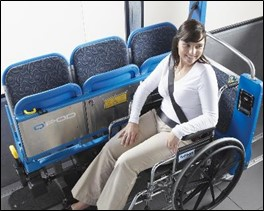{: .img-right }

The IDeA Center then field tested the three-point and semiautomated securement systems to determine if usability findings in the lab are generally applicable to every day transit conditions that include time pressures, crowding, and interactions with professional bus operators.  The study involved 40 participants (14 manual wheelchair users, 19 power wheelchair users, and 7 scooter users). 

Findings indicated:

- A slight majority preferred the semiautomated system over the three-point system;
- Scooter users consistently rated both securement systems as more difficult to use and requiring greater physical effort than other participants;
- Power chair and scooter users were nearly evenly divided between using fixed-route, often due to the presence of the semiautomated system; and
- Design research is needed to explore the capacity for scooters to be secured (rear-facing) safely in public transportation vehicles.

### Public Comments and Questions - Session 2

{: .img-right }

In the public forum that followed, a number of public comments and questions concerned wheelchair securement systems.  Questions were posed on how to provide a universal securement system and whether systems will accommodate all wheeled mobility aids, including pediatric wheelchairs.  One commenter asked how passengers who need assistance will use a vehicle or its securement system.  Another asked whether securement systems are needed on all AVs since some AVs operate in systems with low speeds. 

Additional comments addressed access to AVs used for taxi service, payment systems, personally-owned AVs, and audible communication that employs plain language for passengers who are blind or have low vision, as well as those who have cognitive disabilities. 

### References - Session 2

[Session Recording](https://youtu.be/d9xc-mRrlxY?t=38 "external link") Presentations: [PowerPoint]({{ site.baseurl }}/files/presentations/usab-av-forum-2021-03-24.pptx)  (18 MB) [PDF]({{ site.baseurl }}/files/presentations/usab-av-forum-2021-03-24.pdf)  (6 MB)

## Accessibility for Passengers with Sensory and Cognitive Disabilities: Part 1

<figure class="img-right">
  
  <figcaption style="text-align:center">
    <em>Dr. Victor Pineda</em>
  </figcaption>
</figure>

The third session focused on ride-hailing and on-board communication for passengers with hearing, visual, or cognitive disabilities.  U.S. Access Board Public Member Dr. Victor Santiago Pineda, who is a Professor of Urban Planning at University of California-Berkley and President of [World Enabled](https://worldenabled.org), opened the meeting. 

"This topic could not be more important as cities around the world are deploying, testing, and piloting technology that has tremendous implications for the lives of persons with sensory and cognitive disabilities," Dr. Pineda remarked.  "We want to make sure that nobody is left behind.  We want to make sure that there are clear standards and guidelines.  But most importantly, we want to all be on the same page of understanding what is the future we want."  He also stressed the need for people with disabilities to be actively engaged in helping shape technology and infrastructure.

<figure class="img-right">
  
  <figcaption style="text-align:center">
    <em>Sarah Presley</em>
  </figcaption>
</figure>

**Sarah Presley**, an Accessibility Specialist with the U.S. Access Board, provided an overview of the program agenda and introduced the first presenters. 

### Presentation: Results of Focus Groups on AVs and Persons with Disabilities by Rutgers University and Princeton University
{: .clear }

<figure class="img-right">
  
  <figcaption style="text-align:center">
    <em>Andrea Lubin</em>
  </figcaption>
</figure>

<figure class="img-right">
  
  <figcaption style="text-align:center">
    <em>Dr. Cecilia Feeley</em>
  </figcaption>
</figure>

**Dr. Cecilia Feeley**, Transportation Autism Project Manager, and **Andrea Lubin**, Senior Researcher, at Rutgers University gave a presentation on their findings from a series of focus groups of adults with disabilities who took short autonomous shuttle rides.  A core intent of this [research](https://cait.rutgers.edu/research/autonomous-vehicles-capturing-in-vehicle-experience-focus-group-follow-up-with-persons-with-autism-and-other-disabilities-at-the-2019-princeton-university-smartdrivingcar-summit/)  was to gather feedback and recommendations from persons with visual or cognitive disabilities.  Conducted jointly by Rutgers University and Princeton University, the study convened four focus groups with a total of 21 participants.

The majority of participants said that they do not use personal assistance for their current modes of transportation and would not need personal assistance using AVs, at least not in the long term.  Some participants with developmental disabilities did say that they would like the option of having a family member accompany them on AV trips until they felt comfortable traveling independently using this new mode of transportation.  Some participants who are blind or have low vision said that it would be helpful if assistance was always available to open and close vehicle doors, provide guidance to available seats, help with passenger bags, and secure wheelchairs or other mobility devices. 

Safety-related concerns were the most discussed issue by participants.  Suggestions for addressing these concerns included use of on-board cameras to capture safety-related issues and use of audio and visual sensors that can assist AVs in identifying and responding appropriately to approaching emergency vehicles.  Recommendations to address vehicle malfunction or accident concerns focused on the presence of an on-board attendant. 

<figure class="img-right">
  
  <figcaption style="text-align:center">
    <em>AV Shuttle used in the focus group study.</em>
  </figcaption>
</figure>

Other questions and concerns focused on the communication interface with the vehicle, primarily on how passengers were supposed to indicate their destination and schedule their trip.  They wanted to know if they preferred to use the GPS on their smart phones if they could, or if they would have to indicate their destination upon boarding the vehicle.  Some participants wanted to know if they would be able to engage with the vehicle in a conversational style, asking about topics such as the weather; others wanted to know if they could secure needed assistance while traveling via the vehicle communication interface.  Several participants recommended that the on-board communication interface should permit passengers to access a call center to secure live operator assistance, especially vital in case of an emergency. 

Passengers who are blind or have low vision noted that several design features should be incorporated: utilization of contrast, texture, and color on any vehicle steps; installation of a handrail on vehicle steps; and non-slip finish on vehicle steps and flooring.  They appreciated the lower step between the ground and the floor of the shuttle.  These participants wanted AVs to be on-demand, as are current ride-hailing services, and suggested that there be several options for paying for rides, including cash, smart card, or payment via smart phone. 

### Presentation: Research on AVs for Blind and Low Vision People by the University of Michigan

<figure class="img-right">
  
  <figcaption style="text-align:center">
    <em>Dr. Robin Brewer</em>
  </figcaption>
</figure>

Dr. Robin N. Brewer, Assistant Professor of Information at the [University of Michigan's School of Information](https://www.si.umich.edu) and Assistant Professor of Electrical Engineering and Computer Science at the College of Engineering, presented findings from a two-year study designing autonomous and automated vehicles for persons who are blind or have low vision.  Specifically, the project explored how to design AVs that are accessible to people who are blind or have low vision with differing levels of user control through focus groups and interviews with ridesharing passengers and drivers. 

Participants were primarily concerned about control when a vehicle malfunctions or misinterprets their actions.  Suggestions on design solutions to address these concerns were based largely on existing assistive technology, such as screen readers and refreshable braille displays.  For example, a refreshable tactile display in the steering wheel would give the driver feedback on where other vehicles are in relation to their occupied vehicle.  This focus group suggested that there are ways to leverage existing frameworks, assistive technology, and experience for designing automated transportation. 

Several focus group participants expressed a preference to use semi-autonomous vehicles, contrary to what some in industry might expect.  They pointed out that some people who are blind may have prior experience with driving and may still connect their identity with driving. 

<figure class="img-right">
  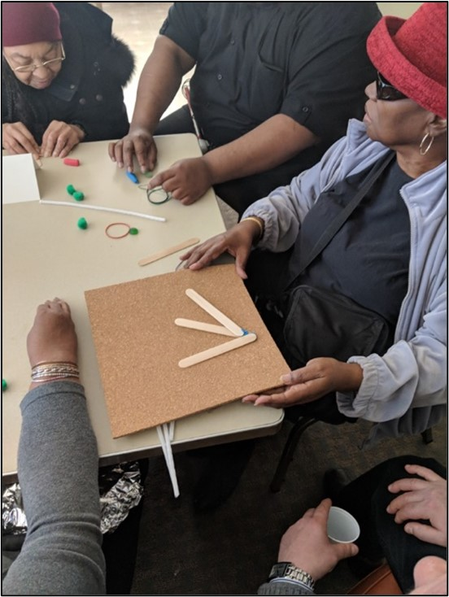
  <figcaption style="text-align:center">
    <em>Photograph from design focus group activity.</em>
  </figcaption>
</figure>

The findings indicate that the effort to make AVs accessible cannot focus exclusively on vehicle design and must also consider the overall process or context for using the automated vehicles.  Brewer and her co-researchers interviewed passengers and drivers to determine what can be learned from ride-sharing experiences of people who are blind and the drivers transporting them.  One issue raised was that drivers cannot always independently locate passengers due to GPS inaccuracies, and passengers who are blind must direct drivers to their pick-up locations.  In addition, persons who are blind may ask drivers to help them find their destinations once the car has arrived at the designated location, and to help them unload luggage or packages from the car. 

Drivers expressed a preference to know about passengers' disabilities ahead of time in order to better know what to expect; however, they also understood why a person with a disability might not wish to disclose their personal information. 

Brewer concluded with a couple points for future researchers and designers.  First, ridesharing companies have policies for working with passengers with disabilities that may inform the design of autonomous vehicles.  Second, replacing humans with artificial intelligence does not necessarily reduce or resolve the problem of discrimination against people with disabilities.  For example, automated systems that have been used for choosing candidates for jobs have shown some of the same biases that people hold, primarily because people with conscious or unconscious biases write the algorithms.  If an algorithm is designed to maximize efficiency, it might give a lower priority to passengers who have given some indication that they might take longer to enter or exit a vehicle. 

### Presentation: Anil Lewis of the National Federation of the Blind

<figure class="img-right">
  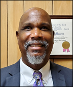
  <figcaption style="text-align:center">
    <em>Anil Lewis</em>
  </figcaption>
</figure>

The next speaker was Anil Lewis who is Executive Director of Blindness Initiatives at the National Federation of the Blind (NFB), which has developed some relationships with automobile manufacturers and researchers through its work with the [Blind Driver Challenge](https://nfb.org/programs-services/center-excellence-nonvisual-access/blind-driver-challenge).  Lewis invited the audience to take an imaginary virtual trip in an AV as a passenger who is blind, from requesting service for the vehicle, to taking the ride, and to arriving at the destination. 

As Lewis took forum attendees through this virtual trip, he noted several complications and complexities for individuals who are blind interacting with AVs.  He observed that the ridesharing model provides a viable model for requesting the vehicle via a smart phone app, but this app must be accessible to people who are blind.  For those who are less tech savvy, requesting the ride through traditional telephone may provide an option, either by speaking with a customer service representative or working through an automated system.  

To address challenges with locating the correct vehicle, Lewis suggested that the ride-hailing app might allow the user to instruct the vehicle to sound its horn through a call and response mode (rather than continuous horn activation).  The app could also use haptic vibrations in the phone, increasing or decreasing in frequency as the rider moves closer to or farther from the correct vehicle.  This option would also be usable by those who are deaf-blind.  Someone without a smart phone would still need personal assistance to locate the correct vehicle. 

Entering existing traditional vehicles may not be an issue for people who are blind, but autonomous vehicles might be designed such that doors are in the front or the rear, which can create confusion or difficulty in determining what is the front or rear of the vehicle.  In this case, some consideration would have to be given to helping a passenger who is blind locate the door. 

Once in the vehicle, blind passengers will need a way to orient themselves in the interior space.  Lewis suggested that there could be an opportunity for pre-orientation to a vehicle before the actual ride.  For example, someone could talk the passenger through what to expect when the passenger signs up for the service; or, the vehicle could have audio description that the passenger could use on demand to provide orientation to the vehicle.  

Controls in the vehicle would be more accessible if they are tactile knobs and buttons, and these elements could be supplemented with tactile symbols indicating the function of the controls.  Touch screens with speech output are also a possibility for those who have mastered using them with smart phones.  However, Lewis posited that giving spoken commands to the vehicle and receiving verbal feedback would be a great option.

Lewis propounded on other questions and issues with vehicle controls in AVs, such as temperature control, radio control, and navigation and destination preferences.  In addition, Lewis questioned what information AVs would be able to provide to passengers during their ride, including the route taken and points of interest.  Any of these functions must be accessible to persons who are blind.  As much as possible, controls should be customizable, including the option to turn off any feature.  Lewis noted that designers should not assume what passengers will need or want. 

Lewis stressed that a blind person's level of travel training will inform their confidence using AVs.  It may not be possible to design autonomous vehicles to accommodate persons who are not confident to travel because they have not had mobility training.  He encourages designers not to base their research on persons who may not be properly trained, which may cause them to rule out accessibility options that could be valid for many other passengers who are blind. 

### Presentation: AVs from a Deaf/Hard of Hearing Perspective

<figure class="img-right">
  
  <figcaption style="text-align:center">
    <em>Dr. Christian Vogler</em>
  </figcaption>
</figure>

Dr. Christian Vogler, Director of the [Technology Access Program at Gallaudet University](https://tap.gallaudet.edu/), presented on AV communication from a deaf or hard of hearing perspective.  Dr. Vogler noted that there is very little research on making AVs accessible for people who are deaf or hard of hearing, thus one must look to research on other topics and integrate that research into what would be useful for AVs.  He posed several broad questions that warrant attention: how do passengers who are deaf or hard of hearing tell the vehicle what to do, where to go, and what to look for?  How does the vehicle give passengers who are deaf or hard of hearing information, such as direction of travel and detours?  How is the deaf passenger alerted to an emergency situation? And how does the deaf passenger communicate with the outside world from inside the AV?

Currently, the main way of communicating with vehicles is through voice interface systems, similar to Alexa or Google Assistant.  These interfaces are good in that one is not as distracted as one might be by looking at a keyboard, but they are not usable for someone who does not communicate by voice or who has speech that the interface may not understand.  Research is needed into designing full-featured, safe, and effective alternatives to these voice interface systems.  Researchers at Gallaudet University are currently investigating the feasibility of using a limited set of gestures, signs, and tactile methods to replace the voice control for such an interface.  Technology is not yet available to use more than a limited set of gestures and signs.

Talking GPS systems give much more information by voice than what is provided visually, which may be true for AVs as well.  Appropriate visual information must be provided if the AV is to be functionally equivalent to a voice system; however, it is imperative not to overload the visual modality, resulting in too much distraction.  Research is needed on how and when to display relevant information and how to prioritize that information while providing functionally equivalent service.

Another area that is often overlooked is how persons using hearing aids or cochlear implants get an effective, clean audio feed to their devices.  Background noise can prevent a clean audio feed from the voice interface of something like an AV.  It is critical to consider direct connection options for hearing aids.  But if a direct connection is used, persons using hearing aids may have to choose between focusing on the communication of others around them in the vehicle or on the communication coming from the vehicle itself.  Future design has to fully integrate the/ idea of multiple audio output options, supported in parallel.  

Vogler concluded his presentation by discussing how communication systems, both inside and outside of the vehicle, are generally audio based.  These systems must provide alternatives such as video and text capabilities and cannot be only voice-activated.

### Public Comments and Questions - Session 3

{: .img-right }

**Bruce Bailey**, an Accessibility Specialist with the U.S. Access Board, moderated the public forum that followed.  One commenter called attention to providing access for passengers with multiple disabilities, as well as the need to address access in all conditions, including emergencies.  In response to a question about the Rutgers focus group, Andrea Lubin and Dr. Cecilia Feeley noted that participants were not hesitant to use vehicle on-board communication systems, but they would prefer to use their own phones to schedule the ride.  

One commenter requested that passengers with electromagnetic sensitivities be involved in the design of AVs so that their needs are addressed, such as hardwiring systems to avoid exposure to wireless signals.  Another speaker recommended that designers consider higher levels of automation, which is where innovation is heading, instead of where the technology is starting today.  In addition, research on AVs and disability needs should cover the full range of users and should not be segmented by disability type.  

### References - Session 3

[Session Recording](https://www.youtube.com/watch?v=nfh-MpcNCB8 "external link") Presentations: [PowerPoint]({{ site.baseurl }}/files/presentations/usab-av-forum-2021-04-07_for_web.pptx)  (46 MB) [PDF]({{ site.baseurl }}/files/presentations/usab-av-forum-2021-04-07.pdf)  (6 MB)

## Accessibility for Passengers with Sensory and Cognitive Disabilities: Part 2

<figure class="img-right">
  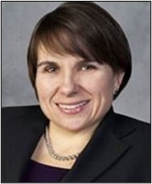
  <figcaption style="text-align:center">
    <em>Karen Tamley</em>
  </figcaption>
</figure>

The fourth and final session in the series continued discussion of communication accessibility in hailing and interacting with AVs for passengers with hearing, visual, or cognitive disabilities.  U.S. Access Board Public Member **Karen Tamley** opened the session with remarks on the value of AVs in expanding travel options for passengers with disabilities.

U.S. Access Board Accessibility Specialist **Sarah Presley** hosted the event and introduced the guest speakers.

### Presentation: Communication Accessibility in Hailing and Interacting with Autonomous Vehicles
{: .clear }

<figure class="img-right">
  
  <figcaption style="text-align:center">
    <em>Dr. Aaron Steinfeld</em>
  </figcaption>
</figure>

**Dr. Aaron Steinfeld**, Associate Research Professor at Carnegie Mellon University, leads the Transportation, Bots, and Disability (TBD) Lab of the [Robotics Institute at Carnegie Mellon University](https://www.ri.cmu.edu/robotics-groups/tbd-lab).  Steinfeld emphasized that the design of accessible AVs requires collaboration and teamwork across institutions and organizations.  Correspondingly, his presentation drew on several different projects and sponsors, including National Institute on Disability, Independent Living, and Rehabilitation Research (NIDILRR), National Science Foundation's National Robotics Initiative, and DOT.

He noted that requesting service to use AVs is one of the core issues in designing AVs.  His research team has found two important considerations with requesting service.  First, users often don't know what the features and functions are because many of them are hidden.  Surfacing what matters for an individual in using a vehicle will be important, especially when there is no training available on the vehicle system.

Second, based on their research, Steinfeld and his team believe that speech systems will become increasingly common for requesting service.  He underscored the need to approach the design of requesting service by attending to nuanced and specific to transportation issues, particularly related to time.  For example, humans can comprehend simple time references, such as asking for a service to "arrive ten minutes before five p.m." which can be confusing to an artificial intelligence (AI) system.

He also noted the challenges individuals will have in navigating from and through transportation hubs to the correct curb location and AV.  For example, once a passenger requests service from an AV, the passenger may encounter problems with the vehicle pulling up to the curb because of temporary curb usage restrictions or local infrastructure and policy.  Additionally, passengers will need to identify where crowds of people are located and how they are moving.  For people who are blind or have low vision, these scenarios can be exacerbating and cumbersome to navigate, as well as cause unsafe situations.

If autonomous vehicles become ubiquitous, multiple vehicles for multiple passengers may arrive in a close area.  This scenario presents challenges for all passengers, especially those with disabilities, in perceiving and locating the appropriate vehicle.  Audible signals and visual signals using unique colors or lights in vehicles can be problematic.  Steinfeld and his team are exploring a remedy to this problem by focusing on coordinated interaction between the sensors on AVs and passengers' mobile devices.

Steinfeld reviewed artificial intelligence assistance that can provide user preferences and streamline the level of interaction between passengers and AVs.  Such an AI system could spare a passenger the effort to request captioning with every ride.  However, this system could raise privacy and data sharing concerns, including with third-party systems.

Researchers and designers will need to account for how weather conditions, unanticipated erratic vehicle behavior, and other factors would affect passengers, especially those who are blind or have low vision.  For example, a vehicle that is driving in unsafe weather conditions may decide to pull over to the side of the road without notifying the passenger because the AI system assumes the passenger is sighted and can infer that driving conditions are unsafe.  A person who has a visual disability would need that information communicated appropriately and promptly.

### Presentation: Cognitive Access to Autonomous Vehicles

<figure class="img-right">
  
  <figcaption style="text-align:center">
    <em>Dr. Gregg Vanderheiden</em>
  </figcaption>
</figure>

**Dr. Gregg Vanderheiden**, Professor in the College of Information Studies and Director of the [Trace Research and Development Center](https://trace.umd.edu/)  at the University of Maryland-College Park discussed cognitive access to AVs.  He noted that cognitive disabilities are not a singular group but encompass a wide range of groups and oftentimes present concurrent with other physical, visual, or hearing disabilities.  This calls for a spectrum of interface solutions that allows passengers to choose a method of interacting with AVs that work best for them at a given moment.  Addressing the needs of myriad users with cognitive disabilities will result in more useable products for everyone.

Vanderheiden focused on issues and challenges when a passenger is aboard an AV.  For example, passengers may change their desired destination while in transit, and AVs must be able to adjust to such requests in an accessible way.  AVs need to cover or provide options for a wide range of travelers, including those with memory loss, those who are easily confused, those who are not able to give clear instructions, and those who use unique words or phrases that are only meaningful to themselves and other people but not to AVs.  In addition, systems must also accommodate those who have accents, non-English speakers, individuals who communicate in sign language, and those unfamiliar with apps.

He outlined several different types of accessible interfaces:

- Ultra-simple interface, which would not require instructions for anyone;
- Layered interface, which would provide a very simple, limited interface, but users could have options through an additional layer;
- Verbal interface, which would not require reading;
- Non-verbal interface, which would use pictures, illustrations, and maps to communicate information;
- Sign language interface, which would work with sign language interpreters who are on-call for two-way communication (all communication presented in voice and text must also be presented in sign);
- Cue and respond interface, which functions through question and answer, and options that are presented until passengers respond;
- Natural language or artificial intelligence interface, which may also include a feature where an AV identifies passengers in crowded or ambiguous locations.

In addition, he suggested several interface features that would make AVs accessible:

- Audible description of features when entering, interacting, and exiting AVs;
- Guiding feature, which allows passengers to be directed toward the vehicle;
- Interactive TIPS feature, where AV "live assistants" interact with a passenger and their particular disabilities for the first time;
- Trip Tags, which are presented by passengers in the AV request service, and the vehicle takes instructions from the tag to fulfill the service. In addition to destination instructions, tags might instruct an AV to:
  * automatically send progress texts to sender or destination;
  * not allow traveler to change destination after starting;
  * identify traveler as a protected passenger;
  * provide visual/auditory monitoring en route, either of passenger or surrounds;
  * keep doors locked until tagged with special tag at destination.

He also reviewed concerns for privacy and potential for data abuse, supplementing Steinfeld's points about privacy concerns.  Any data collected about users' disabilities and accommodations runs the risk of being used in many ways to the detriment of passengers.  For example, the data could be used in employment travel, and employers who want to avoid risk might use such data to assess these individuals as risker to hire or employ.  An external privacy and ethics council should oversee all data that is used by the system.

### Presentation: Federal Communications Commission (FCC) Rules Related to AVs

<figure class="img-right">
  
  <figcaption style="text-align:center">
    <em>Darryl Cooper</em>
  </figcaption>
</figure>

**Darryl Cooper**, Attorney Advisor with the FCC Disability Rights Office, addressed FCC rules that that are applicable to AV communication systems.  He noted that two-way live wireless communications are covered by FCC rules, as well as text messages.  In-car entertainment systems are already explicitly covered, and there are well established accessibility requirements for captioning, audio description, emergency communications, user interface, and program guides.  Additionally, FCC rules require that user interfaces and program guides for communication and video programming need to be accessible.  From a layperson's perspective, these in-car entertainment systems would be expected to be leveraged as the default tool for interacting with an AV.

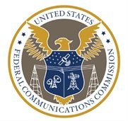{: .img-left }

He noted that the FCC [Disability Rights Office](https://www.fcc.gov/accessibility) is available for guidance on resolving communication accessibility issues that fall under FCC rules.  He also mentioned that solutions to communication service issues are already in the marketplace.  For example, people who are blind or have cognitive disabilities can activate a user interface to begin a phone call or text message.  Voice activation also works, as well as automatic speech recognition (ASR).  For people who are deaf, hard of hearing, deafblind, or have speech disabilities, text-based solutions such as real-time text and ASR providers are researching how to program their ASR for people with speech disabilities.

### Presentation: Accessible Transportation and the World Wide Web Consortium (W3C)

<figure class="img-right">
  
  <figcaption style="text-align:center">
    <em>Ted Guild</em>
  </figcaption>
</figure>

**Ted Guild** of the [World Wide Web Consortium](https://www.w3.org) (W3C) spoke about the W3C's current activity with the "internet of things" and the implications for automotive and transportations industries.  He described activities of the [Web Accessibility Initiative](https://www.w3.org/wai) (WAI) to make the web accessible through the development of normative specifications, documented technical assistance, and best practices.  These include [Accessible Rich Internet Applications](https://www.w3.org/WAI/standards-guidelines/aria/)  (WAI-ARIA), [Web Content Accessibility Guidelines](https://www.w3.org/WAI/standards-guidelines/wcag/) (WCAG), and specification review by the [Accessible Platform Architectures Working Group](https://www.w3.org/WAI/APA/) (APA WG).

From his work leading the [W3C Automotive Working Group](https://www.w3.org/groups/wg/auto), Guild pointed out that auto manufacturers all work with data differently and have their own proprietary application programming interfaces (API) for their vehicles, which is a software intermediary that provides communication between two applications.  These myriad methods and proprietary statuses create an environment of challenges to interoperability, and consequently, inaccessibility.  To resolve these issues, the Working Group has developed a common API and common data model.  These developments will be accompanied by artificial intelligence machine learning that will enable decisions by and performance assessment of autonomous vehicles.

{: .img-right }

Guild described other W3C working groups related to the design of accessible AVs.  The [Linked Building Data Community Group](https://www.w3.org/community/lbd/) is creating ontologies to describe building capabilities and infrastructure.  This work relates to accessibility concerns of various elements, such as wheelchair ramps and egress.  The [Linked Data for Accessibility Community Group](https://www.w3.org/community/lda/2020/04/03/what-is-the-linked-data-for-accessibility-group/) is researching both buildings and transportation.  For example, the group seeks to make available information on the location of restaurants that are wheelchair accessible with ramps.

Guild concluded with some takeaways to consider for AVs:

- Balancing the privacy of personal data with profiles of individual needs, such as wheelchair accommodation;
- Vehicle capabilities supplemented by accessible interfaces or assistive technology that meet individuals' needs; and
- Geospatial data considerations, such as information and usability related to granular location, arrival and departure safety options, accessible routes, and accessible means of egress.

### Presentation: Applicability of Section 508 Definitions for Information and Communication Technology to AVs

<figure class="img-right">
  
  <figcaption style="text-align:center">
    <em>Bruce Bailey</em>
  </figcaption>
</figure>

**Bruce Bailey**, Information Technology Accessibility Specialist at the U.S. Access Board, briefly discussed the Section 508 definition of "Information and Communication Technology (ICT)" and how it builds on the Clinger-Cohen Act's definition of "Information Technology (IT)".  ICT is defined in the [Section 508 Standards]({{ site.baseurl }}/ict/) as:

"information technology *and* other equipment, systems, technologies, or processes, for which the principal function is the creation, manipulation, storage, display, receipt, or transmission of electronic data and information, as well as any associated content.  Examples of ICT include but are not limited to computers and peripheral equipment; information kiosks and transaction machines; telecommunications equipment; customer premises equipment; multifunction office machines; software; applications; Web sites; videos; and electronic documents."

Section 508 relies on a definition by the [Clinger-Cohen Act of 1996, 40 U.S.C. 11101(6)](https://www.govinfo.gov/content/pkg/USCODE-2013-title40/html/USCODE-2013-title40-subtitleIII.htm) for "information technology."  With respect to an executive agency, IT means:

"any equipment or interconnected system or subsystem of equipment, used in the automatic acquisition, storage, analysis, evaluation, manipulation, management, movement, control, display, switching, interchange, transmission, or reception of data or information by the executive agency, if the equipment is used by the executive agency directly or is used by a contractor under a contract with the executive agency that requires the use of that equipment; or of that equipment to a significant extent in the performance of a service or the furnishing of a product."  IT "includes computers, ancillary equipment (including imaging peripherals, input, output, and storage devices necessary for security and surveillance), peripheral equipment designed to be controlled by the central processing unit of a computer, software, firmware and similar procedures, services (including support services), and related resources; but does not include any equipment acquired by a federal contractor incidental to a federal contract."

The Clinger-Cohen definition of IT seems perfectly applicable to automata, including robots and AVs.  Section 508 requires that ICT, and IT, be accessible to individuals with disabilities.  The Section 508 Standards are the base metrics for that accessibility, and they comprehensively address information kiosks and other hardware and could be used for assessing the accessibility of AVs.

### Public Comments and Questions - Session 4

{: .img-right }

Bailey moderated the open forum that followed.  One attendee called attention to the need for people with cognitive disabilities to be able to identify their assigned AV. Some questions concerned adequate legislation and regulation for AV accessibility.  For example, one addressed whether conversation between a passenger and an artificial intelligence device is covered by FCC regulations which apply primarily to conversation between people.  Another asked about regulations needed to address access to privately owned AVs used for ride-share services.  There was also a discussion about the importance of personalization, and how the W3C, including the Accessible Platform Architectures Working Group, was well-suited as a coordination point for specifications of the data formats and interoperability.

### References - Session 4

[Session Recording](https://youtu.be/ImQoLk0CQoc?t=1 "external link") Presentations: [PowerPoint]({{ site.baseurl }}/files/presentations/usab-av-forum-2021-04-21.pptx)  (5 MB) [PDF]({{ site.baseurl }}/files/presentations/usab-av-forum-2021-04-21.pdf)  (3 MB)

## Summary of Comments from AV Online Dialogue

{: .img-right }

Members of the public were invited to share their ideas, comments, and information on AV accessibility through an online crowd-sourcing [dialogue platform](https://transportationinnovation.ideascale.com/) that provided another opportunity for input throughout the webinar series.  This platform was open for comment throughout the series and closed on May 5, 2021. 

Specific discussion topics included: 

- Accessibility for Passengers with Mobility Disabilities: Entering and Exiting
- Accessibility for Passengers with Mobility Disabilities: Maneuvering and Securement
- Accessibility for Passengers with Sensory or Cognitive Disabilities
- Next Steps for Accessible Design of AVs

The public comments and ideas submitted through this platform are summarized below.  A summary report on the dialogue platform by the platform host, ePolicyWorks, is attached.

The Board extends its appreciation to the Office of Disability Employment Policy for providing use of its ePolicyWorks platform for this online conversation.

### General Comments

- The entire AV transportation ecosystem should be viewed holistically.  The design languages of the vehicles and related infrastructure should be interoperable. 
- There are other AV "ecosystem" issues related to the use of AVs, such as: 
  * service availability;  
  * ride hailing;
  * locating a vehicle when it arrives;
  * affordability;
  * safety of drop off and pick up areas; and
  * reduction of other types of accessible transportation as a result of AVs.
- Persons with disabilities should be involved in the design, development, testing, and policy of AVs. 
- Accessibility features also benefit people without disabilities.  For example, a wheelchair ramp can be used by an individual with luggage.
- Some features designed to provide access for one type of disability negatively impact individuals with another type of disability. 
- Whatever human-operated controls are provided should be universally designed so that people with disabilities can use them.  This may mean providing both hard-wired and mobile controls. 
- People with electromagnetics sensitivities may not be able to use AVs due to the radiation they generate.  In addition, the infrastructure needed for AVs may be harmful to these individuals. 
- Magnet strength in vehicles should be considered so that people with implanted medical devices would not be prohibited from using AVs. 
- While there are many challenges in delivering "accessibility" in an AV environment, technology already exists to support tactile navigation of audible content, voice commanded applications, and touchless remote interfaces via smartphones.  These emerging technologies can and should be used in combination as a multi-technology interface to deliver the most accessible infrastructure possible.
- It is predicted that voice commanded systems will be one of the primary interfaces for interaction with AVs.  To maximize the effectiveness of these systems there are various considerations: 
  * Microphones for use as part of a voice commanded system must be "beam focused" (re: designed to filter extraneous sound and remain focused on the user's voice and position).  This feature helps ensure efficient voice capture in a potentially noisy environment.  Voice command applications must also recognize and respond to synthesized human voice devices as used by those without the ability to speak. 
  * Audio speakers must also be "focused" to project sound toward the user at frequencies that can more easily be heard in a moving vehicle.  There must also be provision to connect headphones and adjust sound volume.  Headsets with integrated microphones must also be accommodated.  This may require external speakers and microphones to be muted when a headset with an integrated mic is connected. 
  * The hardware (microphones and speakers) must be designed to withstand hard use and abuse in unattended locations.  They must also be sealed to allow for regular wash down and sanitation procedures.
  * Active microphones deployed in public spaces may raise concerns about privacy and security.  However, this can and has been addressed.  Technology has been developed (and deployed) to detect the presence of a person entering a defined addressable zone.  Once detected that person can be advised (audibly and visually) that a voice command facility is available for their use.  A voice command such as 'I understand and agree' or a 'confirmation button press' can then be used to activate the microphone.  The microphone can be automatically deactivated when the person leaves the addressable zone or verbally commands the microphone to deactivate. 

### Mobility Disabilities -- Entry and Exit 

- The minimum head clearance of AVs for entering and exiting should be 6 feet to avoid injury from bending or stooping. 
- Some people use mobility devices that are wider than 32 inches.  This should be considered with respect to door clearance. 
- Level boarding with a ramp or a lift is ideal for wheelchair users. 
- AVs could kneel to provide level boarding from the curb via the use of a slide-out ramp. 
- Boarding could be more efficient if the AV is alerted in advance of user boarding needs.  With a more efficient boarding process for all users, the perceived inconvenience of loading individuals with disabilities is mitigated. 
- Designers should be attentive to avoid a boarding situation where a ramp deploys at a downward angle and the sidewalk slopes toward the ramp.  This creates a "valley" that is difficult to negotiate in a wheelchair. 
- AVs should allow for driving operations through a fob or augmentative and alternative communication (AAC) device. 
- The needs of users with multiple disabilities should be considered; passengers should be able to deploy ramps without the use of vision. 
- AVs should come in various vehicle types (such as sedan, SUV, minivan, etc.) to accommodate those who need a lower or higher entry point for exiting and entering.  Seats that swivel may allow for easier entrance and exit.
- Older adults would benefit from adequate lighting, reachable and graspable rails and handles, ability to see into the vehicle before entering to ensure safety, help buttons and real-time two-way communication; easy-to-deploy safety belts; and sufficient time to enter and exit the vehicle without fear of doors closing or scary alarms. 

### Mobility Disabilities -- Maneuvering and Securement 

- Securement of service animals should be considered. 
- Seat belts should be automated to some degree to aid in reaching, pulling, and extending the belt from the shoulder/anchor point. 
- Vehicles should provide space to carry an unoccupied mobility device.  This could be accomplished with a storage space in the rear of the vehicle, equipped with a low ramp. 
- Vehicles should provide a securement space for unoccupied mobility devices inside the vehicle.  Not every wheelchair user will wish to remain in his or her wheelchair during transit.  Scooters are not designed to be occupied in a moving vehicle. 
- Do not use a system where a wheelchair user backs into the securement space; it is very time-consuming.  Securement system should not be a seatbelt, which is designed for a person, not a piece of equipment. 
- Wheelchair users should be oriented in a forward-facing position. 
- Many people with disabilities (ambulatory and wheelchair users) lack the core strength to take substantial G-Force impacts from sudden stops and swerves.  
- Flip-down seating could be an option to provide sufficient space for a mobility device when the seat is flipped up. 
- Consider automatic tension-based securement systems that are being installed in new over-the-road buses.  These devices are designed for self-use and can be linked to a user's preferences in a service app. 
- Standards are necessary for wheelchair attachment points and for securement of wheelchairs in AVs. 

### Sensory or Cognitive Disabilities  

- AVs should have easily visible tools for people with cognitive disabilities and/or dementia; for example, large buttons with visual information.  
- Instructions should be written in plain language. 
- Tools should be operable without the use of sight. 
- Some sort of sound should indicate when a ramp is deployed, or a door is opened or closed. 
- AVs should make a sound when they are idling so that people who are blind or have low vision can detect them. 
- For people who have autism or posttraumatic stress disorder (PTSD), reduce the number of warning sounds and signals inside the vehicle, and lower the pitch and volume of necessary sounds. 
- Incorporate an option for human support into the vehicle. 
- Incorporating human support through applications such as Be My Eyes, AIRA, and others should NOT be relied upon for navigation and use of an AV due to connectivity issues.  

### Next Steps Recommended by Commenters

- Accessibility standards for autonomous vehicles must be established as a matter of urgency.  It will be almost impossible to establish mandates retrospectively.  Especially if a diverse range of specifications are already in place, vehicles are widely deployed and significant investments in infrastructure have already been made. 
- A common client user file should be developed so that users can make profiles with their personal information and accessibility needs that can be used across transportation modes and providers. 
- Research should be undertaken as to how AVs can be developed in a manner that would be safe for persons with electromagnetic sensitivities. 
- Form a working group of persons with all types of disabilities to address AVs to ensure that no type of disability is left behind.
