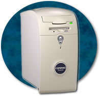
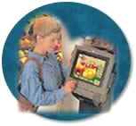
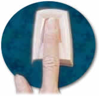
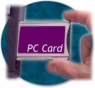

# {{ page.title }}

Updated: August 1, 2001

**Desktop and portable computers (1194.26)**

(a) All mechanically operated controls and keys shall comply with §1194.23 (k) (1) through (4).

(1) Controls and keys shall be tactilely discernible without activating the controls or keys.

(2) Controls and keys shall be operable with one hand and shall not require tight grasping, pinching, or twisting of the wrist. The force required to activate controls and keys shall be 5 lbs. (22.2 N) maximum.

(3) If key repeat is supported, the delay before repeat shall be adjustable to at least 2 seconds. Key repeat rate shall be adjustable to 2 seconds per character.

(4) The status of all locking or toggle controls or keys shall be visually discernible, and discernible either through touch or sound.

***What products are covered under this provision?***\
These provisions cover the keyboards, keypads, and other controls on desktop and laptop computers that need to be activated during the normal operation of the system. Examples of controls that are not located on a keyboard but are still covered include but are not limited to, on/off switches, reset buttons, unlocking controls for docking stations, and releases on items such as PCMCIA card slots and drives.

***What is meant by "tactilely discernible"?*** Individual keys must be identifiable and distinguishable from adjacent keys by touch. A product can meet this provision by using various shapes, spacing, or tactile markings. The typical desktop computer keyboard, for example, would meet this provision because the tactile marks on the "j" and "f" keys permit a user to locate all other keys tactilely. In addition, the physical spacing of the function, "numpad" and cursor keys make them easy to locate by touch.

Because touch is necessary to discern tactile features, this provision requires keyboards to enable touch that does not automatically activate a function based on mere contact. Fortunately, most keyboards require some pressure on individual keys in order to enable a keystroke.

However, "capacitance" keyboards would not meet this provision because they react as soon as they are touched and have no raised marks or actual keys. They may not react at all when touched by persons with a hand prostheses. A "membrane" keypad with keys that must be pressed can be made tactilely discernible by separating keys with raised ridges so that individual keys can be distinguished by touch.

***What is meant by "status of controls" and why do people need that information?***\
This provision requires that the status of toggle controls, such as the "caps lock" or "scroll lock" keys be identifiable by either touch or sound, in addition to visual means. For example, adding audio patterns, such as ascending and descending pitch tones that indicate when a control is turned on or off, would alleviate the problem of a person who is blind inadvertently pressing the locking or toggle controls. Also, buttons which remain depressed when activated and switched with distinct positions will meet this provision.

***Would the reading of status and diagnostic indicators (e.g., light emitting diodes (LEDs)) on a desktop computer's front panel be required to be accessible?***\

Lights and buttons on control panels which are provided strictly for troubleshooting are not addressed. However, indicators of normal operation are covered. For example, the status of "power on" is accompanied by the sound of a fan, and disk activation is accompanied by the sound of a disk spinning.

***What does "key repeat" mean?***\
This provision addresses a challenge encountered by some people with fine motor coordination difficulty. Sometimes, they accidentally press a key several times when intending to hit it only once. This could potentially result in the same character displaying several times on the screen.

Some systems do not support key repeat. However, where key repeat is provided, this provision requires the repeat to be adjustable. Specifically, the delay must be adjustable for a length of time that is up to 2 seconds between repeats.

***How will individuals with disabilities benefit from the requirement enabling operability without tight grasping, pinching, twisting, or pressure?***\
Individuals with tremor, cerebral palsy, or other disabilities may have difficulty operating systems which require fine motor control, a steady hand, or two hands to be used simultaneously for operation. Some laptop computers, for example, require two hands to simultaneously depress buttons on both sides of the laptop to open it, while other laptops can open when a user moves a single switch on the front.

Individuals with high spinal cord injuries, arthritis, and other conditions may have difficulty operating controls which require significant strength. This provision limits the force required to five pounds and is based on section 4.27.4 of the ADA Accessibility Guidelines, codified as the ADA Standards for Accessible Design as part of the Department of Justice's regulation implementing title III of the ADA at 28 C.F.R. pt. 36, Appendix A. This provision is also consistent with the Telecommunications Act Accessibility Guidelines.

* * * * *

*(b) If a product utilizes touchscreens or touch-operated controls, an input method shall be provided that complies with §1194.23 (k) (1) through (4).*

***What products are covered under this provision?***\

This provision covers both desktop and portable computers that use touchscreens or other controls which operate through a person's touch. Touchscreens and other controls that operate by sensing a person's touch pose access problems for a range of persons with disabilities. This provision does not prohibit the use of touchscreens and contact sensitive controls, but requires a redundant set of controls that can be used by persons who have access problems with touchscreens.

* * * * *

*(c) When biometric forms of user identification or control are used, an alternative form of identification or activation, which does not require the user to possess particular biological characteristics, shall also be provided.*

***What are biometric forms of user identification or control?***\
Biometric controls refer to controls that are activated only if a particular biological feature (e.g., voiceprint) of the user exists and matches specific criteria. Fortunately, many computer software manufacturers are aware that voice recognition is a beneficial input or activation method intended to supplement, not replace, other input controls such as standard keyboards.

* * * * *

*(d) Where provided, at least one of each type of expansion slots, ports and connectors shall comply with publicly available industry standards.*

***What does this provision require?***\
This provision requires connection points on a computer system to comply with an industry standard technical specification that is available to other manufacturers. This assures that the developers of assistive technology will have access to information concerning the design of system connections and thus be able to produce products that can utilize those connections. Examples of publicly available industry standards may include RS-232, Centronics, SCSI interfaces, PCMCIA, or USB.
