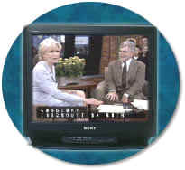

# {{ page.title }}

Updated: June 21, 2001

**(a) All analog television displays 13 inches and larger, and computer equipment that includes analog television receiver or display circuitry, shall be equipped with caption decoder circuitry which appropriately receives, decodes, and displays closed captions from broadcast, cable, videotape, and DVD signals. As soon as practicable, but not later than July 1, 2002, widescreen digital television (DTV) displays measuring at least 7.8 inches vertically, DTV sets with conventional displays measuring at least 13 inches vertically, and stand-alone DTV tuners, whether or not they are marketed with display screens, and computer equipment that includes DTV receiver or display circuitry, shall be equipped with caption decoder circuitry which appropriately receives, decodes, and displays closed captions from broadcast, cable, videotape, and DVD signals.**

***What are captions?***

Like subtitles, captions display spoken dialogue as printed words on a television screen or computer monitor. Unlike subtitles, captions are specifically designed for hard-of-hearing and deaf viewers to enable their full participation when viewing video or multimedia productions. Captions are carefully placed to identify speakers. They often include information regarding on- and off-screen sound effects, such as music or laughter. Captions also hold secondary benefits for people who are learning a foreign language, learning how to read, or watching TV in a noisy area, as well as those who understand best by processing visual information.

Captions come in two forms: open or closed captioning:

-   *Open captions* are displayed automatically as part of the video, without having to be selected by the user.
-   *Closed captions* normally do not appear as part of the video portion of a multimedia presentation unless the viewer has selected them to appear. The person viewing the presentation must be using technology that includes a closed caption decoder. The decoder will allow the otherwise-hidden data within the television signal to be displayed on the user's TV screen or computer monitor. Many newer television models allow viewers to toggle captions on or off with ease.

***What television display formats are required to include caption decoder circuitry?***\
Analog and digital television displays, as well as stand-alone digital television tuners and computer equipment that includes digital television receiver or display circuitry, must include caption decoder circuitry. Section 508 does not require small analog or digital television displays to include caption decoder circuitry. Specifically, analog televisions with screens smaller than 13 inches diagonally and DTVs with displays smaller than 7.8 inches vertically are exempted. The Television Decoder Circuitry Act of 1990 and the Telecommunications Act of 1996 contain similar provisions.

* * * * *

**(b) Television tuners, including tuner cards for use in computers, shall be equipped with secondary audio program playback circuitry.**

***What is a secondary audio channel and why is special circuitry required?***\
The most common method of broadcasting audio description is through the Secondary Audio Program (SAP) feature of stereo televisions. Each television channel has what is called a "secondary audio channel" associated with it. The secondary audio channel may contain audio descriptions or foreign language translations of dialogue. If used to deliver audio descriptions, SAP can greatly enhance the multimedia experience for those who are blind or who have low vision. When television tuners, including tuner cards for use in computers, are equipped with SAP playback circuitry, people who are blind or who have low vision may access whatever audio description has been associated with the presentation.

***How do audio descriptions assist people with disabilities?***\
An "audio description" is an audible description of the visual content of a presentation, synchronized with the existing soundtrack. Typically, appropriate portions of the audio description are narrated during what would otherwise be natural silences in the presentation.

***What is a tuner card?***

Tuner cards enable a computer to receive television broadcasts. This product is an example of what the industry calls "convergence" and represents a way in which the functions historically provided by TV, PC, cable and Internet products are merging onto multi-function devices. Tuner cards can be internal or external and can work with laptop or desktop computers.

* * * * *

**(c) All training and informational video and multimedia productions which support the agency's mission, regardless of format, that contain speech or other audio information necessary for the comprehension of the content, shall be open or closed captioned.**

**(d) All training and informational video and multimedia productions that support the agency's mission, regardless of format, that contain visual information necessary for the comprehension of the content, shall be audio described.**

***What is a multimedia production?***
The term "multimedia productions" refers to productions that present information in more than one sensory mode, e.g., both audibly and visually. For instance, streaming video with a soundtrack is a multimedia production. A show broadcast through a Federal military radio station is audio only and therefore not covered by this captioning requirement. (However, the procurement of electronic and information technology necessary to operate the radio station would be covered under the 508 standard.)

***What does it mean for a video or multimedia production to "support the agency's mission"?***\
Video and multimedia products that "support the agency's mission"are generally required to be captioned and audio-described. For instance, a training film for the Social Security Administration regarding how agency personnel should determine an applicant's eligibility for benefits, is a training production that supports the agency's mission. A video of a retirement celebration, on the other hand, would not be "in support of an agency's mission" and is not covered by these provisions.

Raw videotaped footage recorded by a field investigator to document a safety violation could be considered a film "in support of an agency's mission". However, it is not a "production" and therefore does not need to be captioned or audio described. On the other hand, if such footage were subsequently incorporated into agency training or an informational presentation, it would have to be captioned and audio described.

***When are captioning and audio descriptions required?***

Captioning and audio descriptions are only required to be provided when important to understand the audio or visual components of a video or multimedia production. That is, even if a production "supports the agency's mission," only those audio portions that are necessary for the comprehension of the production's content need to be captioned.

> Ex: A videotaped lecture would need to capture the lecturer's words in captions if it is intended to be used for future training, but the captions need not also relate that students' chairs were squeaking or that the door at the back of the room was closing loudly as people exited.

Similarly, only those visual portions that are necessary for the comprehension of the production's content need to be audio described.

> Ex: A videotaped lecture would need to include an audio description of graphics the lecturer draws on a chalkboard to illustrate a point, but would not need to include an audio description of the strictly verbal -- or "talking heads" -- portion of the lecture.

**If I believe that no one with a hearing loss will see the video, do I still have to caption it?**\
Yes, unless an exception applies (e.g., electronic and information technology that is part of a national security system is not required to adhere to the Access Board's provisions), section 508 requires accessibility features to be built into new multimedia products as called for in this technical provision. Section 508 generally focuses on how the technology is designed, rather than who may use it.

Agencies will likely find that captions will assist many nondisabled individuals as well, including those who otherwise have normal hearing but are "functionally hard of hearing" in rooms with poor acoustics due to echos or noisy ventilation, those who are learning English as a second language, and individuals with auditory processing disabilities. Finally, many people simply learn best if information is presented in more than one sensory mode, such as hearing while simultaneously reading the dialogue.

* * * * *

**(e) Display or presentation of alternate text presentation or audio descriptions shall be user-selectable unless permanent.**

***Does this provision apply differently to audio description than it does to captioning?***\
Given the current state and prevalence of analog technology, the "user-selectable" language generally applies to closed captioning, which the viewer can turn on or off. Audio description on VHS format videos is permanently encoded and is always "on." If a user wanted to watch a video without listening to the audio description, he or she would need to find a separate version of the production that was not audio described. The same is true with open captioning.

CD-ROMs, DVDs, and other digital forms of multimedia can support alternate audio channels for audio description. Using SMIL (Synchronized Multimedia Integration Language) or other emerging technologies, captioning and audio description will likely be more easily integrated into digital multimedia presentations in the near future.

Another point bundled in this provision relates to difficulty users have reported with independently enabling audio description. The means of choosing alternate tracks for audio description varies by the medium, but usually involves selection from an on-screen menu. Therefore those menus must be made audible or otherwise readily selectable so that people with visual disabilities can independently gain access to audio descriptions.
