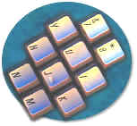
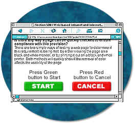

# {{ page.title }}

*Updated: August 1, 2001*

### Self contained, closed products (1194.25)

**(a) Self contained products shall be usable by people with disabilities without requiring an end-user to attach assistive technology to the product. Personal headsets for private listening are not assistive technology.**

**What are self contained, closed products?**

Self contained closed products generally have embedded software and are commonly designed in such a fashion that a user cannot easily attach or install assistive technology. For example, one could attach a screen reader to a computer which meets the section 508 standards but one would not be expected to attach a screen reader to a copier machine. A copier machine is an example of a self-contained, closed product. Other examples include, 
calculators, fax machines, information transaction machines, and information kiosks. 

Unlike other provisions which allow a product to meet the standards by being compatible with assistive technology, this provision requires self contained, closed products to contain built-in accessibility. Although not built-in, a headset is considered an allowable add-on, since it is not considered assistive technology in this case. Headsets might be used for privacy, not accessibility reasons.

* * * * *

**(b)** **When a timed response is required, the user shall be alerted and given sufficient time to indicate more time is required.**

This provision addresses access problems that can arise when self contained, closed products require a response from a user within a certain time. For example, persons with dexterity related disabilities would find entering information such as a social security number within a specified time difficult or impossible. This provision requires that a user be notified if a process is about to time-out and be given an opportunity to answer a prompt asking whether additional time is needed.

* * * * *

**(c) Where a product utilizes touchscreens or contact-sensitive controls, an input method shall be provided that complies with §1194.23 (k) (1) through (4).**

**(1) Controls and keys shall be tactilely discernible without activating the controls or keys.**

**(2) Controls and keys shall be operable with one hand and shall not require tight grasping, pinching, or twisting of the wrist. The force required to activate controls and keys shall be 5 lbs. (22.2 N) maximum.**

**(3) If key repeat is supported, the delay before repeat shall be adjustable to at least 2 seconds. Key repeat rate shall be adjustable to 2 seconds per character.**

**(4) The status of all locking or toggle controls or keys shall be visually discernible, and discernible either through touch or sound.**

**What products are generally covered under this provision?**

This provision covers products that use touch screens or other controls which operate through a person's touch. In some instances, a personal computer with a touch-screen will be enclosed in a display and used as an "information kiosk". Touchscreens and other controls that operate by sensing a person's touch pose access problems for a range of persons with disabilities. This provision does not prohibit the use of touchscreens and contact sensitive controls, but requires a redundant set of controls that can be used by persons who have access problems with touchscreens.

**Is the latching mechanism to release a toner cartridge in a copier considered a control covered by section 508?**

No. Changing a toner cartridge is considered maintenance, not normal daily operations. These provisions apply to operable controls which are defined as components of a product that require physical contact for normal operation. Operable controls include, but are not limited to, mechanically operated controls, input and output trays, card slots, keyboards, or keypads. These provisions are intended to apply to products in their normal operation rather than when a product may be used for maintenance, repair, or occasional monitoring. Operable controls for tasks such as initial set-up and configuration, adding and replacing parts, and repair and service tasks, are not covered by the standards.

**Would printer control panels used for configuration, status, diagnostic, or maintenance functions be required to be accessible?**

If a panel of lights were used strictly for troubleshooting, they would not be addressed by the standards. However, these controls are usually available for all to use and may be temporarily set for the tasks of co-workers. Adjustments may be needed for features in a copier such as contrast, reduction, double sided, stapling, and sorting. Sometimes, people accidentally hit an exposed button and the user needs to put the system back on-line. Therefore, these controls are necessary for normal daily operation and are required to be accessible.

**What is meant by "tactilely discernible"?**

 

Individual keys must be identifiable and distinguishable from adjacent keys by touch. A product can meet this provision by using various shapes, spacing, or tactile markings. The normal desktop computer keyboard, for example, would meet this provision because the tactile marks on the "j" and "f" keys permit a user to locate all other keys tactilely. In addition, the physical spacing of the function, "numpad" and cursor keys make them easy to locate by touch. Because touch is necessary to discern tactile features, this provision requires keyboards to enable touch that does not automatically activate a function based on mere contact. Fortunately, most keyboards require some pressure on individual keys in order to enable a keystroke.

However, "capacitance" keyboards would not meet this provision because they react as soon as they are touched and have no raised marks or actual keys. They may not react at all when touched by persons with prostheses. A "membrane" keypad with keys that must be pressed can be made tactilely discernible by separating keys with raised ridges so that individual keys can be distinguished by touch.

**What is meant by "status of controls" and why do people need that information?**

This provision requires that the status of toggle controls, such as the "caps lock" or "scroll lock" keys be identifiable by either touch or sound, in addition to visual means. For example, adding audio patterns, such as ascending and descending pitch tones that indicate when a control is turned on or off, would alleviate the problem of a person who is blind inadvertently pressing the locking or toggle controls. Also, buttons which remain depressed when activated and switched with distinct positions may meet this provision.

**What does "key repeat" mean?**

This provision addresses a challenge encountered by some people with fine motor coordination difficulty. Sometimes, they accidentally press a key several times when intending to hit it only once. This could potentially result in the same character displaying several times on the screen. Some systems do not support key repeat. However, where key repeat is provided, this provision requires the repeat to be adjustable. Specifically, the delay must be adjustable for a length of time that is no greater than 2 seconds between repeats.

**How will individuals with disabilities benefit from the requirement enabling operability without tight grasping, pinching, twisting, or pressure?**

 

Individuals with tremor, cerebral palsy, or other disabilities may have difficulty operating systems which require fine motor control, a steady hand, or two hands to be used simultaneously for operation. Individuals with high spinal cord injuries, arthritis, and other conditions may have difficulty operating controls which require significant strength. This provision limits the force required to five pounds and is based on section 4.27.4 of the [ADA Accessibility Guidelines](http://www.access-board.gov/adaag/html/adaag.htm), codified as the ADA Standards for Accessible Design as part of the Department of Justice's regulation implementing title III of the ADA at 28 C.F.R. pt. 36, Appendix A. This provision is also consistent with the Telecommunications Act Accessibility Guidelines.

* * * * *

(d) When biometric forms of user identification or control are used, an alternative form of identification or activation, which does not require the user to possess particular biological characteristics, shall also be provided.

**What are biometric forms of user identification or control?**

Biometric controls refer to controls that are activated only if a particular biological feature (e.g., voiceprint) of the user exists and matches specific criteria. Other examples include retinal scans and fingerprint identification that may become a common practice for allowing an individual to gain access to personal data from an information transaction type of machine.

Biometric controls provide a high level of security. However, when a system needs to be accessed by a person with a disability and that disability prohibits the use of a specific biometric feature, a non-biometric alternative should be provided that does not compromise security.

* * * * *

(e) When products provide auditory output, the audio signal shall be provided at a standard signal level through an industry standard connector that will allow for private listening. The product must provide the ability to interrupt, pause, and restart the audio at anytime.

**Does this provision apply to "beeps and tones" or to voice signals only?**

This provision applies only to voice output. For example, it could apply to a device that is providing voice output for a person who is unable to see a visual display.

**What is meant by a standard connector?**

People who regularly use information transaction kiosks may plan to carry a portable headset (or other listening coupler) with them. Examples of common plugs on headsets include those that fit 2.5 mm jacks (such as those in most cellular phones) and 3.5 mm plugs (such as those in most portable stereos). There have been problems in the past when manufacturers made proprietary plugs that were flat with multiple pins and were compatible only their own products.

* * * * *

(f) When products deliver voice output in a public area, incremental volume control shall be provided with output amplification up to a level of at least 65 dB. Where the ambient noise level of the environment is above 45 dB, a volume gain of at least 20 dB above the ambient level shall be user selectable. A function shall be provided to automatically reset the volume to the default level after every use.

**How was the level of 65 dB determined?**

 

According to the Occupational Safety and Health Administration, and the American Speech, Language, and Hearing Association, 65 dB is the volume level for normal speech. This provision requires that audio output from a kiosk type product have a minimum level of 65 dB. A feature has been required to automatically reset the volume to the default level after every use. This is consistent with a similar provision addressing telecommunications products.

**What are the needs of people with partial hearing?**

People who are hard of hearing, generally speaking, require voice levels to be 20 dB above the ambient sound level to understand speech. This means that as long as the noise level in the surrounding environment is below 45 dB, the 65 dB output level would be sufficient. If the product is in an environment with a high noise level, the user must be able to raise the volume to a setting of 20 dB higher than the ambient noise level. This would require the owner or other appropriate responsible party to determine the volume of the background noise at the location of the machine (specifically whether it is above 45 dB), so the machine can be selected or calibrated for that specific environment. To effectively meet this provision, consideration needs to be given to the fact that ambient noise levels may vary in certain environments.

* * * * *

**(g) Color coding shall not be used as the only means of conveying information, indicating an action, prompting a response, or distinguishing a visual element.**

**How can color coding create accessibility difficulties?**

 

A software program that requires a user to distinguish between otherwise identical red and blue squares for different functions (e.g., printing a document versus saving a file) would pose problems for anyone who was color blind and would generally be very difficult to run with assistive technology. Screen reading software can announce color changes. However, this is an "on/off" feature. This means that if a user had to identify a specific color, they would have to have all colors announce which would greatly reduce the usability of the software for that person.

**Does the provision prohibit the use of colors?**

No. This provision does not prohibit the use of color to enhance identification of important features. It does, however, require that some other method of identification, such as text labels, be combined with the use of color.

* * * * *

**(h) When a product permits a user to adjust color and contrast settings, a range of color selections capable of producing a variety of contrast levels shall be provided.**

**Do all products have to provide color selections?**

No. This provision is applied to those products that already allow a user to adjust screen colors.

**What is the desired outcome of this requirement?**

This provision requires more than just providing color choices. The available choices must also allow for different levels of contrast. Many people experience a high degree of sensitivity to bright displays. People with this condition cannot focus on a bright screen for long because they will soon be unable to distinguish individual letters. An overly bright background causes a visual "white-out". To alleviate this problem, the user must be able to select a softer background and appropriate foreground colors. On the other hand, many people with low vision can work most efficiently when the screen is set with very sharp contrast settings. Because there is such a variance in individual needs it is necessary for a program to have a variety of color and contrast settings.

* * * * *

**(i) Products shall be designed to avoid causing the screen to flicker with a frequency greater than 2 Hz and lower than 55 Hz.**

**Why are flashing or blinking displays limited by this provision?**

This requirement is necessary because some individuals with photosensitive epilepsy can have a seizure triggered by displays that flicker or flash, particularly if the flash has a high intensity and is within certain frequency ranges. The 2 Hz limit was chosen to be consistent with proposed revisions to the ADA Accessibility Guidelines which, in turn, are being harmonized with the International Code Council (ICC)/ANSI A117 standard, "Accessible and Usable Buildings and Facilities", ICC/ANSI A117.1-1998 which references a 2 Hz limit. An upper limit was identified at 55 Hz.

* * * * *

**(j) Products which are freestanding, non-portable, and intended to be used in one location and which have operable controls shall comply with the following:**

**(1) The position of any operable control shall be determined with respect to a vertical plane, which is 48 inches in length, centered on the operable control, and at the maximum protrusion of the product within the 48 inch length (see Figure 1 of this part).**

**(2) Where any operable control is 10 inches or less behind the reference plane, the height shall be 54 inches maximum and 15 inches minimum above the floor.**

**(3) Where any operable control is more than 10 inches and not more than 24 inches behind the referenc plane, the height shall be 46 inches maximum and 15 inches minimum above the floor.**

**(4) Operable controls shall not be more than 24 inches behind the reference plane (see Figure 2 of this part).**

**What do these provisions require?**

These provisions apply to the physical characteristics of large office equipment including reach ranges and the general physical accessibility of controls and features. Examples of these products, include but are not limited to copiers, information kiosks, and free standing printers. These provisions are based on the Americans with Disabilities Act Accessibility Guidelines (ADAAG 4.2 Space Allowance and Reach Ranges).

**If a document feeder was within the technical specifications, but access to the platen glass was outside the reach range, would a copier machine meet the provisions?**

No. Users need to be able to access both ways of placing a piece of paper on a copier for copying. There are some things (too small or too large) that cannot be run through a paper feed.

**If the trays for storing reams of paper are not reachable, does the copier machine meet the provisions?**

Copier paper tray access is not covered under the standards because replacing paper is considered a maintenance function, not a normal daily operation. Operable controls include, but are not limited to, mechanically operated controls, input and output trays, card slots, keyboards, or keypads. The standards apply to products in their normal operation rather than when a product may be used for maintenance, repair, or occasional monitoring. Other tasks such as initial set-up and configuration, adding and replacing parts, and repair and service tasks are also not covered by the standards.
