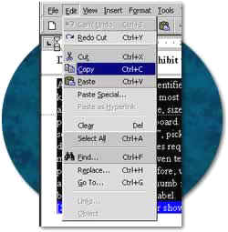

# {{ page.title }}

Updated: June 21, 2001

These provisions are applicable for both software applications and operating systems.  They address program features that must be contained in software for the product to meet the standards.  Because there are many programming languages from which a software producer may select, it is impossible to give specific coding techniques.  In some cases it is possible that a particular programming language may not possess the features necessary to fulfill these requirements.  In those instances, another language for creating the program would most likely have to be considered for the product to meet the standards.

*All electronic and information technology contains software of some type.  Do these provision apply to all software with no exceptions?*

To meet the standards, a product can either build all accessibility features in, or be compatible with assistive technology.  Many of the provisions in this section are required to make software compatible with assistive technology.  For example, how text is to be written to the display is required so assistive technology can read the text output of a program.  Therefore, if the software is running on a product, such as a desktop computer, where it is possible to add assistive technology, that software must comply with this section.

*Are these provisions the only feasible approach for making software work with assistive technology?*

No.  By studying these provisions, a software producer can gain an understanding of what is to be achieved.  However, as stated in 1194.5, equivalent facilitation, the provisions are not intended in anyway to discourage producers from developing their own approach to achieving the end result. Alternative approaches through equivalent facilitation are allowed as long as the alternative provides equivalent or greater access than the approach specified in these provisions.

* * * * *

(a) When software is designed to run on a system that has a keyboard, product functions shall be executable from a keyboard where the function itself or the result of performing a function can be discerned textually.

*Why is keyboard access to software required?*

When keyboard access to a programs' controls and features is provided, a person who cannot use a mouse or other pointing device will still be able to run the product.  For example, a person with a disability that affects dexterity may find it impossible to move or hold a pointing device with enough accuracy to activate desired features.  A person who cannot see the screen, therefore relying on assistive technology, may have no problems moving the pointer but will be unable to determine what is being pointed to.

*Does this provision prohibit the use of "mouse-only" functions in any software?*

All actions that can be identified or labeled with text are required to be executable from a keyboard.  For example, most of the menu functions even in common drawing programs that allow a user to open, save, size, rotate, and perform other actions on a graphic image can all be performed from the keyboard.  However, providing keyboard alternatives for creating an image by selecting a "drawing tool", picking a color, and actually drawing a design would be extremely difficult.  Such procedures require the precise level of control afforded by a pointing device (e.g., a mouse) and cannot be given text labels because there is no way to predict what action the user plans to perform.  Therefore, when a programmer is determining which functions need keyboard access, the best rule of thumb is to add keyboard shortcuts to any feature where the function can be identified with a text label.

*Many applications utilize toolbars with buttons.  Do these buttons all need keyboard access?*

Not necessarily.  Most toolbars give a visual shortcut to functions that also exist in the menu structure of a program.  If the feature activated by a control on a toolbar is a duplicate of a menu function that already has a keyboard shortcut then the toolbar control does not need its own keyboard access. However, if the control on the toolbar is unique and cannot be accessed in any other way, the control will be required to have a keyboard shortcut.  Although not in the toolbar, a scroll feature which is not available in a menu bar must have keyboard alternatives.  Typically, the use of the page up, and page down keys will provide keyboard access to scroll bars.

* * * * *

(b) Applications shall not disrupt or disable activated features of other products that are identified as accessibility features, where those features are developed and documented according to industry standards. Applications also shall not disrupt or disable activated features of any operating system that are identified as accessibility features where the application programming interface for those accessibility features has been documented by the manufacturer of the operating system and is available to the product developer.

*What is the application programming interface?*

The application programming interface, (API) refers to a standard way for programs to communicate with each other, including the operating system, and with input and output devices. For instance, the application programming interface affects how programs display information on a monitor or receive keyboard input via the operating system.

*What are accessibility features?*

Many commercially available software applications and operating systems have features built into the program that are labeled as accessibility features.  These features can typically be turned on or off by a user.  Examples of these features include: reversing the color scheme (to assist people with low vision), showing a visual prompt when an error tone is sounded (to assist persons who are deaf or hard of hearing), or providing "sticky keys" that allow a user to press key combinations (such as control-C) sequentially rather than simultaneously (to assist persons with dexterity disabilities).  This requirement prohibits software programs from disabling these features when they have been activated prior to running the application.

* * * * *

(c) A well-defined on-screen indication of the current focus shall be provided that moves among interactive interface elements as the input focus changes. The focus shall be programmatically exposed so that assistive technology can track focus and focus changes.

*What is the importance of the focus for assistive technology?*

The position on a screen where an action will take place is referred to as the "focus".  For example, when a menu item in a program is highlighted - meaning that if the user clicks the mouse or presses the enter key - the feature will activate and that item has the focus.  Providing a visual indication of the focus allows someone who is viewing the screen to accurately access the programs' features.  When a computer is being operated by a person who is also running a screen enlargement program or a speech or Braille output system, the assistive technology must discern the focus point.  This provision requires that the position of the programs' focus be made available through its code to assistive technology. When, for example, a screen enlargement program magnifies a section of the screen, it must be able to follow the focus as the focus changes.  If the magnified area does not move with the focus, the user may easily move down through a list of choices with the arrow keys but the magnified area remains stationary and very shortly the user has no idea what items will be activated if an action is taken.

* * * * *

(d) Sufficient information about a user interface element including the identity, operation and state of the element shall be available to assistive technology. When an image represents a program element, the information conveyed by the image must also be available in text.

*What is considered a "user interface element"?*

Examples of user interface elements include button checkboxes, menus, toolbars, scroll bars, and any other feature of a program that is intended to allow the user to perform some action.

*What does this provision require to be done with these elements?*

This provision requires that text must be associated with each element.  The text must identify the element and its current state or condition.  For example, a button that shows a hand for getting more help must have the word "help" associated with the button.  If a checkbox is present, a text label must indicate what is being checked, and whether the checkbox is checked or unchecked.  There are many ways to accomplish this depending on the program language being used.

* * * * *

(e) When bitmap images are used to identify controls, status indicators, or other programmatic elements, the meaning assigned to those images shall be consistent throughout an application's performance.

*What forms of bitmap images are affected by this provision?*

This provision applies to those images which are used to indicate an action.  An image used strictly for decoration is not covered by this provision.

*Why is the provision important for accessibility?*

Most screen reading programs allow users to assign text names to bitmap images.  If the bitmap image changes meaning during a program's execution, the assigned identifier is no longer valid and is confusing to the user.

* * * * *

(f) Textual information shall be provided through operating system functions for displaying text. The minimum information that shall be made available is text content, text input caret location, and text attributes.

*Can an application programmer develop unique display techniques for writing text on the screen or using graphics?*

The operating system is the "core" computer software that controls basic functions, such as receiving information from the keyboard, displaying information on the computer screen, and storing data on the hard disk.  Other software programs use the standard protocols dictated by the operating system for displaying their own information or processing the output of other computer programs.  When programs are written using unique schemes for writing text on the screen or use graphics, other programs such as software for assistive technology may not be able to interpret the information.  This provision does not prohibit or limit an application programmer from developing unique display techniques.  It requires that when a unique method is used, the text should also be written to the screen through the operating system.

* * * * *

(g) Applications shall not override user selected contrast and color selections and other individual display attributes.

*How does this requirement improve accessibility for people with disabilities?*

Often, persons with disabilities can increase their efficiency with a system by selecting colors, contrast, keyboard repeat rate, and keyboard sensitivity settings provided by an operating system. When an application disables these system-wide settings, accessibility is reduced.  This provision is aimed at allowing users to select personalized settings which cannot be disabled by software programs.

*Does this provision mean that programs may not use any custom settings?*

This provision allows programs to have unlimited options for customizing the display of the programs' content.  However, there must be a section in the software that tells the program not to use its own setting, but to use whatever settings are already in place before the program starts.  A simple menu selection, for example under a view, or options menu, might be a checkbox that lets the user check "use system display setting."

* * * * *

(h) When animation is displayed, the information shall be displayable in at least one non-animated presentation mode at the option of the user.

*How can screen animation affect accessibility for people with disabilities?*

The use of animation on a screen can pose serious access problems for users of screen readers or other assistive technology applications.  When important elements such as push-buttons or relevant text are animated, the user of assistive technology cannot access the application reliably. This provision requires that in addition to the animation, an application shall provide an option to turn off animation.

* * * * *

(i) Color coding shall not be used as the only means of conveying information, indicating an action, prompting a response, or distinguishing a visual element.

*How can color coding create accessibility difficulties?*

A software program that requires a user to distinguish between otherwise identical red and blue squares for different functions (e.g., printing a document versus saving a file) would pose problems for anyone who was color blind and would generally be very difficult to run with assistive technology.  Screen reading software can announce color changes.  However, this is an "on/off" feature.  This means that if a user had to identify a specific color, they would have to have all colors announce which would greatly reduce the usability of the software for that person.

*Does the provision prohibit the use of colors?*

No.  This provision does not prohibit the use of color to enhance identification of important features.  It does, however, require that some other method of identification, such as text labels, be combined with the use of color.

* * * * *

(j) When a product permits a user to adjust color and contrast settings, a variety of color selections capable of producing a range of contrast levels shall be provided.

*Do all products have to provide color selections?*

No.  This provision is applied to those products that already allow a user to adjust screen colors.

*What is the desired outcome of this requirement?*

This provision requires more than just providing color choices.  The available choices must also allow for different levels of contrast.  Many people experience a high degree of sensitivity to bright displays.  People with this condition cannot focus on a bright screen for long because they will soon be unable to distinguish individual letters.  An overly bright background causes a visual "white-out".  To alleviate this problem, the user must be able to select a softer background and appropriate foreground colors.  On the other hand, many people with low vision can work most efficiently when the screen is set with very sharp contrast settings.  Because there is such a variance in individual needs it is necessary for a program to have a variety of color and contrast settings.

* * * * *

(k) Software shall not use flashing or blinking text, objects, or other elements having a flash or blink frequency greater than 2 Hz and lower than 55 Hz.

*Why are flashing or blinking displays limited by this provision?*

This requirement is necessary because some individuals with photosensitive epilepsy can have a seizure triggered by displays that flicker or flash, particularly if the flash has a high intensity and is within certain frequency ranges.  The 2 Hz limit was chosen to be consistent with proposed revisions to the ADA Accessibility Guidelines which, in turn, are being harmonized with the International Code Council (ICC)/ANSI A117 standard, "Accessible and Usable Buildings and Facilities", ICC/ANSI A117.1-1998 which references a 2 Hz limit.  An upper limit was identified at 55 Hz.

* * * * *

(l) When electronic forms are used, the form shall allow people using assistive technology to access the information, field elements, and functionality required for completion and submission of the form, including all directions and cues.

*Why are electronic forms so difficult for some people with disabilities to access?*

At present, the interaction between form controls and screen readers can be unpredictable, depending upon the design of the page containing these controls.

*How can forms in a software application meet this provision?*

If keyboard alternatives are provided for navigating through a form, and all elements of the form are labeled with text located in close proximity to the field that is to be completed, the form will most likely meet this provision.  Attention must be paid to the placement of field labels.  On a webpage, a label can have a direct association with a particular field that is indicated in the HTML code.  Assistive technology can interpret the HTML and correctly announce the appropriate label.  There is no similar method for forms in software programs.  Therefore, the label must be in a logical position relative to the input areas.  For example, placing labels to the immediate left of where the user is to enter information is by far the most logical position for the label.
