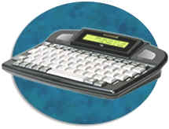
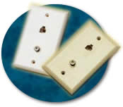
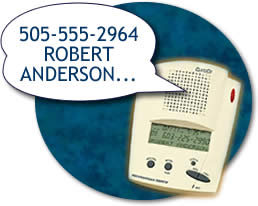

# {{ page.title }}

Updated: June 21, 2001

**How does section 508 relate to the Telecommunications Act?**

Section 255 of the Telecommunications Act of 1996 requires phone manufacturers and telecommunications service providers to make their products accessible when readily achievable to do so. A TTY, for example, is considered customer premises equipment, subject to section 255 provisions. The Access Board wrote guidelines for section 255 known as the Telecommunications Act Accessibility Guidelines (36 CFR, Part 1193). The FCC (Federal Communications Commission) used the guidelines as a basis for developing a report and order under section 255. The Access Board also incorporated the guideline's language in the 508 standard. Using consistent language in both documents enables companies to develop products that satisfy manufacture's design requirements as well as Federal agencies' procurement requirements.

* * * * *

**(a) Telecommunications products or systems which provide a function allowing voice communication and which do not themselves provide a TTY functionality shall provide a standard non-acoustic connection point for TTYs. Microphones shall be capable of being turned on and off to allow the user to intermix speech with TTY use.**

**What is a TTY?**

A TTY (Teletypewriter) is a data terminal that allows a person with a communication disability to use the telephone. TTYs traditionally have been stand-alone devices with a keyboard and an electronic display for reading text. TTYs send and receive tones which are converted to text. TTYs transmit and receive baudot code at a rate of 45.5 baud. Baudot refers to the code made from bits of electronic information. Baudot is considered to be an antiquated code. Baud refers to the speed at which data can be transmitted. Some TTYs may transmit at a faster speed using proprietary protocols or ASCII. ASCII (American Standard Code for Information Interchange) is a more conventional code, commonly used by computers and other devices that transmit data.

It is possible to enable some computers to function as TTYs if appropriate communication software (and sometimes a different modem) is installed. Some TTYs can connect directly to the phone or phone line, thus reducing the possibility of noise interfering with the data. Depending on the type of phone, a TTY might connect via a standard RJ-11 phone jack or a 2.5 mm audio jack. A variety of TTY styles exist that include models without acoustic coupling ability and models without keyboards. People select and use TTYs differently depending on their communication preferences and the nature of their disabilities. Basic information on how to use a TTY can be obtained here.

**What is VCO and HCO?**

VCO is "voice carry over" and HCO is "hearing carry over". These terms refer to strategies for using TTYs. VCO allows people who are hard of hearing or oral deaf (deaf with intelligible speech) to use a TTY without typing. They only use the TTY for reading during the inbound direction of the call. They talk to their party by speaking into a microphone. Similarly, HCO allows a person with a speech disability to hear a response from their party directly. These options are often used in conjunction with a relay service.

**What is a relay service?**

A telecommunications relay service (TRS) is essentially a telephone interpreting service for people with communication disabilities. It enables a TTY user to converse with a non-TTY user. Relay service operators are called Communication Assistants (CAs) and serve as third parties to facilitate conversations - by typing or speaking information as appropriate. Relay services are available without charge 24 hours per day. These and other TRS provisions are mandated under Title IV of the Americans with Disabilities Act. An FCC report and order mandates 7-1-1 as a toll-free number to use in accessing a relay service. The Federal Relay Service is one of several relay services available throughout the country.

**Why is a non-acoustic connection point needed for TTYs?**

Traditionally, people with communication disabilities used a TTY by placing a telephone handset in an acoustic modem on top of the TTY. Some manufacturers reduced the size of their TTY by removing the acoustic modem, thus requiring the TTY to connect directly to a telephone or wall jack. Therefore, if a new phone system has hardwired cords with no port for direct connection, then a direct connect TTY cannot be used at that phone and the phone will be considered non-conforming with this section 508 provision.

**Why must phone systems be capable of intermixing speech and TTY tones and why must users be able to turn microphones on and off?**

This provision supports VCO and HCO. People with communication disabilities have reported instances in which they connected a TTY to a cellular phone, which resulted in a deactivation of the telephone's microphone. In those cases, there was no way to talk into the phone (no way to turn the microphone on). This is frustrating to people with a hearing disability and intelligible speech who prefer to talk instead of type.

People who are deaf and use the TTY for both typing as well as reading would have less of a problem with a connection that disables the microphone. However, even they would be concerned if the phone was disabled to a point where it was unable to transmit tones for responding to interactive telephone response systems. TTY signals are not the same as "touch tone" sounds, and some TTYs may not readily make the necessary tones.

On the other extreme, some TTY-phone set-ups keep a microphone on throughout the entire conversation (never toggling it off). This can cause a problem if the microphone picks up extraneous noise during the data reception mode and results in errors.

**Do TTYs work with digital phones?**

At this time, TTYs do not work reliably with most digital **cellular** phones. The industry is working toward a solution on this matter through an FCC order which set a deadline of June 30, 2002 for wireless providers to be able to transmit 911 calls made from TTYs.

With regard to landline phones, most digital phones from offices or hotels will transmit TTY signals. If a TTY is use in an acoustic mode, then it does not matter whether it is being used with analog or digital phones. However, direct-connect TTYs should only be connected to analog phones to prevent damage to the TTYs. TTYs use analog plugs. Users may experience some confusion in determining whether a phone is analog or digital because of variances in the jacks. Digital jacks are often larger than standard RJ-11 analog plugs, but sometimes they are the same size. Finally, it is important that digital systems enable TTY signals to come out of the system undistorted if signals are compressed along the way.

* * * * *

**(b) Telecommunications products which include voice communication functionality shall support all commonly used cross-manufacturer non-proprietary standard TTY signal protocols.**

**How might telephone systems affect TTY signals?**

Some systems compress or alter transmissions, including TTY audio signals, in such a manner that the signals are not decoded properly. This provision is consistent with language in theTelecommunications Act Accessibility Guidelines.

**What communication protocols are used by TTYs?**

TTYs transmit in Baudot code at a rate of 45.5 baud. Products would need to match this protocol to be considered "TTY compatible." A standard was published for TTYs on June 23, 2000, which is available from the Telecommunications Industry Association. Under 508, this is the protocol which must be retained as TTY signals pass through phone systems.

Some TTYs also include the optional ability to connect at a rate of 300 baud ASCII, which enables them to communicate with some computers or other TTYs with the same protocol. These two codes (300 baud ASCII and 45.5 baud Baudot) are considered non-proprietary. Equipment that contains a v.18 chip will enable transmission in many protocols including these two. That chip is based on an international standard.

Some TTY manufacturers developed proprietary protocols that enable TTYs to communicate in Baudot at a higher rate. TTY users will see a benefit in using proprietary protocols only when communicating with other users who have products with the same protocol. The 508 standard does not require support for proprietary protocols.

* * * * *

**(c)Voice mail, auto-attendant, and interactive voice response telecommunications systems shall be usable by TTY users with their TTYs.**

**What difficulties have TTY users experienced with interactive voice response systems (IVRSs)?**

IVRSs include a variety of systems such as voice mail, recordings that require selecting a department you wish to connect to and job line announcements. Due to a hearing disability, many TTY users cannot understand prompts indicating which phone buttons to push when encountering IVRSs. Often when calling through relay services, TTY users are not given enough time to respond and get timed-out by the IVRS. Auditory information when typed to a TTY user via relay may not include necessary spacing or punctuation to help a consumer understand sections of what is being conveyed. TTY users have discovered that some voice mail systems corrupt TTY data left in voice mail boxes.

**What does this provision require?**

This provision is a performance requirement. It does not require phone systems to provide voice to text conversion capabilities. IVRS products have been available for over a decade which provide TTY users all of the same functions and information as non-TTY users, such as reading streaming text, leaving messages, and managing personal voice mail. This software should not be confused with other software on the market that is designed to allow computers to transmit and receive TTY code for live communication.

* * * * *

**(d) Voice mail, messaging, auto-attendant, and interactive voice response telecommunications systems that require a response from a user within a time interval, shall give an alert when the time interval is about to run out, and shall provide sufficient time for the user to indicate more time is required.**

**Why is an alert necessary?**

This provision was included to serve the needs of people, such as those with cognitive or dexterity disabilities, who may require additional time to respond to the prompts of an interactive telephone response system in order to avoid getting disconnected prematurely. The provision does not specify what the alert could sound like or exactly how much additional time would be sufficient, as those factors vary. This provision is identical to section 1194.22(p).

* * * * *

**(e)Where provided, caller identification and similar telecommunications functions shall also be available for users of TTYs, and for users who cannot see displays.**

**What types of challenges have people with disabilities experienced with information displayed on phones?**

Some phones have an LCD (liquid crystal display) window that shows Caller ID or other functions of the phone. People with visual or other disabilities may be unable to read the display. Talking Caller ID would be one means of making that information available in an alternate format.

Receiving this information has been a problem in the past for TTY users who were forced to use an analog phone and line that bypassed the office digital system. This will no longer be a problem with new 508 compliant systems that will support TTY requirements.

* * * * *

**(f) For transmitted voice signals, telecommunications products shall provide a gain adjustable up to a minimum of 20 dB. For incremental volume control, at least one intermediate step of 12 dB of gain shall be provided.**

**How are volume controls affected by this provision?**

If a volume control (usually a calibrated wheel or slide) is provided that allows a user to set the level anywhere from 0 to the upper requirement of 20 dB, there is no need to specify an intermediate level. If a stepped volume control is provided (usually through pressing a button repeatedly), one of the intermediate levels must provide 12 dB of gain.

**How is this provision related to ANSI standards and ADA Accessibility Guidelines?**

This provision is consistent with the 1998 American National Standards Institute (ANSI) A117.1 document, **"Accessible and Usable Buildings and Facilities." **ANSI is a voluntary standard-setting body which issues accessibility standards that become incorporated into the nation's model building codes. This standard is consistent with the Telecommunications Act Accessibility Guidelines and proposed revisions to the ADA and Architectural Barriers Act Accessibility Revised Guidelines.

* * * * *

**(g) If the telecommunications product allows a user to adjust the receive volume, a function shall be provided to automatically reset the volume to the default level after every use.**

**Why is this provision necessary?**

This is a safety feature to protect people from damaging their hearing, which might occur if they answer a telephone with the amplification accidentally turned too high.

**How does it relate to other accessibility guidelines and rules?**

The provision is adopted from the ADA Accessibility Guidelines (ADAAG), where it applies to public phones used by many people. The FCC's Part 68 rules requires an automatic reset when the phone is hung up if the volume exceeds 18 dB gain. To provide the ability to override the reset function would require a waiver from the FCC.

* * * * *

**(h) Where a telecommunications product delivers output by an audio transducer which is normally held up to the ear, a means for effective magnetic wireless coupling to hearing technologies shall be provided.**

**What is hearing aid compatibility (HAC)?**

HAC commonly refers to magnetic leakage around a telephone receiver. Hearing aid users desire a phone that emits such a magnetic field because it enables them to listen through a phone handset held up to their ear without getting an annoying squealing sound (acoustic feedback). They accomplish this by turning off their hearing aid microphone and listening "inductively" (via magnetism).

**Who benefits from products with wireless magnetic coupling?**

Hearing aid users (and their representative associations) have been the primary advocates for hearing aid compatibility and are the most common beneficiaries. However, only hearing aids with a telecoil, also known as a t-coil or telephone switch, can pick-up sound inductively. In addition, cochlear implant users, who have an optional t-coil inserted in an ear-level speech processor, can listen inductively.

**What types of products can be made hearing aid compatible?**

In addition to HAC telephone handsets, HAC telephone headsets are now available. Note that this provision does not require a product to fit comfortably, nor does it address the problem of interference to hearing aids. (People with over-the-ear hearing aids often find that headsets do not direct sound into their hearing aid very well, even if the headset is HAC.)

**How does this 508 provision relate to other public policies?**

This standard is consistent with language in the Telecommunications Act Accessibility Guidelines.

* * * * *

**(i) Interference to hearing technologies (including hearing aids, cochlear implants, and assistive listening devices) shall be reduced to the lowest possible level that allows a user of hearing technologies to utilize the telecommunications product.**

**Why is this provision necessary?**

This provision largely grew out of complaints about digital cellular phones by hearing aid users. Some hearing aid users heard a humming sound coming from the phone and this interfered with the ability to hear the conversation. This problem existed for both hearing aid users with t-coils as well as those without t-coils. See discussion of provision (h) (previous) for an explanation of a t-coil.

**Who and what does the provision apply to?**

This provision was carefully worded so that it could apply to listening technologies other than hearing aids, such as cochlear implants and assistive listening systems. In addition, although digital cellular phones were identified as one source of interference, there may be other electronic and information technologies that cause interference.

**How can interference be determined?**

The ANSI/IEEE C63.19 Standard, available from the American National Standards Institute, can be used to assess electromagnetic characteristics of hearing aids and wireless phones for the purpose of determining compatibility. The FCC, consumer groups and the telecommunications industry are now discussing plans for educating the public about this cell phone/hearing aid compatibility standard.

* * * * *

**(j) Products that transmit or conduct information or communication, shall pass through cross-manufacturer, non-proprietary, industry-standard codes, translation protocols, formats or other information necessary to provide the information or communication in a usable format. Technologies which use encoding, signal compression, format transformation, or similar techniques shall not remove information needed for access or shall restore it upon delivery.**

**What types of products does this provision apply to?**

This provision applies to any technologies involved with the transmission of information, such as televisions and DVD players. People who depend on closed captioning discovered that sometimes they would miss captions if they saw a show on cable as opposed to receiving the same show through other broadcast modes. Closed captioned information is usually included in portions of a video signal not seen by users without decoders or who have turned off or disabled the captioning. This issue applies to retaining audio description information as well. This provision prohibits products from stripping out such information or requires the information to be restored at the end point. The provision was written broadly enough to ensure that it will apply to evolving technologies.

* * * * *

**(k) Products which have mechanically operated controls or keys, shall comply with the following:**

(1) Controls and keys shall be tactilely discernible without activating the controls or keys.  
(2) Controls and keys shall be operable with one hand and shall not require tight grasping, pinching, or twisting of the wrist. The force required to activate controls and keys shall be 5 lbs. (22.2 N) maximum.  
(3) If key repeat is supported, the delay before repeat shall be adjustable to at least 2 seconds. Key repeat rate shall be adjustable to 2 seconds per character.  
(4) The status of all locking or toggle controls or keys shall be visually discernible, and discernible either through touch or sound.  

**What products are generally covered under this provision?**

This provision only applies to products that have mechanically operated controls or keys, such as standard telephone keypads and computer keyboards. It is not intended to apply to touchscreens.

**What is meant by 'tactilely discernible'?**

 

Individual keys must be identifiable and distinguishable from adjacent keys by touch. Compliance with this provision can be accomplished by using various shapes, spacing, or tactile markings. The normal desktop computer keyboard, for example, would meet this provision because the tactile marks on the "j" and "f" keys permit a user to locate all other keys tactilely. Many phones also have a raised dot on the number 5 button, enabling them to orient their fingers around the 12 keys. In addition, the physical spacing of the function, "numpad" and cursor keys make them easy to locate by touch.

Because touch is necessary to discern tactile features, this provision requires keyboards to enable touch that does not automatically activate a function based on mere contact. Fortunately most keyboards require some pressure on individual keys in order to enable a keystroke.

However, "capacitance" keyboards would not meet this provision because they react as soon as they are touched and have no raised marks or actual keys. They may not react at all when touched by persons with prostheses. A "membrane" keypad with keys that must be pressed can be made tactilely discernible by separating keys with raised ridges so that individual keys can be distinguished by touch.

**What is meant by "status of controls" and why do people need that information?**

This provision requires the status of toggle controls, such as the "caps lock" or "scroll lock" keys to be identifiable by either touch or sound, in addition to visual means. For example, adding audio patterns, such as ascending and descending pitch tones that indicate when a control is turned on or off, would alleviate the problem of a person who is blind inadvertently pressing the locking or toggle controls. Also, buttons which remain depressed when activated and switched with distinct positions may meet this provision.

**What does "key repeat" mean?**

This provision addresses a challenge encountered by some people with fine motor coordination difficulty. Sometimes they accidentally press a key several times when intending to hit it only once. This could potentially result in the same character displaying several times on the screen. Some systems do not support key repeat. However, where key repeat is provided, this provision requires the repeat to be adjustable. Specifically, the delay must be adjustable for a length of time that is no greater than 2 seconds between repeats.

**How will individuals with disabilities benefit from the requirement enabling operability without tight grasping, pinching, twisting or pressure?**

Individuals with tremor, cerebral palsy, or other disabilities may have difficulty operating systems which require fine motor control, a steady hand, or two hands to be used simultaneously for operation. Individuals with high spinal cord injuries, arthritis, and other conditions may have difficulty operating controls which require significant strength. The standard limits the force required to five pounds and is based on section 4.27.4 of the ADA Accessibility Guidelines, codified as the ADA Standards for Accessible Design as part of the Department of Justice's regulation implementing title III of the ADA at 28 C.F.R. pt. 36, Appendix A. This provision is also consistent with the Telecommunications Act Accessibility Guidelines.
