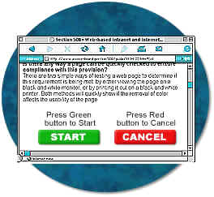
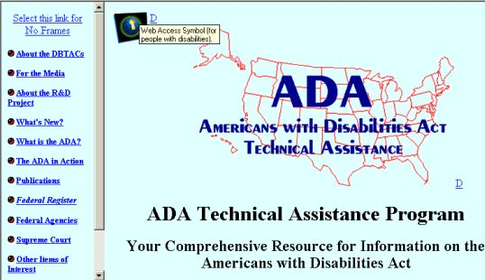
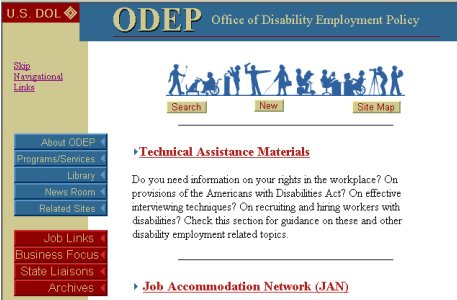

# {{ page.title }}

Updated: June 21, 2001

These provisions of the standards provide the requirements that must be followed by Federal agencies when producing web pages. These provisions apply unless doing so would impose an undue burden.

The key to compliance with these provisions is adherence to the provisions. Many agencies have purchased assistive software to test their pages. This will produce a better understanding of how these devices interact with different coding techniques. However, it always should be kept in mind that assistive technologies, such as screen readers, are complex programs and take extensive experience to master. For this reason, a novice user may obtain inaccurate results that can easily lead to frustration and a belief that the page does not comply with the standards. For example, all screen reading programs use special key combinations to read properly coded tables. If the novice user of assistive technology is not aware of these commands, the tables will never read appropriately no matter how well the tables have been formatted. A web site will be in compliance with the 508 standards if it meets paragraphs (a) through (p) of Section 1194.22. Please note that the tips and techniques discussed in the document for complying with particular sections are not necessarily the only ways of providing compliance with 508. In many cases, they are techniques developed by the Board, the Department of Education, and the Department of Justice that have been tested by users with a wide variety of screen reader software. With the evolution of technology, other techniques may become available or even preferable.

* * * * *

(a) A text equivalent for every non-text element shall be provided (e.g., via "alt", "longdesc", or in element content).

*What is meant by a text equivalent?*

A text equivalent means adding words to represent the purpose of a non-text element. This provision requires that when an image indicates a navigational action such as "move to the next screen" or "go back to the top of the page," the image must be accompanied by actual text that states the purpose of the image. This provision also requires that when an image is used to represent page content, the image must have a text description accompanying it that explains the meaning of the image.

HTML Source Code: ``

*How much information actually needs to be in the text equivalent?*

The text information associated with a non-text element should, when possible, communicate the same information as its associated element. For example, when an image indicates an action, the action must be described in the text. The types of non-text elements requiring actual text descriptions are limited to those elements that provide information required for comprehension of content or those used to facilitate navigation. Web page authors often utilize transparent graphics for spacing. Adding a text description to these elements will produce unnecessary clutter for users of screen readers. For such graphics, an empty ALT attribute is useful.

Example of source code: ``

*What is meant by the term, non-text element?*

A non-text element is an image, graphic, audio clip, or other feature that conveys meaning through a picture or sound. Examples include buttons, check boxes, pictures and embedded or streaming audio or video.

HTML Source Code: ``

*How should audio presentations be treated?*

This provision requires that when audio presentations are available on a multimedia web page, the audio portion must be captioned. Audio is a non-textual element, so a text equivalent of the audio must be provided if the audio is part of a multimedia presentation, Multimedia includes both audio and video. If the presentation is audio only, a text transcript would meet this requirement.

*What are ways of assigning text to elements?*

There are several ways of providing textual information so that it can be recognized by assistive technology devices. For instance, the  tag can accept an "alt" attribute that will enable a web designer to include text that describes the picture directly in the  tag.

HTML source code: ``

Link: <http://www.section508.gov/>

Similarly, the <APPLET> tag for Java applets also accepts an "alt" attribute, but it only works for browsers that provide support for Java. Often, users with slower internet connections will turn support for Java applets off. A better alternative for providing textual descriptions is to simply include the alternative text between opening and closing <APPLET> or <OBJECT> tags. For instance, if a web designer wanted to include an\
applet called MyCoolApplet in a web page, and also include a description that the applet shows a stock ticker displaying the current price of various stocks, the designer would use the following HTML coding for example:

> `<APPLET CODE="MyCoolApplet.class" WIDTH="200", HEIGHT="100">`  
> This applet displays current stock prices for many popular stocks.  
> `</APPLET>`  

Finally, yet another way of providing a textual description is to include it in the page in the surrounding context:

> `
Below is a picture of me during my great vacation!`  
> ` 
`  

* * * * *

(b) Equivalent alternatives for any multimedia presentation shall be synchronized with the presentation.

*What are considered equivalent alternatives?*

Captioning for the audio portion and audio description of visual information of multimedia presentations are considered equivalent alternatives. This provision requires that when an audio portion of a multimedia production is captioned, as required in provision (a), the captioning must be synchronized with the audio. Synchronized captioning would be required so someone reading the captions could also watch the speaker and associate relevant body language with the speech.

*If a website offers audio files with no video, do they have to be captioned?*

No, because it is not multimedia. However, since audio is a non-text element, a text equivalent, such as a transcript, must be available. Similarly, a (silent) web slide show presentation does not need to have an audio description accompanying it, but does require text alternatives to be associated with the graphics.

*If a Federal agency official delivers a live audio and video webcast speech, does it need to be captioned?*

Yes, this would qualify as a multimedia presentation and would require the speech to be captioned.

Example:

National Endowment for the Humanities  
<www.neh.gov/media/scottcaptions.ram>

National Center for Accessible Media (NCAM)  
<http://main.wgbh.org/wgbh/access/dvs/lion.ram>

* * * * *

(c) Web pages shall be designed so that all information conveyed with color is also available without color, for example from context or markup.

*Why is this provision necessary?*

When colors are used as the sole method for identifying screen elements or controls, persons who are color blind as well as those people who are blind or have low vision may find the web page unusable.

*Does this mean that all pages have to be displayed in black and white?*

No, this provision does not prohibit the use of color to enhance identification of important features. It does, however, require that some other method of identification, such as text labels, must be combined with the use of color. This provision addresses not only the problem of using color to indicate emphasized text, but also the use of color to indicate an action. For example, a web page that directs a user to "press the green button to start" should also identify the green button in some other fashion than simply by color.

*Is there any way a page can be quickly checked to ensure compliance with this provision?*

There are two simple ways of testing a web page to determine if this requirement is being met: by either viewing the page on a black and white monitor, or by printing it out on a black and white printer. Both methods will quickly show if the removal of color affects the usability of the page.

* * * * *

(d) Documents shall be organized so they are readable without requiring an associated style sheet.

*What are the potential problems posed by style sheets?*

Style sheets can enable users to define specific viewing preferences to accommodate their disability. For instance, users with low vision may create their own style sheet so that, regardless of what web pages they visit, all text is displayed in an extra large font with white characters on a\
black background. If designers set up their pages to override user-defined style sheets, people with disabilities may not be able to use those pages. For good access, therefore, it is critical that designers ensure that their web pages do not interfere with user-defined style sheets.

In general, the "safest" and most useful form of style sheets are "external" style sheets, in which the style rules are set up in a separate file. An example of an external style sheet is:

Example of source code: `<link rel=stylesheet type="text / css" href="/section508.css>`

* * * * *

(e) Redundant text links shall be provided for each active region of a server-side image map.

*How do "image maps" work?*

An "image map" is a picture (often an actual map) on a web page that provides different "links" to other web pages, depending on where a user clicks on the image. There are two basic types of image maps: "client-side image maps" and "server-side image maps." With client-side image maps, each "active region" in a picture can be assigned its own "link" (called a URL or "Uniform Resource Locator") that specifies what web page to retrieve when a portion of the picture is selected. HTML allows each active region to have its own alternative text, just like a picture can  have alternative text (see §1194.22(a)). By contrast, clicking on a location of a server-side image map only specifies the coordinates within the image when the mouse was depressed. The ultimate selection of the link or URL must be deciphered by the computer serving the web page.

*Why is this provision necessary?*

When a web page uses a server-side image map to present the user with a selection of options, browsers cannot indicate to the user the URL that will be followed when a region of the map is activated. Therefore, the redundant text link is necessary to provide access to the page for anyone not able to see or accurately click on the map.

* * * * *

(f) Client-side image maps shall be provided instead of server-side image maps except where the regions cannot be defined with an available geometric shape.

*Why do client-side image maps provide better accessibility?*

Unlike server-side image maps, the client-side image map allow an author to assign text to each image map "hot spots." This feature means that someone using a screen reader can easily identify and activate regions of the map. An explanation of how these image maps are constructed will help clarify this issue.

Creating a basic client-side image map requires several steps:

-   Identify an image for the map. First, an image must be used in a client-side image map. This image is identified using the `` tag. To identify it as a map, use the "usemap" attribute.
-   Use the `<MAP>` tag to "areas" within the map . The `<MAP>` tag is a container tag that includes various `<AREA>` tags that are used to identify specific portions of the image.
-   Use `<AREA>` tags to identify map regions . To identify regions within a map, simply use `<AREA>` tags within the `<MAP>` container tags. Making this client-side image map accessible is considerably easier to describe: simply include the "ALT" attribute and area description inside each `<AREA>` tag. The following HTML demonstrates how to make a client-side image map:

> ``  
> `<map name="Map">`  
> `<area shape="rect" coords="0,2,64,19" href="/general.html" alt="information about us" >`  
> `<area shape="rect" coords="65,2,166,20" href="/jobs.html" alt="job opportunities" >`  
> `<area shape="rect" coords="167,2,212,19" href="/faq.html" alt="Frequently Asked Questions" >`  
> `<area shape="rect" coords="214,2,318,21" href="/location.html" alt="How to find us" >`  
> `<area shape="rect" coords="319,2,399,23" href="/contact.html" alt="How to contact us" >`  
> `</map>`  

* * * * *

(g) Row and column headers shall be identified for data tables.

(h) Markup shall be used to associate data cells and header cells for data tables that have two or more logical levels of row or column headers.

*Why are these two provisions necessary?*

Paragraphs (g) and (h) permit the use of tables, but require that the tables be coded according to the rules of the markup language being used for creating tables. Large tables of data can be difficult to interpret if a person is using a non-visual means of accessing the web. Users of screen readers can easily get "lost" inside a table because it may be impossible to associate a particular cell that a screen reader is reading with the corresponding column headings and row names. For instance, assume that a salary table includes the salaries for federal employees by grade and step. Each row in the table may represent a grade scale and each column may represent a step. Thus, finding the salary corresponding to a grade 9, step 5 may involve finding the cell in the ninth row and the fifth column. For a salary chart of 15 grade scales and 10 steps, the table will have at least 150 cells. Without a method to associate the headings with each cell, it is easy to imagine the difficulty a user of assistive technology may encounter with the table.

Section 1194.22 (g) and (h) state that when information is displayed in a table format, the information shall be laid out using appropriate table tags as opposed to using a preformatted table in association with the `<pre>`   tag. Web authors are also required to use one of several methods to provide an association between a header and its related information.

*How can HTML tables be made readable with assistive technology?*

*Using the "Scope" Attribute in Tables* -- Using the "scope" attribute is one of the most effective ways of making HTML compliant with these requirements. It is also the simplest method to implement. The scope attribute also works with some (but not all) assistive technology in tables that use "colspan" or "rowspan" attributes in table header or data cells.

*Using the Scope Attribute* -- The first row of each table should include column headings. Typically, these column headings are inserted in `<TH>` tags, although `<TD>` tags can also be used. These tags at the top of each column should include the following attribute:

> `scope="col"`

By doing this simple step, the text in that cell becomes associated with every cell in that column. Unlike using other approaches (notably "id" and "headers") there is no need to include special attributes in each cell of the table. Similarly, the first column of every table should include information identifying information about each row in the table. Each of the cells in that first column are created by either `<TH>` or `<TD>` tags. Include the following attribute in these cells:

> `scope="row"`

By simply adding this attribute, the text in that cell becomes associated with every cell in that row. While this technique dramatically improves the usability of a web page, using the scope attribute does not appear to interfere in any way with browsers that do not support the attribute.\
*Example of source code* -- the following simple table summarizes the work schedule of three employees and demonstrates these principles.

> `<table>`  
>> `<tr>`  
>>> `<td> &nbsp; </td>`  
>>> `<th scope="col" > Spring </th> <th scope="col"> Summer </th> <th scope="col"> Autumn </th> <th scope="col"> Winter </th>`  
>> `</tr>`  
>> `<tr> <td scope="row"> Betty </td>`  
>>> `<td> 9-5 </td> <td> 10-6 </td> <td> 8-4 </td> <td> 7-3 </td>`  
>> `</tr>`  
>> `<tr> <td scope="row"> Wilma </td>`
>>> `<td> 10-6 </td> <td> 10-6 </td> <td> 9-5 </td> <td> 9-5 </td>`  
>> `</tr>`  
>> `<tr> <td scope="row" > Fred </td>`  
>>> `<td> 10-6 </td> <td> 10-6 </td> <td> 10-6 </td> <td> 10-6 </td>`  
>> `</tr>`  
> `</table>`  

This table would be displayed as follows:

<table>
<tr>
<td> &nbsp; </td>
<th scope="col"> Spring </th> <th scope="col"> Summer </th> <th scope="col"> Autumn </th> <th scope="col"> Winter </th>
</tr>
<tr> <td scope="row"> Betty </td>
<td> 9-5 </td> <td> 10-6 </td> <td> 8-4 </td><td> 7-3 </td>
</tr>
<tr> <td scope="row"> Wilma </td>
<td> 10-6 </td> <td> 10-6 </td> <td> 9-5 </td> <td> 9-5 </td>
</tr>
<tr> <td scope="row"> Fred </td>
<td> 10-6 </td> <td> 10-6 </td> <td> 10-6 </td> <td> 10-6 </td>
</tr>
</table>

The efficiency of using the scope attribute becomes more apparent in much larger tables. For instance, if an agency used a table with 20 rows and 20 columns, there would be 400 data cells in the table. To make this table comply with this provision without using the scope attribute would require special coding in all 400 data cells, plus the 40 header and row cells. By contrast, using the scope attribute would only require special attributes in the 40 header and row cells.

*Using the "ID" and "Headers" Attributes in Tables*

Unlike using the "scope" attribute, using the "id" and "headers" attributes requires that every data cell in a table include special attributes for association. Although its usefulness for accessibility may have been diminished as browsers provide support for the "scope" attribute, the "id" and "headers" attributes are still very useful and provide a practical means of providing access in smaller tables.

The following table is much more complicated than the previous example and demonstrates the use of the "id" and "headers" attributes and then the scope attribute. Both methods provide a means of complying with the requirements for data tables in web pages. The table in this example includes the work schedules for two employees. Each employee has a morning and afternoon work schedule that varies depending on whether the employee is working in the winter or summer months. The "summer" and "winter" columns each span two columns labeled "morning" and "afternoon." Therefore, in each cell identifying the work schedule, the user needs to be told the employee's name (Fred or Wilma), the season (Summer or Winter), and the shift (morning or afternoon).

> `<table>`  
>> `<tr>`  
>>> `<th>&nbsp;</th>`  
>>> `<th colspan="2" id="winter">Winter</th>`  
>>> `<th colspan="2" id="summer">Summer</th>`  
>> `</tr>`  
>> `<tr>`  
>>> `<th>&nbsp;</th>`  
>>> `<th id="am1" >Morning</th>`  
>>> `<th id="pm1" >Afternoon</th>`  
>>> `<th id="am2" >Morning</th>`  
>>> `<th id="pm2" >Afternoon</th>`  
>> `</tr>`  
>> `<tr>`  
>>> `<td id="wilma" >Wilma</td>`  
>>> `<td headers="wilma am1 winter">9-11</td>`  
>>> `<td headers="wilma pm1 winter">12-6</td>`  
>>> `<td headers="wilma am2 summer">7-11</td>`  
>>> `<td headers="wilma pm2 summer">12-3</td>`  
>> `</tr>`  
>> `<tr>`  
>>> `<td id="fred" >Fred</td>`  
>>> `<td headers="fred am1 winter">10-11</td>`  
>>> `<td headers="fred pm1 winter">12-6</td>`  
>>> `<td headers="fred am2 summer">9-11</td>`  
>>> `<td headers="fred pm2 summer">12-5</td>`  
>> `</tr>`  
> `</table>`  

This table would be displayed as follows:

<table>
<tr>
<th>&nbsp;</th>
<th colspan="2" id="winter" >Winter</th>
<th colspan="2" id="summer" >Summer</th>
</tr>
<tr>
<th>&nbsp;</th>
<th id="am1">Morning</th>
<th id="pm1">Afternoon</th>
<th id="am2">Morning</th>
<th id="pm2">Afternoon</th>
</tr>
<tr>
<td id="wilma">Wilma</td>
<td headers="wilma am1 winter">9-11</td>
<td headers="wilma pm1 winter">12-6</td>
<td headers="wilma am2 summer">7-11</td>
<td headers="wilma pm2 summer">12-3</td>
</tr>
<tr>
<td id="fred" >Fred</td>
<td headers="fred am1 winter">10-11</td>
<td headers="fred pm1 winter">12-6</td>
<td headers="fred am2 summer">9-11</td>
<td headers="fred pm2 summer">12-5</td>
</tr>
</table>

Coding each cell of this table with "id" and "headers" attributes is much more complicated than using the "scope" attribute shown below:

> `<table>`  
>> `<tr>`  
>>> `<td>&nbsp;</td>`  
>>> `<th colspan="2" scope="col"> Winter </th>`  
>>> `<th colspan="2" scope="col"> Summer </th>`  
>> `</tr>`  
>> `<tr>`  
>>> `<td>&nbsp;</td>`  
>>> `<th scope="col"> Morning </th>`  
>>> `<th scope="col"> Afternoon </th>`  
>>> `<th scope="col"> Morning </th>`  
>>> `<th scope="col"> Afternoon </th>`  
>> `</tr>`  
>> `<tr>`  
>>> `<td scope="row"> Wilma </td>`  
>>> `<td>9-11</td>`  
>>> `<td>12-6</td>`  
>>> `<td>7-11</td>`  
>>> `<td>12-3</td>`  
>> `</tr>`  
>> `<tr>`  
>>> `<td scope="row"> Fred </td>`  
>>> `<td>10-11</td>`  
>>> `<td>12-6</td>`  
>>> `<td>9-11</td>`  
>>> `<td>12-5</td>`  
>> `</tr>`  
> `</table>`  

This table would be displayed as follows:

<table>
<tr>
<td>&nbsp;</td>
<th colspan="2" scope="col" >Winter</th>
<th colspan="2" scope="col" >Summer</th>
</tr>
<tr>
<td>&nbsp;</td>
<th scope="col" >Morning</th>
<th scope="col" >Afternoon</th>
<th scope="col" >Morning</th>
<th scope="col" >Afternoon</th>
</tr>
<tr>
<td scope="row" >Wilma</td>
<td>9-11</td>
<td>12-6</td>
<td>7-11</td>
<td>12-3</td>
</tr>
<tr>
<td scope="row" >Fred</td>
<td>10-11</td>
<td>12-6</td>
<td>9-11</td>
<td>12-5</td>
</tr>
</table>

*Is the summary attribute an option?*

Although highly recommended by some webpage designers as a way of summarizing the contents of a table, the "summary" attribute of the `<table>` tag is not sufficiently supported by major assistive technology manufacturers to warrant recommendation. Therefore, web developers who are interested in summarizing their tables should consider placing their descriptions either adjacent to their tables or in the body of the table, using such tags as the `<caption>` tag. In no event should web developers use summarizing tables as an alternative to making the contents of their tables compliant as described above.

* * * * *

(i) Frames shall be titled with text that facilitates frame identification and navigation.

*Why is this provision necessary?*

Frames provide a means of visually dividing the computer screen into distinct areas that can be separately rewritten. Unfortunately, frames can also present difficulties for users with disabilities when those frames are not easily identifiable to assistive technology. For instance, a popular use of frames is to create "navigational bars" in a fixed position on the screen and have the content of the web site retrievable by activating one of those navigational buttons. The new content is displayed another area of the screen. Because the navigational bar doesn't change, it provides a stable "frame-of-reference" for users and makes navigation much easier. However, users with disabilities may become lost if the differences between the two frames are not clearly established.

*What is the best method for identifying frames?*

The most obvious way to accomplish this requirement is to include text within the body of each frame that clearly identifies the frame. For instance, in the case of the navigation bar, a web developer should consider putting words such as "Navigational Links" at the beginning of the contents of the frame to let all users know that the frame depicts navigational links. Providing titles like this at the top of the contents of each frame will satisfy these requirements. An additional measure that should be considered by agencies is to include meaningful text in the `<frame>` tag's "title" attribute. Although not currently supported by major manufacturers of assistive technology, the "title" attribute is part of the HTML 4.0 specification and was intended to let web developers include a description of the frame as a quote-enclosed string. Demonstrating the use of the "title" attribute requires a basic understanding of how frames are constructed. When frames are used in a web page, the first page that is loaded must include a `<frameset>`  tag that encloses the basic layout of the frames on the page. Within the `<frameset>` tag, `<frame>` tags specify the name, initial contents, and appearance of each separate frame. Thus, the following example uses the "title" attribute to label one frame "Navigational Links Frame" and the second frame "Contents Frame."

> `<frameset cols="30%, 60%">`  
> `<frame src="/navlinks.html" name="navlinks" title="Navigational Links Frame">`  
> `<frame src="/geninfo.html" name="contents_page" title="Contents Frame">`  
> `</frame>`  

While assistive technology does not yet widely support the "title" attribute, we recommend including this attribute in web pages using frames.

Example: ADA Technical Assistance Program - The use of frames with "No Frames Link"  
<http://www.adata.org>

* * * * *

(j) Pages shall be designed to avoid causing the screen to flicker with a frequency greater than 2 Hz and lower than 55 Hz.

*Why is this provision necessary?*

This provision is necessary because some individuals with photosensitive epilepsy can have a seizure triggered by displays that flicker, flash, or blink, particularly if the flash has a high intensity and is within certain frequency ranges. The 2 Hz limit was chosen to be consistent with proposed revisions to the ADA Accessibility Guidelines which, in turn, are being harmonized with the International Code Council (ICC)/ANSI A117 standard, "Accessible and Usable Buildings and Facilities", ICC/ANSI A117.1-1998 which references a 2 Hz limit. An upper limit was identified at 55 Hz.

*How can flashing or flickering elements be identified?*

Flashing or flickering elements are usually added through technologies such as animated gif's, Java applets, or third-party plug-ins or applications. Java applets and third party plug-ins can be identified by the presence of `<APPLET>` or `<OBJECT>` tags. Animated gif's are images that download in a single file (like ordinary image files), but have content that changes over short periods of time. Like other images, however, they are usually incorporated through the use of the `` tag.

* * * * *

(k) A text-only page, with equivalent information or functionality, shall be provided to make a web site comply with the provisions of these standards, when compliance cannot be accomplished in any other way. The content of the text-only page shall be updated whenever the primary page changes.

*What must a text-only page contain to comply with this provision?*

Text-only pages must contain equivalent information or functionality as the primary pages. Also, the text-only page shall be updated whenever the primary page changes.

Example HTML source code: `
 
<a HREF="../textonly/default.asp">Text Only</a> 

`  

* * * * *

(l) When pages utilize scripting languages to display content, or to create interface elements, the information provided by the script shall be identified with functional text that can be read by assistive technology.

*What accessibility problems can scripts cause?*

Web page authors have a responsibility to provide script information in a fashion that can be read by assistive technology. When authors do not put functional text with a script, a screen reader will often read the content of the script itself in a meaningless jumble of numbers and letters. Although this jumble is text, it cannot be interpreted or used.

*How can web developers comply with this provision?*

Web developers working with JavaScript frequently use so-called JavaScript URL's as an easy way to invoke JavaScript functions. Typically, this technique is used as part of `<a>` anchor links. For instance, the following link invokes a JavaScript function called myFunction:

> `<a href="javascript:myFunction();">Start myFunction</a>`

This technique does not cause accessibility problems for assistive technology. A more difficult problem occurs when developers use images inside of JavaScript URL's without providing meaningful information about the image or the effect of the anchor link. For instance, the following link also invokes the JavaScript function myFunction, but requires the user to click on an image instead of the text "Start myFunction":

> ``

This type of link, as written, presents tremendous accessibility problems, but those problems can easily be remedied. The `` tag, of course, supports the "alt" attribute that can also be used to describe the image and the effect of clicking on the link. Thus, the following revision remedies the accessibility problems created in the previous example:

> ``

Another technique advocated by some developers is to use the "title" attribute of the `<a>` tag. For instance, the following example includes a meaningful description in a "title" attribute:

> ``

This tag is supported by some but not all assistive technologies. Therefore, while it is part of the HTML 4.0 specifications, authors should use the "alt" tag in the enclosed image.

Finally, the browser's status line (at the bottom of the screen) typically displays the URL of any links that the mouse is currently pointing towards. For instance, if clicking on an anchor link will send the user to [http://www.usdoj.gov](http://www.usdoj.gov/), that URL will be displayed in the status line if the user's mouse lingers on top of the anchor link. In the case of JavaScript URL's, the status line can become filled with meaningless snips of script. To prevent this effect, some web developers use special "event handlers" such as onmouseover and onmouseout to overwrite the contents of the status line with a custom message. For instance, the following link will replace the content in the status line with a custom message "Nice Choice".

> ``

This text rewritten into the status line is difficult or impossible to detect with a screen reader. Although rewriting the status line did not interfere with the accessibility or inaccessibility of the JavaScript URL, web developers should ensure that all important information conveyed in the status line also be provided through the "alt" attribute, as described above.

JavaScript uses so-called "event handlers" as a trigger for certain actions or functions to occur. For instance, a web developer may embed a JavaScript function in a web page that automatically checks the content of a form for completeness or accuracy. An event handler associated with a "submit" button can be used to trigger the function before the form is actually submitted to the server for processing. The advantage for the government agency is that it saves government resources by not requiring the government's server to do the initial checking. The advantage for the computer user is that feedback about errors is almost instantaneous because the user is told about the error before the information is even submitted over the Internet.

Web developers must exercise some caution when deciding which event handlers to use in their web pages, because different screen readers provide different degrees of support for different event handlers. The following table includes recommendations for using many of the more popular event handlers:

-   onClick -- The onClick event handler is triggered when the user clicks once on a particular item. It is commonly used on links and button elements and, used in connection with these elements, it works well with screen readers. If clicking on the element associated with the onClick event handler triggers a function or performs some other action, developers should ensure that the context makes that fact clear to all users. Do not use the onClick event handlers for form elements that include several options (e.g. select lists, radio buttons, checkboxes) unless absolutely necessary.  

-   onDblClick -- The onDblClick event handler is set off when the user clicks twice rapidly on the same element. In addition to the accessibility problems it creates, it is very confusing to users and should be avoided.  

-   onMouseDown and onMouseUp -- The onMouseDown and onMouseUp event handlers each handle the two halves of clicking a mouse while over an element -- the process of (a) clicking down on the mouse button and (b) then releasing the mouse button. Like onDblClick, this tag should be used sparingly, if at all, by web developers because it is quite confusing. In most cases, developers should opt for the onClick event handler instead of onMouseDown.  

-   onMouseOver and onMouseOut -- These two event handlers are very popular on many web sites. For instance, so-called rollover gif's, which swap images on a web page when the mouse passes over an image, typically use both of these event handlers. These event handlers neither can be accessed by the mouse nor interfere with accessibility -- a screen reader simply bypasses them entirely. Accordingly, web designers who use these event handlers should be careful to duplicate the information (if any) provided by these event handlers through other means.  

-   onLoad and onUnload -- Both of these event handlers are used frequently to perform certain functions when a web page has either completed loading or when it unloads. Because neither event handler is triggered by any user interaction with an element on the page, they do not present accessibility problems.  

-   onChange -- This event handler is very commonly used for triggering JavaScript functions based on a selection from within a `<select>` tag. Surprisingly, it presents tremendous accessibility problems for many commonly used screen readers and should be avoided. Instead, web developers should use the onClick event handler (associated with a link or button that is adjacent to a `<select>` tag) to accomplish the same functions.  

-   onBlur and onFocus -- These event handlers are not commonly used in web pages. While they don't necessarily present accessibility problems, their behavior is confusing enough to a web page visitor that they should be avoided.  

* * * * *  

(m) When a web page requires that an applet, plug-in or other application be present on the client system to interpret page content, the page must provide a link to a plug-in or applet that complies with §1194.21(a) through (l).  

*Why is this provision necessary?*  

While most web browsers can easily read HTML and display it to the user, several private companies have developed proprietary file formats for transmitting and displaying special content, such as multimedia or very precisely defined documents. Because these file formats are proprietary, web browsers cannot ordinarily display them. To make it possible for these files to be viewed by web browsers, add-on programs or "plug-ins" can be downloaded and installed on the user's computer that will make it possible for their web browsers to display or play the content of the files. This provision requires that web pages that provide content such as Real Audio or PDF (Adobe Acrobat's Portable Document Format) files also provide a link to a plug-in that will meet the software provisions. It is very common for a web page to provide links to needed plug-ins. For example, web pages containing Real Audio almost always have a link to a source for the necessary player. This provision places a responsibility on the web page author to know that a compliant application exists, before requiring a plug-in.  

*How can plug-ins and applets be detected?*  

Plug-ins can usually be detected by examining a page's HTML for the presence of an `<OBJECT>`  tag. Some plug-in manufacturers, however, may require the use of proprietary tags. Like plug-ins, applets can also be identified by the presence of an `<OBJECT>` tag in the HTML source for a web page. Also, an `<APPLET>` tag may also signal the inclusion of an applet in a web page.  

* * * * *  

(n) When electronic forms are designed to be completed on-line, the form shall allow people using assistive technology to access the information, field elements, and functionality required for completion and submission of the form, including all directions and cues.  

*Why do electronic forms present difficulties to screen readers?*  

Currently, the interaction between form controls and screen readers can be unpredictable, depending upon the design of the page containing these controls. HTML forms pose accessibility problems when web developers separate a form element from its associated label or title. For instance, if an input box is intended for receiving a user's last name, the web developer must be careful that the words "last name" (or some similar text) appear near that input box or are somehow associated with it. Although this may seem like an obvious requirement, it is extremely easy to violate because the visual proximity of a form element and its title offers no guarantee that a screen reader will associate the two or that this association will be obvious to a user of assistive technology.  

The following form demonstrates these problems. Visually, this form is part of a table and each field is carefully placed in table cells adjacent to their corresponding labels (n.b. formatting forms with tables are by no means the only situation presenting the accessibility problems inherent in forms; tables merely illustrate the problem most clearly).  

While the relationship between the titles "First Name" or "Last Name" and their respective input boxes may be obvious from visual inspection, the relationship is not obvious to a screen reader. Instead, a screen reader may simply announce "input box" when encountering each input box. The reason for these difficulties is revealed from inspecting the HTML source for this table. The following code is a simplified version of this table.  

> `<FORM>`  
>> `<TABLE>`  
>>> `<TR>`  
>>>> `<TH scope="row"> FIRST NAME: </TH>`  
>>>> `<TD> <INPUT TYPE="TEXT" NAME="FIRSTNAME"> </TD>`  
>>> `</TR>`  
>>> `<TR>`  
>>>> `<TH scope="row"> LAST NAME: </TH>`  
>>>> `<TD> <INPUT TYPE="TEXT" NAME="LASTNAME"> </TD>`  
>>> `</TR>`  
>> `</TABLE>`  
>> `
`  
>>> `<INPUT TYPE="SUBMIT" VALUE="SUBMIT"> 
`  
> `</FORM>`    

The two pairs of form elements are indicated in bold above. The problem created by laying out form elements inside of this table is now clear -- the form elements are separated from their labels by the formatting instructions for the table.  

*How can developers provide accessible HTML forms?*  

The first rule of thumb is to place labels adjacent to input fields, not in separate cells of a table. For the web developer who does not wish to place form elements immediately adjacent to their corresponding titles, the HTML 4.0 specification includes the `<LABEL>` tag that lets web developers mark specific elements as "labels" and then associate a form element with that label. There are generally two ways to use the label tag: explicit labels and implicit labels.  

"Explicit Labels" Work Well

Experience has shown that explicit labeling works extremely well with all popular assistive technology and are recommended in all but the very simplest of tables. We recommend that all agencies ensure that their web developers are familiar with these important concepts. Using "explicit" labels involves two distinct steps:  

-   Use the `<LABEL>` Tag and Associated "FOR" Attribute to Tag Labels. In other words, identify the exact words that you want to use as the label for the form element and enclose those words in a `<LABEL>` tag. Use the "FOR" attribute to uniquely identify that element.  

-   Use the "ID" Attribute in the Associated Form Element. Every form element supports the "ID" attribute. By setting this attribute to the identifier used in the "FOR" attribute of the associated `<LABEL>` tag, you "tie" that form element to its associated label. For instance, we have rewritten the HTML code for our simple form-inside-a-table to include explicit labels below. The new HTML code for the explicit labels is indicated in bold:  

> `<FORM>`  
>> `<TABLE>`  
>>> `<TR>`  
>>>> `<TH scope="row"> <LABEL FOR="first">FIRST NAME:</LABEL> </TH>`  
>>>> `<TD> <INPUT TYPE="TEXT" NAME="FIRSTNAME" ID="first"> </TD>`  
>>> `</TR>`  
>>> `<TR>`  
>>>> `<TH scope="row"> <LABEL FOR="last"> LAST NAME: </LABEL> </TH>`  
>>>> `<TD> <INPUT TYPE="TEXT" NAME="LASTNAME" ID="last" > </TD>`  
>>> `</TR>`  
>> `</TABLE>`  
>> `
'  
>>> `<INPUT TYPE="SUBMIT" VALUE="SUBMIT"> 
`  
> `</FORM>`    

In a nutshell, that's all there is to making HTML form elements accessible to assistive technology. Experience has shown that this technique works extremely well in much more complicated and convoluted forms and it should work well in all agency HTML forms.  

Avoid Using "Implicit Labels"

In "implicit" labels, the form element and its associated label are contained within an opening `<LABEL>` tag and a closing `</LABEL>` tag. For instance, in the table above, an implicit label to associate the words "First Name" with its associated input cell, we could use an implicit label as follows:  

> `<LABEL>`  
>> `FIRST NAME: <INPUT TYPE="TEXT" NAME="FIRSTNAME">`  
> `</LABEL >`  

Experience has shown that implicit labeling should be avoided for two reasons. First, implicit labeling is not reliably supported by many screen readers and, in particular, does not work well if explicit labels are simultaneously used anywhere on the same web page. Often, the output can be wildly inaccurate and confusing. Second, if any text separates a label from its associated form element, an implicit label becomes impractical and confusing because the label itself is no longer easily identified with the form element.  

* * * * *  

(o) A method shall be provided that permits users to skip repetitive navigation links.  

*Why do navigational links present impediments to screen readers and other types of assistive technologies?*  

This provision provides a method to facilitate the easy tracking of page content that provides users of assistive technology the option to skip repetitive navigation links. Web developers routinely place a host of routine navigational links at a standard location -- often across the top, bottom, or side of a page. If a nondisabled user returns to a web page and knows that he or she wants to view the contents of that particular page instead of selecting a navigation link to go to another page, he or she may simply look past the links and begin reading wherever the desired text is located. For those who use screen readers or other types of assistive technologies, however, it can be a tedious and time-consuming chore to wait for the assistive technology to work through and announce each of the standard navigational links before getting to the intended location. In order to alleviate this problem, the section 508 rule requires that when repetitive navigational links are used, there must be a mechanism for users to skip repetitive navigational links.  

Example: USDA Target Center and DOL websites use the Skip Repetitive Navigational Links.  

<http://www.usda.gov/oo/target.htm>  

  

<http://www.dol.gov/dol/odep/>  

  

* * * * *  

(p) When a timed response is required, the user shall be alerted and given sufficient time to indicate more time is required.  

*Why do timed responses present problems to web users with disabilities?*  

Web pages can be designed with scripts so that the web page disappears or "expires" if a response is not received within a specified amount of time. Sometimes, this technique is used for security reasons or to reduce the demands on the computer serving the web pages. Someone's disability can have a direct impact on the speed with which he or she can read, move around, or fill in a web form. For instance, someone with extremely low vision may be a slower-than-average reader. A page may "time out" before he is able to finish reading it. Many forms, when they "time out" automatically, also delete whatever data has been entered. The result is that someone with a disability who is slow to enter data cannot complete the form. For this reason, when a timed response is required, the user shall be alerted via a prompt and given sufficient time to indicate whether additional time is needed.  

Example: Thrift Savings Plan  
<http://www.tsp.gov>
