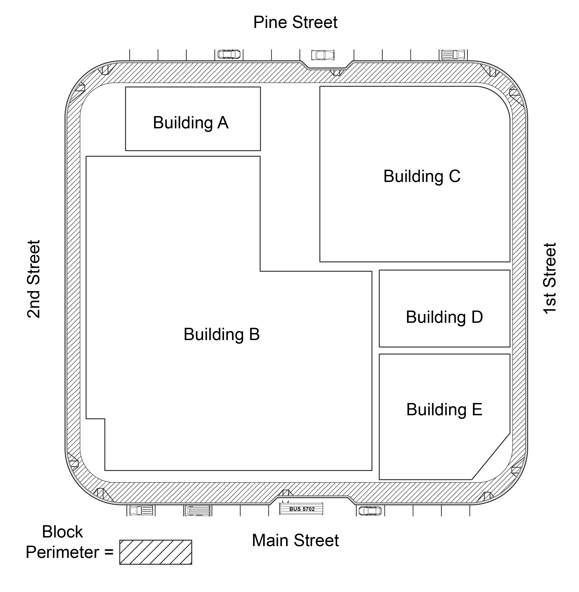

## Chapter 2:&nbsp; Scoping Requirements

### R201 General

#### R201.1 Scope

All newly constructed *pedestrian facilities* and *altered* portions of existing *pedestrian facilities* for *pedestrian* circulation and use located in the *public right-of-way* shall comply with these guidelines.

EXCEPTION:  *Pedestrian facilities* within vaults, tunnels, and other spaces used only by service personnel for maintenance, repair, or monitoring of equipment are not required to comply with these guidelines.

#### R201.2 Temporary and Permanent Pedestrian Facilities 

The requirements in these guidelines shall apply to temporary and permanent *pedestrian facilities* and *elements* in the *public right-of-way*. Where a *pedestrian* *circulation path* or *transit stop* is temporarily closed by construction, maintenance operations, or similar conditions, an alternate *pedestrian access route or transit stop* shall be provided in accordance withR204.

#### R201.3 Buildings, Structures, and Elements

*Buildings*, structures, and *elements* in the *public right-of-way* that are not covered by the requirements in these guidelines shall comply with the applicable requirements in 36 CFR part 1191 (ADA & ABA Accessibility Guidelines). Examples include, but are not limited to, *buildings*, structures, and *elements* at safety rest areas or park and ride lots, temporary performance stages and reviewing stands.

### R202 Alterations

#### R202.1 General 

_Alterations_ to _pedestrian facilities_ shall comply with R202.

#### R202.2 Connection to Pedestrian Circulation Path

Where _pedestrian facilities_ are _altered_, they shall be connected by a _pedestrian access route_ complying with R302 to an existing _pedestrian circulation path_.  A _transitional segment_ may be used in the connection.

#### R202.3 Existing Physical Constraints

In *alterations*, where existing physical constraints make compliance with applicable requirements technically infeasible, compliance with these requirements is required to the maximum extent feasible. Existing physical constraints include, but are not limited to, underlying terrain, underground structures, adjacent *developed* facilities, drainage, or the presence of a significant natural or historic feature.

#### R202.4 Reduction in Access Prohibited
An *alteration*  to *pedestrian facilities* or *elements* shall not decrease the accessibility of an existing *pedestrian facility* or *element* or an *accessible* connection to an adjacent *building* or site below the requirements in these guidelines.

#### R202.5 Alterations to Qualified Historic Facilities  
Where the State Historic Preservation Officer or Advisory Council on Historic Preservation determines that compliance with an applicable requirement of these guidelines would threaten or destroy the historic significance of a *qualified historic building or facility*, compliance with that requirement is required to the maximum extent feasible without threatening or destroying the historic significance of the *qualified historic building or facility.*

### R203 Pedestrian Access Routes

#### R203.1 General

Where provided, the *pedestrian facilities* addressed in R203 shall contain or connect a  *pedestrian access route*, and shall comply with these guidelines. 

#### R203.2 Connection to Accessible Facilities

*Pedestrian access routes* shall connect *accessible* *elements*, spaces, and *pedestrian facilities* in accordance with R203.2.

##### R203.2.1 Connection to Accessible Facilities subject to the ADA

*Pedestrian access routes* subject to the ADA shall connect *accessible* *elements*, spaces, and *pedestrian facilities* required to be *accessible* and connect to *accessible* routes required by section 206.2.1 of appendix B to 36 CFR part 1191 (ADA & ABA Accessibility Guidelines) that connect *building* and facility entrances to public *streets* and *sidewalks*. 

EXCEPTION: Where *elements* are *altered*, on or adjacent to an existing *pedestrian circulation path,* the existing *pedestrian circulation path* need not be *altered* to provide a *pedestrian access route* complying with R202.2. 

##### R203.2.2 Connection to Accessible Facilities subject to the ABA

*Pedestrian access routes* subject to the ABA shall connect *accessible* *elements*, spaces, and *pedestrian facilities* required to be *accessible* and connect to *accessible* routes required by section F206.2.1 of appendix C to 36 CFR part 1191 (ADA & ABA Accessibility Guidelines) that connect *building* and facility entrances to public *streets* and *sidewalks*. 

EXCEPTION: Where *elements* are *altered*, on or adjacent to an existing *pedestrian circulation path,* the existing *pedestrian circulation path* need not be *altered* to provide a *pedestrian access route* complying with R202.2. 

#### R203.3 Pedestrian Circulation Paths

*Pedestrian access routes* complying with R302 shall be provided within  *pedestrian circulation paths,* including *sidewalks* and *shared use paths*.  *Transitional segments* may be used to connect new or *altered* *pedestrian access routes* to existing *pedestrian circulation paths*, and the differences between adjacent surface characteristics shall be minimized to provide a smooth transition.

#### R203.4 Crosswalks

A *pedestrian access route* complying with R302 shall be provided within and for the full length of a *crosswalk*, including *medians* and *pedestrian refuge islands*.  *Crosswalks* shall comply with R306.

#### R203.5 Pedestrian At-Grade Rail Crossing

Where a *pedestrian circulation path* crosses at-grade rail tracks, a *pedestrian access route* complying with R302 shall be included within the *pedestrian* at-grade rail crossing.  *Pedestrian* at-grade rail crossings shall comply with R306.

#### R203.6 Curb Ramps and Blended Transitions

A *curb ramp*, *blended transition*, or a combination of *curb ramps* and *blended transition*s shall be provided in accordance with R203.6 and shall comply with R304. 

##### R203.6.1 Placement

Placement of *curb ramps* and *blended transition*s shall comply with R203.6.1.

###### R203.6.1.1 Crosswalks at an Intersection

At an intersection corner, one *curb ramp* or *blended transition* shall be provided for each *crosswalk*, or a single *blended transition* that spans all *crosswalks* at the intersection corner may be provided. Where *pedestrian* crossing is prohibited, *curb ramps* or *blended transitions* shall not be provided, and the *pedestrian circulation path* shall be either (a) separated from the *roadway* with landscaping or other non-prepared surface or (b) separated from the *roadway* by a detectable vertical edge treatment with a bottom edge 15 inches maximum above the *pedestrian circulation path*.

EXCEPTION: In *alterations*, where existing physical constraints make compliance with R203.6.1.1 technically infeasible, a single *curb ramp* complying with R304 shall be permitted at the apex of the intersection corner.

###### R203.6.1.2 Mid-Block and Roundabout Crosswalks

At a mid-block or *roundabout* *crosswalk*, *curb ramps* or *blended transitions* shall be provided on both ends of the *crosswalk*. Where *pedestrian* crossing is not intended, *curb ramps* or *blended transitions* shall not be provided, and the *pedestrian circulation path* shall be either (a) separated from the *roadway* with landscaping or other non-prepared surface or (b) separated from the *roadway* by a detectable vertical edge treatment with a bottom edge 15 inches maximum above the *pedestrian circulation path*.

###### R203.6.1.3 Parallel On-Street Parking

At parallel on-street parking spaces complying with the dimensions specified in R310.2.1, a *curb ramp* or *blended transition* shall be provided at either end of the parking space if needed to connect the parking space to a *pedestrian access route*. 

###### R203.6.1.4 Perpendicular and Angled On-Street Parking and Passenger Loading Zones

At perpendicular and angled on-street parking spaces, and at *passenger loading zones*, a *curb ramp* or *blended transition* shall be provided if needed to connect the access aisle to a *pedestrian access route*. 

##### R203.6.2 Alterations to Crosswalks

When *alterations* are made to *crosswalks*, *curb ramps* or *blended transition*s shall be provided on both ends of the *crosswalk* where the *pedestrian access route* crosses a *curb*.

#### R203.7 Pedestrian Overpasses and Underpasses

*Pedestrian* overpasses and underpasses shall contain a *pedestrian access route* complying with R302. Where an overpass, underpass, bridge, or similar structure is designed for *pedestrian* use only, or pedestrian and bicycle use only, and the approach slope to the structure exceeds 1:20 (5.0%), a *ramp* complying with R407, or an elevator or limited use/limited application elevator complying with sections 407 or 408 of Appendix D to 36 CFR part 1191 (ADA & ABA Accessibility Guidelines), shall be provided. Elevators and limited use/limited application elevators shall be unlocked and independently usable during the operating hours of the *pedestrian facility* served.

EXCEPTION:  In *alterations*, where existing physical constraints make compliance with R203.7 technically infeasible, a platform lift complying with section 410 of Appendix D to 36 CFR part 1191 (ADA & ABA Accessibility Guidelines) shall be permitted.

#### R203.8 Ramps

Where provided, *ramps* shall comply with R407.

#### R203.9. Elevators and Limited Use/Limited Application Elevators

Where provided, elevators and limited use/limited application elevators shall comply with sections 407 or 408 of Appendix D to 36 CFR part 1191 (ADA & ABA Accessibility Guidelines).

#### R203.10 Platform Lifts

In *alterations*, where the use of elevators or limited use elevators is not technically feasible, platform lifts may be used and shall comply with section 410 of Appendix D to 36 CFR part 1191 (ADA & ABA Accessibility Guidelines).

#### R203.11 Doors, Doorways, and Gates

Doors, doorways, and gates that are part of a *pedestrian access route* shall comply with section 404 of Appendix D to 36 CFR part 1191 (ADA & ABA Accessibility Guidelines).

### R204 Alternate Pedestrian Access Routes, Transit Stops, and Passenger Loading Zones 

#### R204.1 Alternate Pedestrian Access Route

When a *pedestrian circulation path* is temporarily not *accessible* due to construction, maintenance operations, closure, or other similar conditions, an alternate *pedestrian access route* must be provided and comply with R303 and R402.

EXCEPTION:  If establishing or maintaining an alternate *pedestrian access route* is technically infeasible due to site conditions or existing physical constraints, an alternate means of providing access for *pedestrians* with disabilities shall be permitted.

#### R204.2 Alternate Transit Stops

Where *accessible transit stops* are temporarily not *accessible* due to construction, maintenance operations, or other similar conditions, alternate *transit stops* complying with R309 shall be provided.

#### R204.3 Alternate Passenger Loading Zones

Where a permanently designated *passenger loading zone* is temporarily not *accessible* due to construction, maintenance operations, or other similar conditions, and a temporary *passenger loading zone* is provided, it must comply with R311. 

### R205 Detectable Warning Surfaces

#### R205.1 General

*Detectable warning surfaces* shall be provided in accordance with R205.

#### R205.2 Curb Ramps and Blended Transitions

*Curb ramps* shall have *detectable warning surfaces* complying with R205.2.1. *Blended transition*s shall have *detectable warning surfaces* complying with R205.2.2.

EXCEPTION: *Detectable warning surfaces* are not required on *curb ramps* and *blended transition*s used exclusively to connect *passenger loading zones,* *accessible* parallel on-street parking spaces, and access aisles for perpendicular and angled parking spaces to *pedestrian access routes*.

##### R205.2.1 Curb Ramps

*Curb ramps* located at *crosswalks* shall have *detectable warning surfaces* complying with R305.1 and either R305.2.1 or R305.2.2.

##### R205.2.2 Blended Transitions

*Blended transition*s located at *crosswalks* shall have *detectable warning surfaces* complying with R305.1 and R305.2.3.

#### R205.3 Pedestrian Refuge Islands

Cut-through *pedestrian refuge islands* shall have *detectable warning surfaces* complying with R305.1 and R305.2.4.

#### R205.4 Pedestrian At-Grade Rail Crossings

*Pedestrian* at-grade rail crossings not located within a *street* shall have *detectable warning surfaces* complying with R305.1 and R305.2.5. *Pedestrian* at-grade rail crossings located within a *street* at a *crosswalk* shall not have *detectable warning surfaces* adjacent to the railway.

#### R205.5 Boarding Platforms

*Boarding platform*s at *transit stops* that are not protected by screens or guards along the sides of the boarding and alighting areas facing the transit vehicles shall have *detectable warning surfaces* complying with R305.1 and R305.2.6.

#### R205.6 Sidewalk and Street-Level Rail Boarding and Alighting Areas

Boarding and alighting areas at *sidewalk* or *street*-level *transit stops* for rail vehicles that are not protected by screens or guards along the side of the boarding and alighting areas facing the rail vehicles shall have *detectable warning surfaces* complying with R305.1 and R305.2.7.

#### R205.7 Driveways

*Pedestrian circulation paths* at driveways controlled with yield or stop control devices or traffic signals shall have *detectable warning* *surfaces* complying with R305.2.8.

### R206 Pedestrian Signal Heads and Pedestrian Activated Warning Devices

#### R206.1 General

Where provided, *pedestrian signal heads* and *pedestrian activated warning devices* shall comply with R206.  The *accessible* features required by these guidelines shall be available at all times.

#### R206.2 Traffic Control Signals and Hybrid Beacons with Pedestrian Signal Heads

Where *pedestrian signal heads* are provided at *crosswalks*, the walk indication shall comply with R308.  *Pedestrian signal heads* must have a *pedestrian* *push button* complying with R307, except for R307.7, or passive detection or pretimed operation that activates audible and *vibrotactile* indications complying with R308. 

#### R206.3 Pedestrian Activated Warning Devices

*Pedestrian activated warning devices* shall have *pedestrian* *push buttons* complying with R307, except for R307.2 and R307.6, or passive detection that operates audible indications complying with R307.7. 

### R207 Protruding Objects and Vertical Clearance

#### R207.1 General

Protruding objects and vertical clearance along any portion of a *pedestrian circulation path* shall comply with R402.

### R208 Pedestrian Signs

#### R208.1 General
Where provided, signs intended solely for *pedestrians*, including transit signs, and all signs serving *shared use paths*, shall comply with R410.

EXCEPTIONS:  1. Transit schedules, timetables, and maps are not required to comply with R410.

2\. Signs mounted immediately above or incorporated into a *push button* detector unit are not required to comply with R410.

### R209 Street Furniture

#### R209.1 General

Where provided, street furniture shall comply with the applicable requirements in R209.

#### R209.2 Drinking Fountains

Drinking fountains shall comply with sections 602.1 through 602.6 of Appendix D to 36 CFR part 1191 (ADA & ABA Accessibility Guidelines).

#### R209.3 Public Street Toilets

Public street toilets shall be provided in accordance with R209.3.

##### R209.3.1 Permanent Public Street Toilets

Permanent public street toilets shall comply with sections 603 through 610 of Appendix D to 36 CFR part 1191 (ADA & ABA Accessibility Guidelines).

##### R209.3.2 Portable Toilet Units

Portable toilet units shall comply with section 603 of Appendix D to 36 CFR part 1191 (ADA & ABA Accessibility Guidelines). Where multiple single user portable toilet units are clustered at a single location, at least 5 percent, but no fewer than one of each type of the toilet units at each cluster shall be required to comply with 603 Appendix D to 36 CFR part 1191 (ADA & ABA Accessibility Guidelines). Portable toilet units complying with section 603 shall be identified by the International Symbol of Accessibility complying with R411.

#### R209.4 Tables

At least 5 percent of tables at each group of adjacent tables, but no fewer than one, shall comply with section 902 of Appendix D to 36 CFR part 1191 (ADA & ABA Accessibility Guidelines).

#### R209.5 Sales or Service Counters

Sales or service counters shall comply with section 904.4 of Appendix D to 36 CFR part 1191 (ADA & ABA Accessibility Guidelines).

EXCEPTION 1: Sales or service counters that are located in a *building* subject to the ADA that is not itself in the *public right-of-way* but that directly serve the *public right-of-way*, such as at a service window accessed from the *sidewalk*, may comply with section 227.3 of Appendix B to 36 CFR part 1191 (ADA & ABA Accessibility Guidelines).

EXCEPTION 2: Sales or service counters that are located in a *building* subject to the ABA that is not itself in the *public right-of-way* but that directly serve the *public right-of-way*, such as at a service window accessed from the *sidewalk*, may comply with section F227.3 of Appendix C to 36 CFR part 1191 (ADA & ABA Accessibility Guidelines).

#### R209.6 Benches

Benches, other than those that are part of tables complying with R209.4, shall comply with R209.6.

##### R209.6.1 Benches at Transit Stops and Shelters

Benches provided at *transit stops* shall have clear space complying with R404 next to either end of the bench, or if the bench has no end, such as a circular bench, the clear space shall either be integral to the bench or no more than 18 inches (455 mm) from the front of the bench. Benches provided within *transit shelters* shall have clear space complying with R309.2.2.

##### R209.6.2 Benches Not at Transit Stops and Shelters

At least 50 percent, but no less than one, of benches at each group of adjacent benches shall provide clear space complying with R404.  The clear space shall be located next to either end of the bench, or if the bench has no end, such as a circular bench, the clear space shall either be integral to the bench or no more than 18 inches (455 mm) from the front of the bench.

#### R209.7 Operable Parts of Other Fixed Elements

*Operable parts* of other fixed *elements* to be used by *pedestrians* shall comply with R403.

### R210 Transit Stops and Transit Shelters

#### R210.1 General

Where provided, *transit stops* and *transit shelters* shall comply with R309.

#### R210.2 Fare Vending Machines

Where provided at *transit stops* and *transit shelters*, fare vending machines shall comply with R403 and section 707 of Appendix D to 36 CFR part 1191 (ADA & ABA Accessibility Guidelines), except for 707.2 and 707.3.

#### R210.3. Operable Parts of Other Fixed Elements

*Operable parts* of  other fixed *elements* at *transit stops* and shelters intended to be used by *pedestrians* shall comply with R403.

### R211 On-Street Parking Spaces

#### R211.1 General

Where on-street parking is provided and is metered or designated by signs or pavement markings, accessible parking spaces complying with R310 shall be provided in accordance with R211 and Table R211.

EXCEPTIONS:  1.  On-street parking spaces designated exclusively as residential parking shall not be required to comply with R211 and shall not be counted for purposes of Table R211.

2\.  On-street parking spaces designated exclusively for commercial or law enforcement vehicles shall not be required to comply with R211 and shall not be counted for purposes of Table R211. 

3\.  Where on-street parking spaces are *altered*, the requirements of R211 shall apply only to the affected parking spaces until the minimum number of *accessible* on-street parking spaces as specified in Table R211 are provided.

#### R211.2 Parking on Block Perimeter

Where parking spaces are provided on a *block perimeter* and are metered or designated by signs or pavement markings, *accessible* parking spaces complying with R310 shall be provided in accordance with Table R211.  Where parking is metered or designated by signs or pavement markings, but individual spaces are not marked, each 20 feet (6.1 m) of *block perimeter* where parking is designated shall be counted as one parking space.

**Advisory:** Figures are provided for informational purposes only.
{: .advisory }

<figure class="center advisory">
  <figcaption>Figure R211.2 Example of block perimeter</figcaption>
  
</figure>

#### R211.3 Parking not on Block Perimeter

Where parking spaces are provided on a section of a *street* that is not part of a *block perimeter*, *accessible* parking spaces complying with R310 shall be provided in accordance with Table R211. Where parking is metered or designated by signs or pavement markings, but individual spaces are not marked, each 20 feet (6.1 m) of *street* where parking is designated shall be counted as one parking space.

#### Table R211 On-Street Parking Spaces

##### Table R211 On-Street Parking Spaces

| Total Number of Metered or Designated Parking Spaces | Minimum Required Number of Accessible Parking Spaces |
| -------- | --- |
| 1 to 25    | 1 |
| 26 to 50   | 2 |
| 51 to 75   | 3 |
| 76 to 100  | 4 |
| 101 to 150 | 5 |
| 151 to 200 | 6 |
| 201 and over | 4 percent of total |
{: .usa-table .usa-table--striped }

### R212 Passenger Loading Zones

#### R212.1 General

Where permanently designated *passenger loading zones* other than *transit stops* are provided, at least one *accessible* *passenger loading zone* complying with R311 shall be provided in every continuous 100 feet (30 m) of loading zone space, or fraction thereof.

### R213 Stairs and Escalators

#### R213.1 General

Where provided on *pedestrian circulation paths*, *stairs* shall comply with R408 and escalators shall comply with section 810.9 of Appendix D to 36 CFR part 1191 (ADA & ABA Accessibility Guidelines).  _Stairs_ and escalators shall not be part of _pedestrian access routes_.

### R214 Handrails

#### R214.1 General

Where provided on *pedestrian circulation paths*, handrails shall comply with R409.
