## Chapter 4:&nbsp; Supplemental Technical Requirements

**_Advisory:_ Figures are provided for informational purposes only.**
{: .advisory }

### R401 General

#### R401.1 Scope

The supplemental technical requirements in Chapter 4 shall apply where required by Chapter 2 or where referenced by a requirement in these guidelines.

### R402 Protruding Objects and Vertical Clearance

#### R402.1 General

Protruding objects and vertical clearance shall comply with R402.

#### R402.2 Protrusion Limits

Objects with leading edges more than 27 inches (685 mm) and less than 80 inches (2030 mm) above the walking surface shall not protrude horizontally more than 4 inches (100 mm) into *pedestrian circulation paths*.

EXCEPTION: Handrails shall be permitted to protrude 4 ½ inches (115 mm) maximum.

<figure class="advisory">
  <figcaption>Figure R402.2 Protrusion limits</figcaption>
  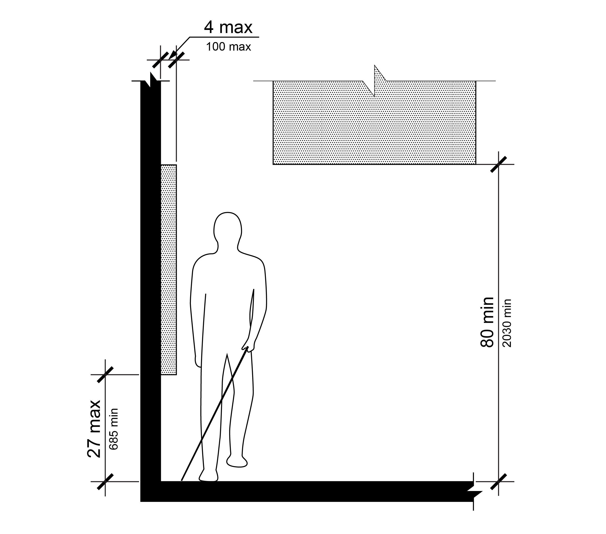
</figure>

#### R402.3 Post-Mounted Objects

Where objects are mounted on posts or pylons, they shall comply with R402.3.

EXCEPTION:  The sloping portions of handrails serving *stairs* and *ramps* shall not be required to comply with R402.3.

##### R402.3.1 Objects Mounted on Single Post or Pylon

Where objects are mounted on a single post or pylon and the objects are more than 27 inches (685 mm) and less than 80 inches (2030 mm) above the walking surface, the objects shall not protrude into the *pedestrian circulation path* more than 4 inches (100 mm) measured horizontally from the post or pylon or more than 4 inches (100mm) measured horizontally from the outside edge of the base where the base height is 2 ½ inches (64 mm) minimum.

  <figure>
    <figcaption>Figure R402.3.1(a) Objects mounted on single post or pylon</figcaption>
    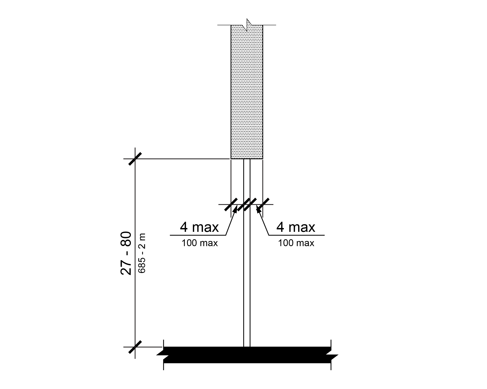
  </figure>
  <figure>
    <figcaption>Figure R402.3.1(b) Objects mounted on single post or pylon</figcaption>
    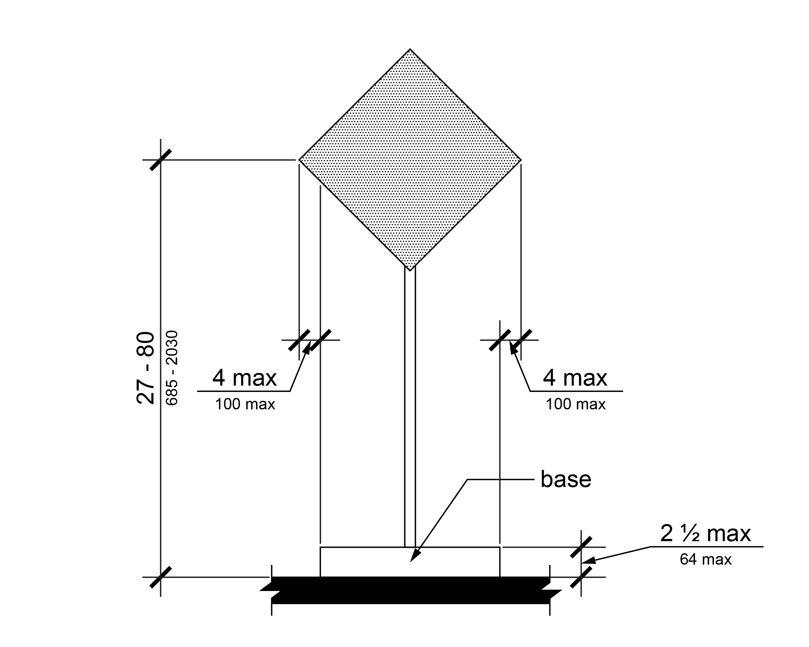
  </figure>

##### R402.3.2 Objects Mounted Between Posts or Pylons

Where objects are mounted between posts or pylons and the clear distance between the posts or pylons is greater than 12 inches (305 mm), the lowest edge of the object shall be 27 inches (685 mm) maximum or 80 inches (2030 mm) minimum above the walking surface.

EXCEPTION: Objects mounted with the lowest edge greater than 27 inches (685 mm) and less than 80 inches (2030 mm) above the walking surface are permitted if a barrier with its lowest edge at 27 inches (685 mm) maximum above the walking surface is provided between the posts or pylons.

<figure class="advisory">
  <figcaption>Figure R402.3.2 Objects mounted between posts or pylons</figcaption>
  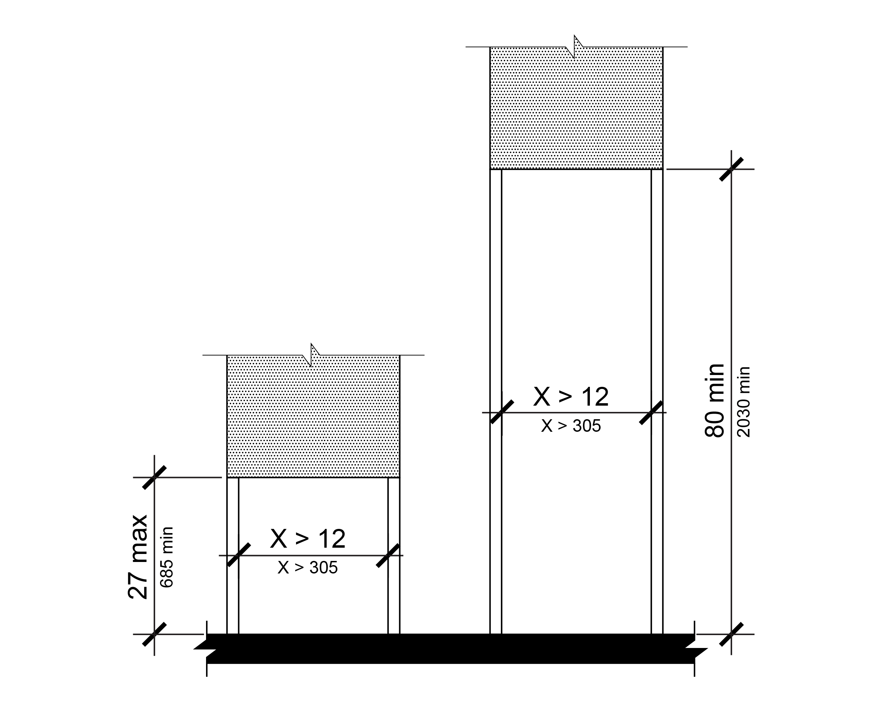
</figure>

#### R402.4 Vertical Clearance

Vertical clearance shall be 80 inches (2030 mm) high minimum. Guards or other barriers to prohibit *pedestrian* travel shall be provided where the vertical clearance is less than 80 inches (2030 mm) high above the walking surface. The lowest edge of the guard or barrier shall be located 27 inches (685 mm) maximum above the walking surface.

<figure class="advisory">
  <figcaption>Figure R402.4 Vertical Clearance</figcaption>
  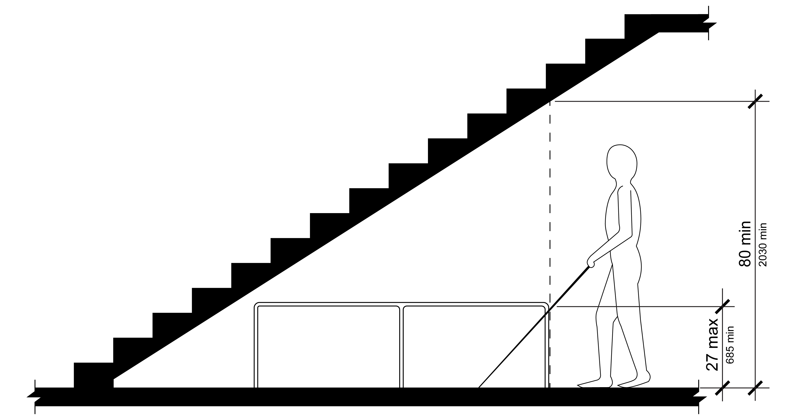
</figure>

#### R402.5 Required Clear Width

Protruding objects shall not reduce the clear width required for *pedestrian access routes*.

### R403 Operable Parts

#### R403.1 General

*Operable parts* shall comply with R403.

#### R403.2 Clear Space
A clear space complying with R404 shall be provided at *operable parts*.

#### R403.3 Height

*Operable parts* shall be placed within one or more of the reach ranges specified in R406.

#### R403.4 Operation

*Operable parts* shall be operable with one hand and shall not require tight grasping, pinching, or twisting of the wrist. The force required to activate *operable parts* shall be 5 pounds (22.2 N) maximum.

### R404 Clear Spaces

#### R404.1 General

Clear spaces shall comply with R404.

#### R404.2 Surfaces

Surfaces of clear spaces shall comply with R302.6.  The slope of the clear space shall be 1:48 (2.1%) maximum in both directions.

EXCEPTION: Where the slope of the clear space would exceed 1:48 (2.1%) in either or both directions due to the *grade* of an adjacent *pedestrian access route* conforming to the requirements of R302.4, the slope of the clear space may be consistent with the slope of the *pedestrian access route*.

#### R404.3 Size

Clear spaces shall be 30 inches (760 mm) minimum by 48 inches (1220 mm) minimum.

#### R404.4 Knee and Toe Clearance

Unless otherwise specified, clear spaces shall be permitted to include knee and toe clearance complying with R405.

#### R404.5 Position

Clear spaces shall be positioned either for forward approach where the 30-inch side is nearest to the *element*, or for parallel approach where the 48-inch side is nearest to the *element*. Clear spaces shall not be located on *curb ramp* runs or flares.

#### R404.6 Approach

One full unobstructed side of a clear space shall adjoin a *pedestrian access route* or adjoin another clear space.

#### R404.7 Maneuvering Clearance

Where a clear space is confined on all or part of three sides, additional maneuvering clearance shall be provided in accordance with R404.7.1 and R404.7.2.

##### R404.7.1 Forward Approach

The clear space and additional maneuvering clearance shall be 36 inches (915 mm) wide minimum where the depth of the confined space exceeds 24 inches (610 mm) measured perpendicular to the *element*.

##### R404.7.2 Parallel Approach

The clear space and additional maneuvering clearance shall be 60 inches (1525 mm) wide minimum where the depth of the confined space exceeds 15 inches (380 mm) measured perpendicular to the *element*.

### R405 Knee and Toe Clearance

#### R405.1 General

Where space beneath an *element* is included as part of a clear space, the space shall comply with R405. Additional space shall not be prohibited beneath an *element* but shall not be considered as part of the clear space.

<figure class="advisory">
  <figcaption>Figure R405.1 General</figcaption>
  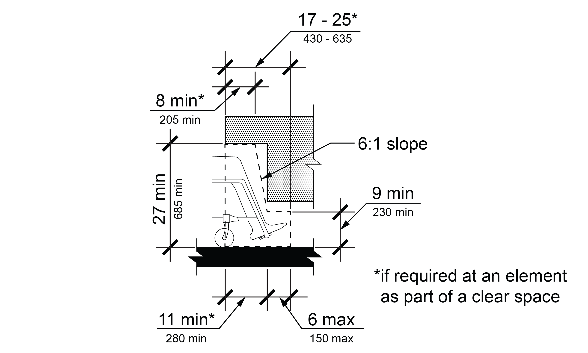
</figure>

#### R405.2 Toe Clearance

Toe clearance shall comply with R405.2.



  <figure>
    <figcaption>Figure R405.2(a) Toe clearance, elevation view</figcaption>
    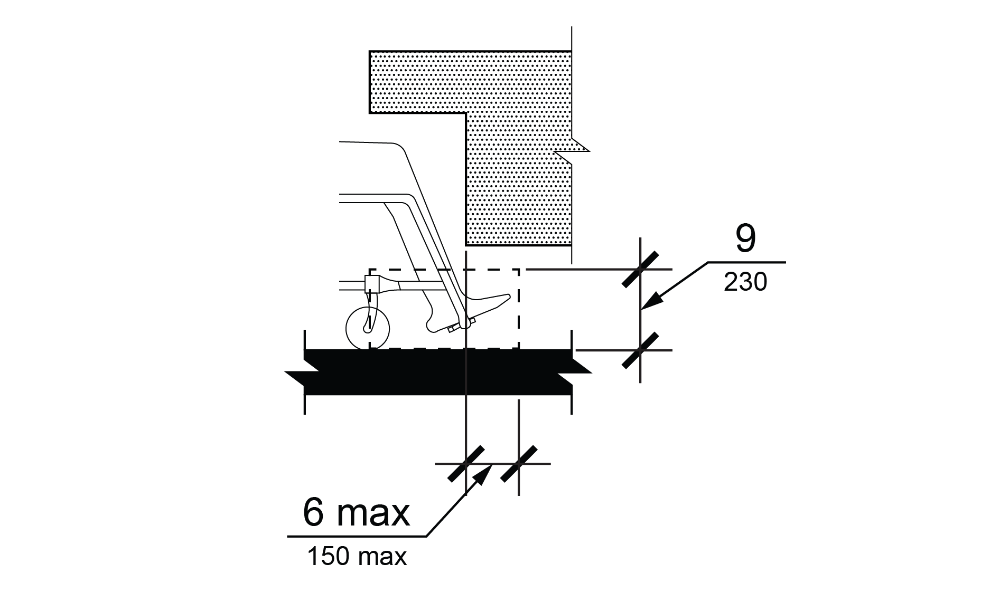
  </figure>
  <figure>
    <figcaption>Figure R405.2(b) Toe clearance, plan view 1 of 2</figcaption>
    
  </figure>
  <figure>
    <figcaption>Figure R405.2(c) Toe clearance, plan view 2 of 2</figcaption>
    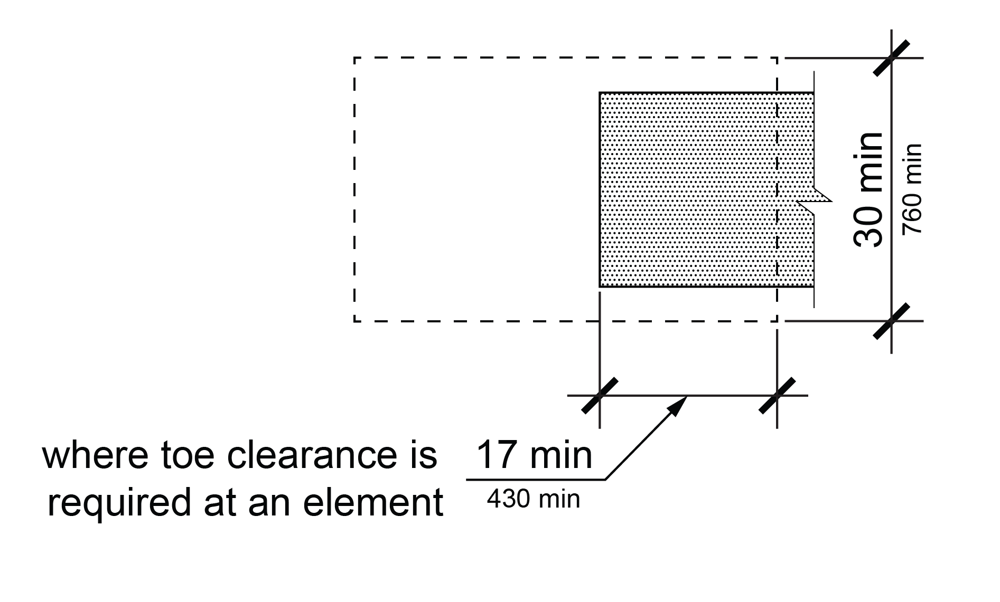
  </figure>



##### R405.2.1 General

Space under an *element* between the ground surface and 9 inches (230 mm) above the ground surface shall be considered toe clearance and shall comply with R405.2.

##### R405.2.2 Maximum Depth

Toe clearance shall extend 25 inches (635 mm) maximum under an *element*.

<figure class="advisory">
  <figcaption>Figure R405.2.2 Maximum Depth</figcaption>
  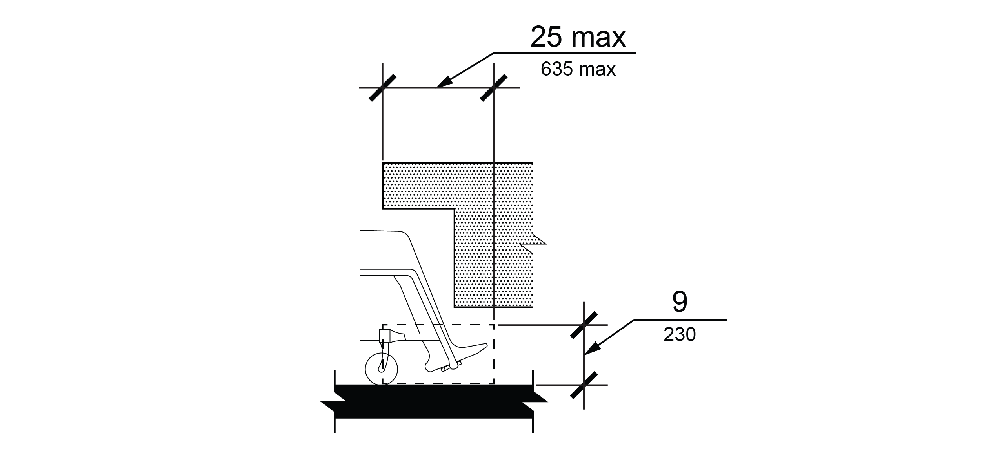
</figure>

##### R405.2.3 Minimum Required Depth

Where toe clearance is required at an *element* as part of a clear space, the toe clearance shall extend 17 inches (430 mm) minimum under the *element*.

<figure class="advisory">
  <figcaption>Figure R405.2.3 Minimum Required Depth</figcaption>
  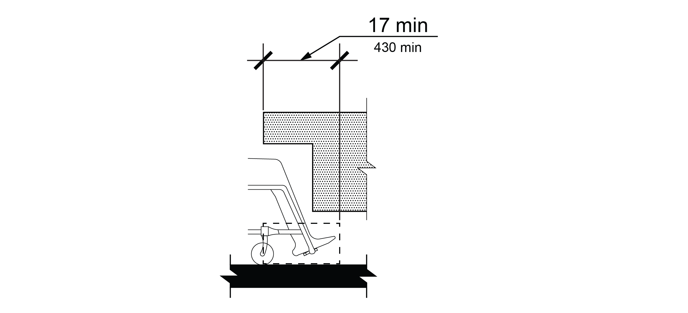
</figure>

##### R405.2.4 Additional Clearance

Space extending greater than 6 inches (150 mm) beyond the available knee clearance at 9 inches above the ground surface shall not be considered toe clearance.

<figure class="advisory">
  <figcaption>Figure R405.2.4 Additional Clearance</figcaption>
  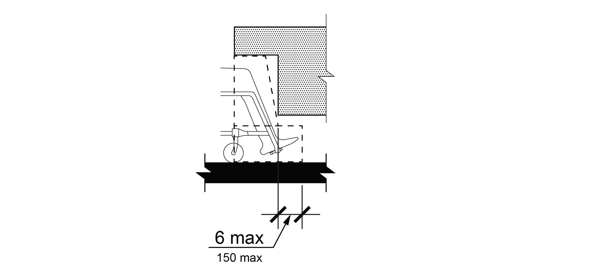
</figure>

##### R405.2.5 Width

Toe clearance shall be 30 inches (760 mm) wide minimum.

#### R405.3 Knee Clearance

Knee clearance shall comply with R405.3.



  <figure>
    <figcaption>Figure R405.3(a) Knee clearance, elevation view</figcaption>
    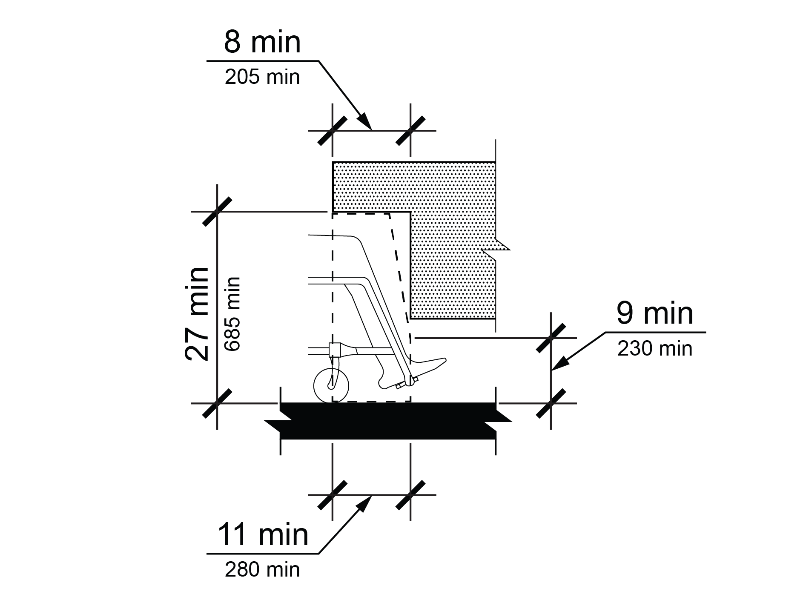
  </figure>
  <figure>
    <figcaption>Figure R405.3(b) Knee clearance, plan view</figcaption>
    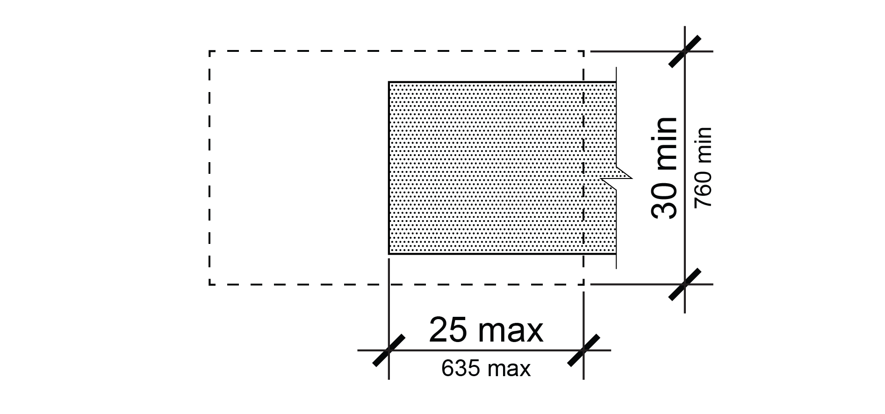
  </figure>



##### R405.3.1 General

Space under an *element* between 9 inches (230 mm) and 27 inches (685 mm) above the ground surface shall be considered knee clearance and shall comply with R405.3.

##### R405.3.2 Maximum Depth

Knee clearance shall extend 25 inches (635 mm) maximum under an *element* at 9 inches (230 mm) above the ground surface.

<figure class="advisory">
  <figcaption>Figure R405.3.2 Maximum Depth</figcaption>
  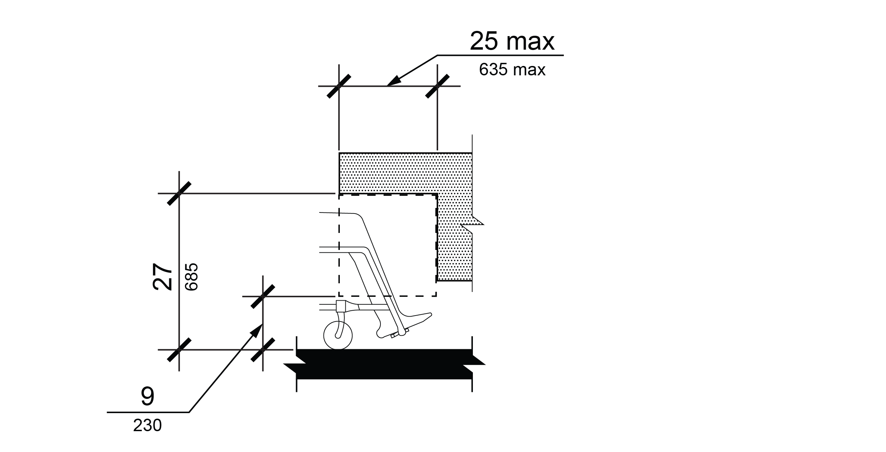
</figure>

##### R405.3.3 Minimum Required Depth

Where knee clearance is required under an *element* as part of a clear space, the knee clearance shall be 11 inches (280 mm) deep minimum at 9 inches (230 mm) above the ground surface, and 8 inches (205 mm) deep minimum at 27 inches (685 mm) above the ground surface.

<figure class="advisory">
  <figcaption>Figure R405.3.3 Minimum Required Depth</figcaption>
  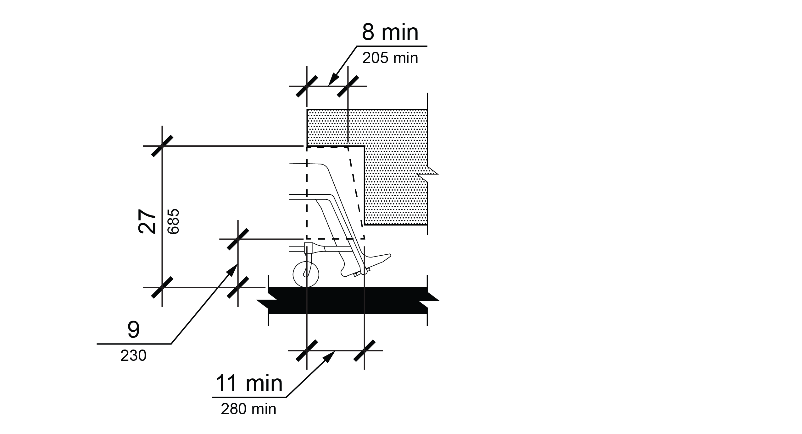
</figure>

##### R405.3.4 Clearance Reduction

Between 9 inches (230 mm) and 27 inches (685mm) above the ground surface, the knee clearance shall be permitted to reduce at a rate of 1 inch (25 mm) in depth for each 6 inches (150 mm) in height.

<figure class="advisory">
  <figcaption>Figure R405.3.4 Clearance Reduction</figcaption>
  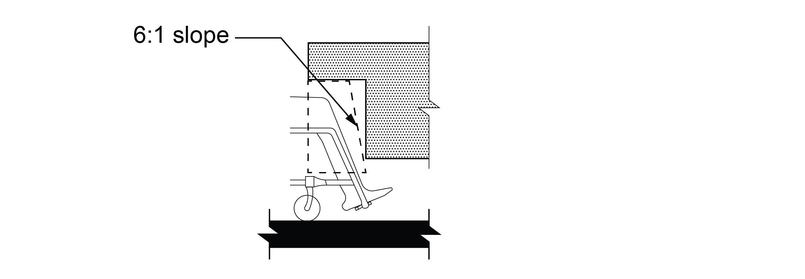
</figure>

##### R405.3.5 Width

Knee clearance shall be 30 inches (760 mm) wide minimum.

### R406 Reach Ranges

#### R406.1 General

Reach ranges shall comply with R406.

#### R406.2 Reach Range Limits

For forward and parallel approaches, the high reach shall be 48 inches (1220 mm) maximum and the low reach shall be 15 inches (380 mm) minimum above the ground surface.

  <figure>
    <figcaption>Figure R406.2(a) Forward reach range limits</figcaption>
    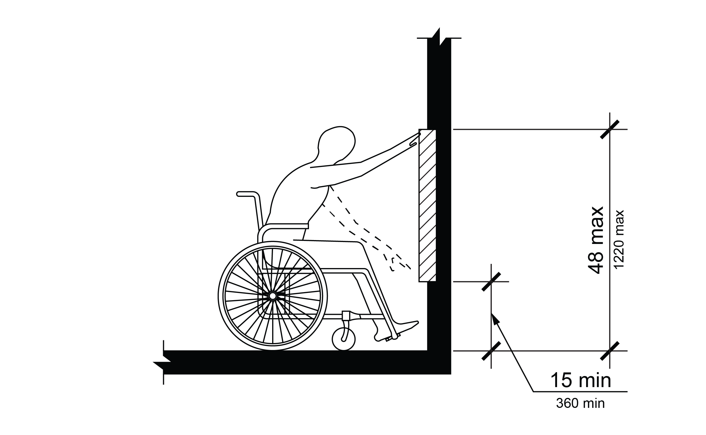
  </figure>
  <figure>
    <figcaption>Figure R406.2(b) Side reach range limits</figcaption>
    
  </figure>

#### R406.3 Obstructions

Obstructed reach shall comply with R406.3.

##### R406.3.1 Forward Reach

Where the clear space is configured solely for a forward approach to an *element*, obstructions shall not be permitted between the clear space and the *element* for a forward reach.

##### R406.3.2 Side Reach

Where a clear space is configured for a parallel approach to an *element*, an obstruction shall be permitted between the clear space and the *element* where the depth of the obstruction is 10 inches (255 mm) maximum and the height of the obstruction is 34 inches (865 mm) maximum.

<figure class="advisory">
  <figcaption>Figure R406.3.2 Obstructed side reach</figcaption>
  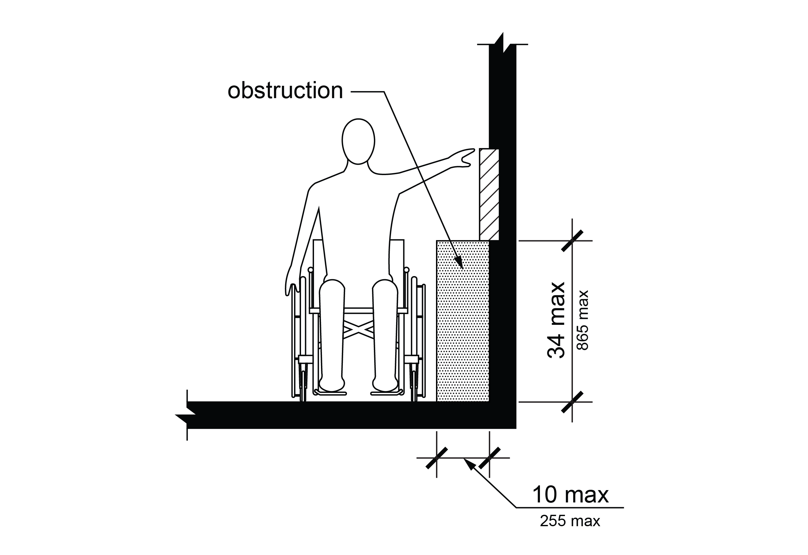
</figure>

### R407 Ramps

#### R407.1 General

*Ramps* shall comply with R407. R407 does not apply to *curb ramps* or *pedestrian access routes* following the *grade* established for the adjacent *street* consistent with the requirements of R302.4.1.

#### R407.2 Running Slope

The *running slope* of each *ramp* run shall be 1:12 (8.3%) maximum.

#### R407.3 Cross Slope

The *cross slope* of *ramp* runs shall be 1:48 (2.1%) maximum.

#### R407.4 Clear Width

The clear width of a *ramp* run shall be 48 inches (1220 mm) minimum. Where handrails are provided, the clear width between handrails shall be 48 inches (1220 mm) minimum.

EXCEPTION: Where a *ramp* only serves a *building* entrance, the clear width of the *ramp* run shall be permitted to be 36 inches (915 mm) minimum. Where handrails are provided, the clear width between handrails shall be permitted to be 36 inches (915 mm) minimum.

#### R407.5 Rise

The rise for any *ramp* run shall be 30 inches (760 mm) maximum.

#### R407.6 Landings

*Ramps* shall have landings at the top and the bottom of each *ramp* run. Landings shall comply with R407.6.

<figure class="advisory">
  <figcaption>Figure R407.6 Ramp landings</figcaption>
  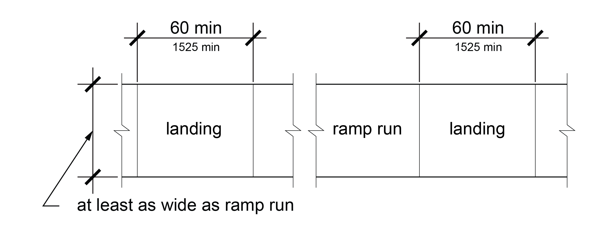
</figure>

##### R407.6.1 Slope

Landing slopes shall be 1:48 (2.1%) maximum parallel and perpendicular to the *ramp* *running slope*.

##### R407.6.2 Width

The landing clear width shall be at least as wide as the widest *ramp* run leading to the landing.

##### R407.6.3 Length

The landing clear length shall be 60 inches (1525 mm) long minimum.

##### R407.6.4 Change in Direction

*Ramps* that change direction between runs at landings shall have a clear landing 60 inches (1525 mm) minimum by 60 inches (1525 mm) minimum.

<figure class="advisory">
  <figcaption>Figure R407.6.4 Change_in_direction</figcaption>
  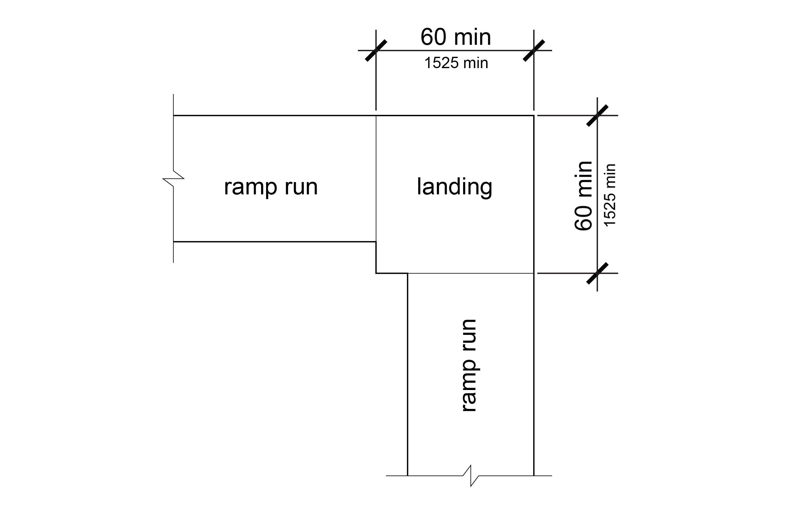
</figure>

#### R407.7 Surfaces

Surfaces of *ramp* runs and landings shall comply with R302.6, except that changes in level are not permitted.

#### R407.8 Handrails
*Ramp* runs with a rise greater than 6 inches (150 mm) shall have handrails complying with R409.

#### R407.9 Edge Protection

Edge protection complying with R407.9.1 or R407.9.2 shall be provided on each side of *ramp* runs and each side of *ramp* landings except those serving an adjoining ramp run, stairway, or other *pedestrian circulation path*. 

##### R407.9.1 Extended Ramp Surface

The surface of the *ramp* run or landing shall extend 12 inches (305 mm) minimum beyond the inside face of a handrail complying with R409.  

<figure class="advisory">
  <figcaption>Figure R407.9.1 Extended ramp surface</figcaption>
  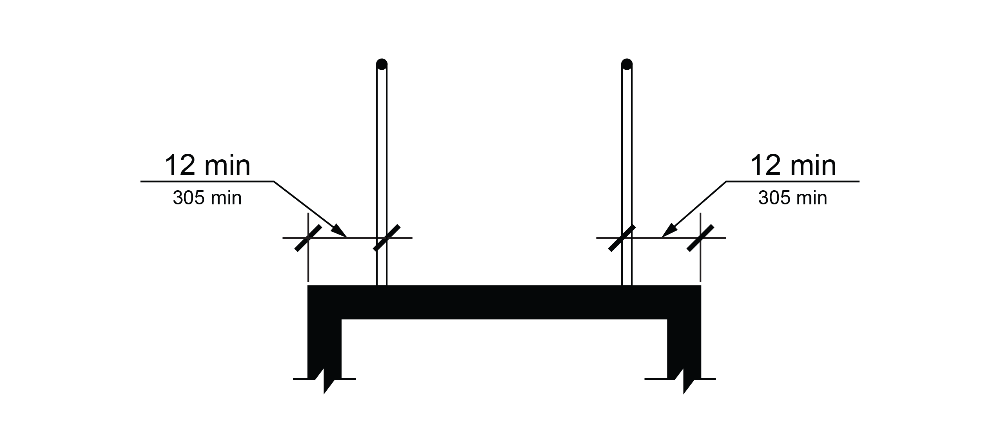
</figure>

##### R407.9.2 Curb or Barrier

A *curb* that is 4 inches (100 mm) high minimum, or a barrier that prevents the passage of a 4-inch (100 mm) diameter sphere, where any portion of the sphere is within 4 inches (100 mm) of the surface of the *ramp run* or landing, shall be provided.

### R408 Stairs

#### R408.1 General

*Stairs* shall comply with R408.

#### R408.2 Treads and Risers

All steps on a flight of *stairs* shall have uniform riser heights and uniform tread depths. Risers shall be 4 inches (100 mm) high minimum and 7 inches (180 mm) high maximum. Treads shall be 11 inches (280 mm) deep minimum.

#### R408.3 Open Risers

Open risers are not permitted.

#### R408.4 Tread Surface

*Stair* treads shall comply with R302.6, except that changes in level are not permitted.

EXCEPTION:  Treads shall be permitted to have a slope not steeper than 1:48 (2.1%).

#### R408.5 Nosings

The radius of curvature at the leading edge of the tread shall be ½ inch (13 mm) maximum. Nosings that project beyond risers shall have the underside of the leading edge curved or beveled. Risers shall be permitted to slope under the tread at an angle of 30 degrees maximum from vertical. The permitted projection of the nosing shall extend 1½ inches (38 mm) maximum over the tread below.

#### R408.6 Visual Contrast

The leading edge of each step tread and top landing shall be marked by a stripe. The stripe shall be 1 inch (25 mm) wide minimum and shall contrast visually with the rest of the step tread or circulation path surface either light-on-dark or dark-on-light.

#### R408.7 Handrails

*Stairs* shall have handrails complying with R409.

### R409 Handrails

#### R409.1 General

Handrails required at *ramps* and *stairs*, and handrails provided on *pedestrian circulation paths* shall comply with R409. R409 does not apply to *curb ramps*.

#### R409.2 Where Required

Handrails shall be provided on both sides of *ramps* and *stairs*.

#### R409.3 Continuity

Handrails shall be continuous within the full length of each *ramp* run or *stair* flight. Inside handrails on switchback or dogleg *ramps* and *stairs* shall be continuous between *ramp* runs or *stair* flights.

#### R409.4 Height

The top of gripping surfaces of handrails shall be 34 inches (865 mm) minimum and 38 inches (965 mm) maximum vertically above walking surfaces, *ramp* surfaces, and *stair* nosings. Handrails shall be at a consistent height above walking surfaces, *ramp* surfaces, and *stair* nosings.

<figure class="advisory">
  <figcaption>Figure R409.4(a) Ramp handrail height</figcaption>
  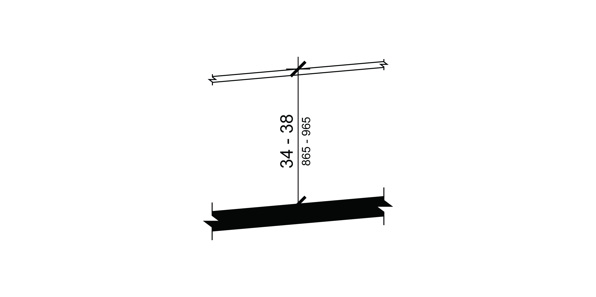
</figure>
<figure class="advisory">
  <figcaption>Figure R409.4(b) Stairway handrail height</figcaption>
  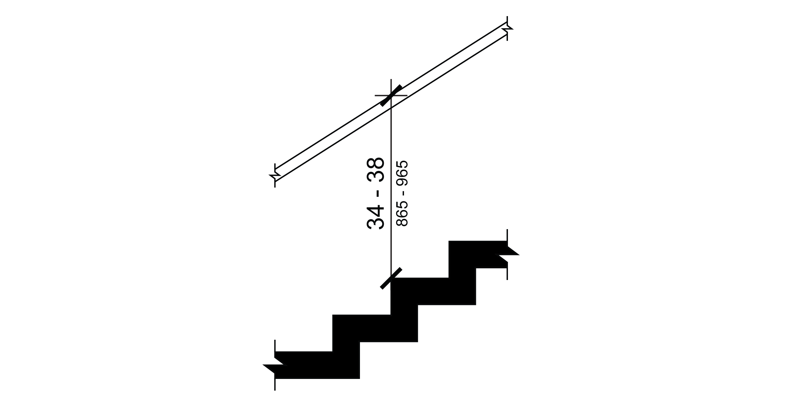
</figure>
<figure class="advisory">
  <figcaption>Figure R409.4(c) Handrail gripping surface height</figcaption>
  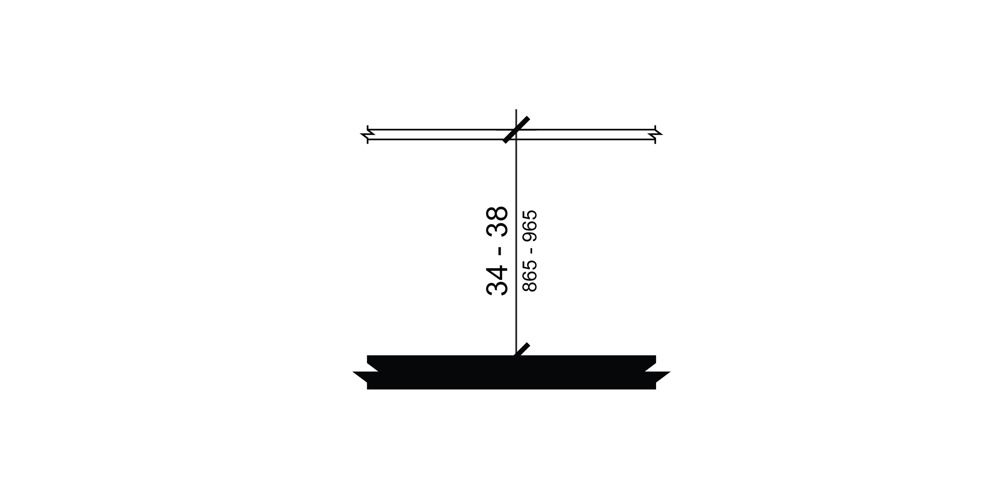
</figure>

#### R409.5 Clearance

Clearance between handrail gripping surfaces and adjacent surfaces shall be 1½ inches (38 mm) minimum.

#### R409.6 Gripping Surface

Handrail gripping surfaces shall be continuous along their length and shall not be obstructed along their tops or sides. The bottoms of handrail gripping surfaces shall not be obstructed for more than 20 percent of their length. Where provided, horizontal projections shall occur 1½ inches (38 mm) minimum below the bottom of the handrail gripping surface.

#### R409.7 Cross Section

Handrail gripping surfaces shall have a cross section complying with R409.7.1 or R409.7.2. Where expansion joints are necessary for large spans of handrails, the expansion joint cross section is permitted to be smaller than the specified cross section diameters for 1 inch (25 mm) maximum in length.

##### R409.7.1 Circular Cross Section

Handrail gripping surfaces with a circular cross section shall have an outside diameter of 1¼ inches (32 mm) minimum and 2 inches (51 mm) maximum.

##### R409.7.2 Non-Circular Cross Section

Handrail gripping surfaces with a non-circular cross section shall have a perimeter dimension of 4 inches (100 mm) minimum and 6¼ inches (160 mm) maximum, and a cross-section dimension of 2¼ inches (57 mm) maximum.

<figure class="advisory">
  <figcaption>Figure R409.7.2(a) Rectangular handrail cross section</figcaption>
  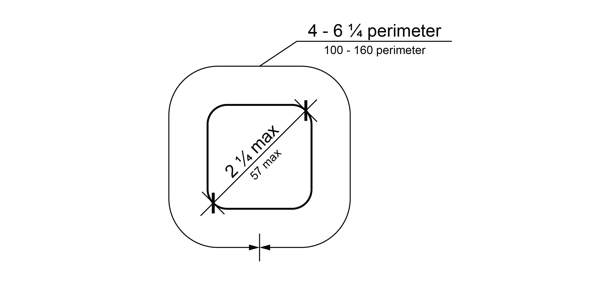
</figure>
<figure class="advisory">
  <figcaption>Figure R409.7.2(b) Elliptical handrail cross section</figcaption>
  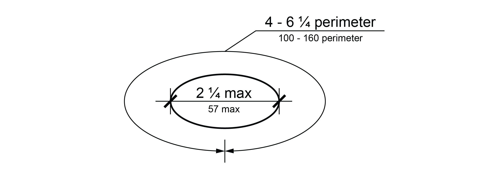
</figure>

#### R409.8 Surfaces

Handrail gripping surfaces and any surfaces adjacent to them shall be free of sharp or abrasive *elements* and shall have rounded edges.

#### R409.9 Fittings

Handrails shall not rotate within their fittings. Where expansion joints are necessary for large spans of handrails, the expansion joint is permitted to rotate in its fitting.

#### R409.10 Handrail Extensions

Handrail gripping surfaces shall extend beyond and in the same direction of *ramp* runs and *stair* flights in accordance with R409.10. Handrail extensions shall not extend into the *roadway or pedestrian circulation path*.  In *alterations*, if handrail extensions complying with R409.10 would reduce the clear width of a *pedestrian access route*, they shall extend as far as possible without reducing the clear width of the *pedestrian access route*.

EXCEPTION: Extensions shall not be required for continuous handrails at the inside turn of switchback or dogleg *ramps* and *stairs*.

##### R409.10.1 Top and Bottom Extension at Ramps

*Ramp* handrails shall extend horizontally above the landing for 12 inches (305 mm) minimum beyond the top and bottom of *ramp* runs. Extensions shall return to a wall, guard, or the landing surface, or shall be continuous to the handrail of an adjacent *ramp* run.

<figure class="advisory">
  <figcaption>Figure R409.10.1 Ramp handrail, top and bottom extension</figcaption>
  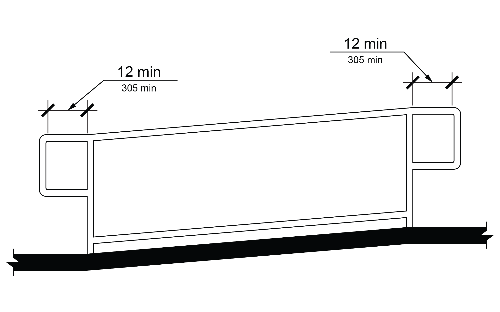
</figure>

##### R409.10.2 Top Extension at Stairs

At the top of a *stair* flight, handrails shall extend horizontally above the landing for 12 inches (305 mm) minimum beginning directly above the first riser nosing. Extensions shall return to a wall, guard, or the landing surface, or shall be continuous to the handrail of an adjacent *stair* flight.

<figure class="advisory">
  <figcaption>Figure R409.10.2 Stair handrail top extension</figcaption>
  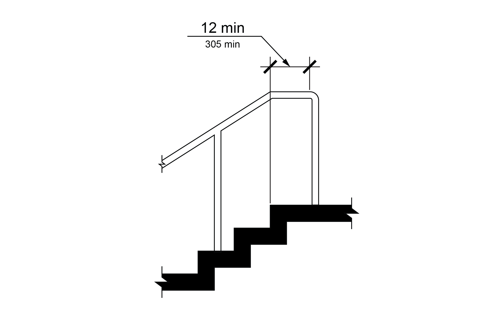
</figure>

##### R409.10.3 Bottom Extension at Stairs

At the bottom of a *stair* flight, handrails shall extend at the slope of the *stair* flight for a horizontal distance at least equal to one tread depth beyond the last riser nosing. Extensions shall return to a wall, guard, or the landing surface, or shall be continuous to the handrail of an adjacent *stair* flight.

<figure class="advisory">
  <figcaption>Figure R409.10.3 Stair handrail bottom extension</figcaption>
  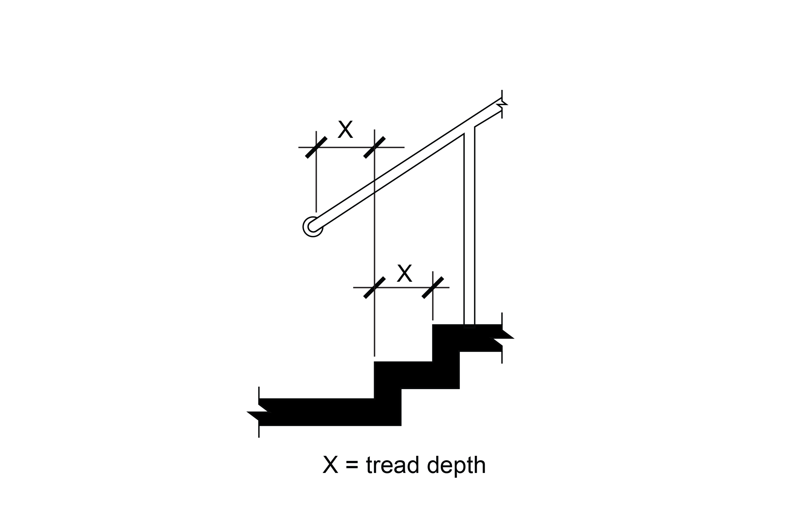
</figure>

### R410 Visual Characters on Signs

#### R410.1 General

Visual characters on signs shall comply with R410. 

#### R410.2 Finish and Contrast
Characters and their background shall have a non-glare finish. Characters shall contrast with their background with either light characters on a dark background or dark characters on a light background.

#### R410.3 Case

Characters shall be uppercase or lowercase or a combination of both.

#### R410.4 Style

Characters shall be conventional in form. Characters shall not be italic, oblique, script, highly decorative, or of other unusual forms.

#### R410.5 Character Proportions

Characters shall be selected from fontsmwhere the width of the uppercase letter "O" is 55 percent minimum and 110 percent maximum of the height of the uppercase letter "I".

#### R410.6 Character Height

Minimum character height shall comply with Table R410.6. Viewing distance shall be measured as the horizontal distance between the character and an obstruction preventing further approach towards the sign. Character height shall be based on the uppercase letter "I".

#### R410.6 Visual Character Height

##### Table R410.6 Visual Character Height

| Height to Finish Surface from Baseline of Character | Horizontal Viewing Distance | Minimum Character Height |
| --- | --- | --- |
| 40 inches (1015 mm) to less than or equal to 70 inches (1780 mm) | Less than 72 inches (1830 mm) | 5/8 inch (16 mm) |
| 40 inches (1015 mm) to less than or equal to 70 inches (1780 mm) | 72 inches (1830 mm) and greater | 5/8 inch (16 mm), plus 1/8 inch (3.2 mm) per foot (305 mm) of viewing distance above 72 inches (1830 mm) |
| Greater than 70 inches (1780 mm) to less than or equal to 120 inches (3050 mm) | Less than 180 inches (4570 mm) | 2 inches (51 mm) |
| Greater than 70 inches (1780 mm) to less than or equal to 120 inches (3050 mm) | 180 inches (4570 mm) and greater | 2 inches (51 mm), plus 1/8 inch (3.2 mm) per foot (305 mm) of viewing distance above 180 inches (4570 mm) |
| Greater than 120 inches (3050 mm) | Less than 21 feet (6400 mm) | 3 inches (75 mm) |
| Greater than 120 inches (3050 mm) | 21 feet (6400 mm) and greater | 3 inches (75 mm), plus 1/8 inch (3.2 mm) per foot (305 mm) of viewing distance above 21 feet (6400 mm) |
{: .usa-table .usa-table--striped }

#### R410.7 Stroke Thickness

Stroke thickness of the uppercase letter "I" shall be 10 percent minimum and 30 percent maximum of the height of the character.

#### R410.8 Character Spacing

Character spacing shall be measured between the two closest points of adjacent characters, excluding word spaces. Spacing between individual characters shall be 10 percent minimum and 35 percent maximum of character height.

#### R410.9 Line Spacing

Spacing between the baselines of separate lines of characters within a message shall be 135 percent minimum and 170 percent maximum of the character height.

#### R410.10 Height from Ground Surface

Visual characters shall be 40 inches (1015 mm) minimum above the ground surface.

### R411 International Symbol of Accessibility 

#### R411.1 General

The International Symbol of Accessibility shall comply with R411 and Figure R411.

#### R411.2 Finish and Contrast

The symbol and its background shall have a non-glare finish. The symbol shall contrast with its background with either a light symbol on a dark background or a dark symbol on a light background.

#### Figure R411 -- International Symbol of Accessibility

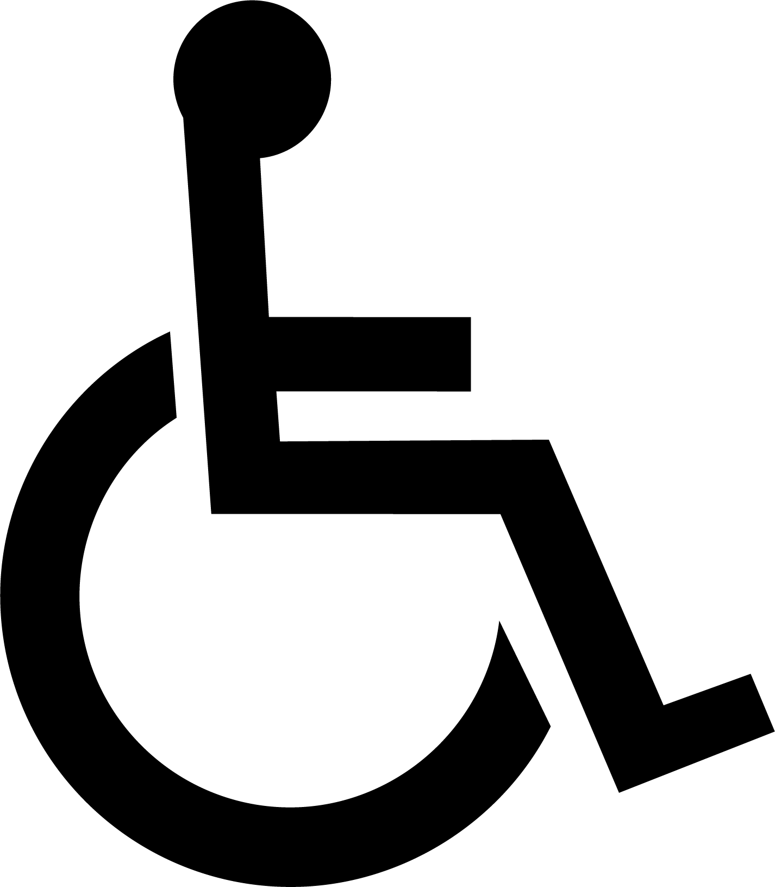
{: .img-medium }
