## Chapter 3:&nbsp; Technical Requirements

**_Advisory:_ Figures are provided for informational purposes only.**
{: .advisory }

### R301 General

#### R301.1 Scope

The technical requirements in Chapter 3 shall apply where required by Chapter 2 or where referenced by a requirement in these guidelines.

### R302 Pedestrian Access Routes

#### R302.1 General

*Pedestrian access routes* shall comply with R302.

#### R302.2 Continuous Clear Width

Except as provided in R302.2.1 and R302.2.2, the continuous clear width of *pedestrian access routes* shall be 48 inches (1220 mm) minimum, exclusive of the width of any *curb*.

<figure class="advisory">
  <figcaption>Figure R302.2 Continuous Clear Width</figcaption>
  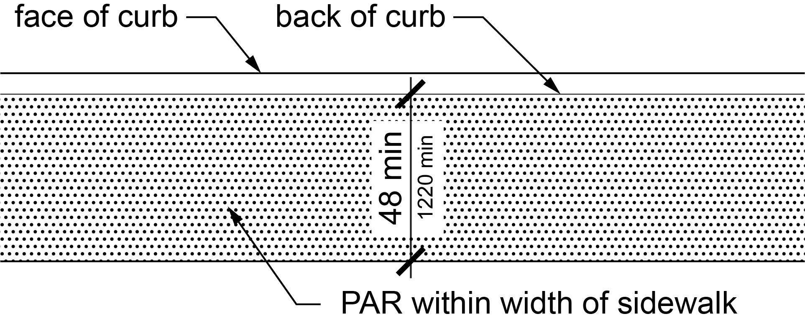
</figure>

##### R302.2.1 Medians and Pedestrian Refuge Islands

The clear width of *pedestrian access routes* crossing *medians* and *pedestrian refuge islands* shall be 60 inches (1525 mm) minimum, except that where *shared use paths* cross *medians* and *pedestrian refuge islands* the clear width of the *pedestrian access route* shall be 60 inches (1525 mm) minimum or at least as wide as the *crosswalk,* whichever is greater.

##### R302.2.2 Shared Use Paths

On *shared use paths*, the clear width of the *pedestrian access route* shall extend the full width provided for *pedestrian* circulation on the path. Obstructions, such as bollards, shall not reduce the clear width of the *pedestrian access route* to less than 48 inches (1220 mm) measured from the edge of the obstruction.

#### R302.3 Passing Spaces

Where the clear width of *pedestrian access routes* is less than 60 inches (1525 mm), passing spaces shall be provided at intervals of 200 feet (61 m) maximum.  Passing spaces shall be 60 inches (1525 mm) minimum by 60 inches (1525 mm) minimum.  Passing spaces and *pedestrian access routes* are permitted to overlap.

<figure class="advisory">
  <figcaption>Figure R302.3 Passing Spaces</figcaption>
  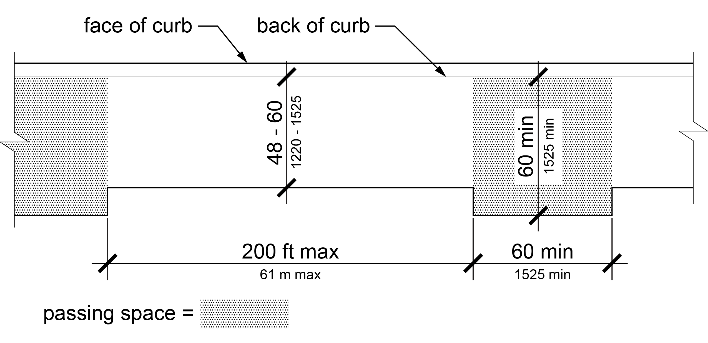
</figure>

#### R302.4 Grade

The *grade* of *pedestrian access routes* shall comply with R302.4, except the *grade* of *curb ramps* and *blended transitions* shall comply with R304 and the *grade* of *ramps* shall comply with R407.

##### R302.4.1 Within Highway Right-of-Way

Except as provided in R302.4.3, where a *pedestrian access route* is contained within a *highway* right-of-way, the *grade* of the *pedestrian access route* shall not exceed 1:20 (5.0%).

EXCEPTION: Where the *grade* established for the adjacent *street* exceeds 1:20 (5.0%), the *grade* of the *pedestrian access route* shall not exceed the *grade* established for the adjacent *street*.

##### R302.4.2 Not Within Highway Right-of-Way

Where a *pedestrian access route* is not contained within a *highway* right-of-way, the *grade* of the *pedestrian access route* shall not exceed 1:20 (5.0%).

##### R302.4.3 Within a Crosswalk

Where a *pedestrian access route* is contained within a *crosswalk*, the *grade* of the *pedestrian access route* shall be 1:20 (5.0%) maximum.

EXCEPTION: Where *roadway* design requires superelevation greater than 1:20 (5.0%) at the location of a *crosswalk*, the *grade* of the *pedestrian access route* within the *crosswalk* may be the same as the superelevation.

#### R302.5 Cross Slope

The *cross slope* of a *pedestrian access route* shall comply with R302.5.

##### R302.5.1 Not Contained Within a Crosswalk

The *cross slope* of a *pedestrian access route* not contained within a *crosswalk* shall be 1:48 (2.1%) maximum.

EXCEPTION:  The portion of a *pedestrian access route* within a *street* that connects an *accessible* parallel on-street parking space to the nearest *crosswalk* at the end of the block face or the nearest midblock *crosswalk* is not required to comply with R302.5.

##### R302.5.2 Contained Within a Crosswalk

The *cross slope* of a *pedestrian access route* contained within a *crosswalk* shall comply with R302.5.2.

###### R302.5.2.1 Crosswalk with Yield or Stop Control Devices

Where a *pedestrian access route* is contained within a *crosswalk* at an intersection approach with yield or stop control devices, the *cross slope* of the *pedestrian access route* shall be 1:48 (2.1%) maximum.

###### R302.5.2.2 Crosswalk at Uncontrolled Approach

Where a *pedestrian access route* is contained within a *crosswalk* at an uncontrolled approach, the *cross slope* of the *pedestrian access route* shall be 1:20 (5.0%) maximum.

###### R302.5.2.3 Crosswalk with Traffic Control Signal or Pedestrian Hybrid Beacon

Where a *pedestrian access route* is contained within a *crosswalk* at an intersection approach controlled by a traffic control signal or *pedestrian hybrid beacon*, the *cross slope* of the *pedestrian access route* shall be 1:20 (5.0%) maximum.

###### R302.5.2.4 Midblock and Roundabout Crosswalks

The *cross slope* of a *pedestrian access route* within a midblock *crosswalk* or a *crosswalk* at a *roundabout* shall not exceed the *street* *grade*.

#### R302.6 Surfaces

The walking surfaces of *pedestrian access routes*, *elements*, and spaces that are required to be *accessible* shall be stable, firm, and slip resistant and shall comply with R302.6.

##### R302.6.1 Grade Breaks

*Grade breaks* shall be flush.

##### R302.6.2 Changes in Level

Changes in level of ¼ inch (6.4 mm) maximum shall be permitted to be vertical.  Changes in level between ¼ inch (6.4 mm) and ½ inch (13 mm) shall be beveled with a slope not steeper than 1:2 (50.0%).  Changes in level greater than ½ inch (13 mm) up to 6 inches shall have a 1:12 (8.3%) maximum slope. Changes in level greater than 6 inches (150 mm) shall comply with R407.

  <figure>
    <figcaption>Figure R302.6.2(a) Vertical change in level</figcaption>
    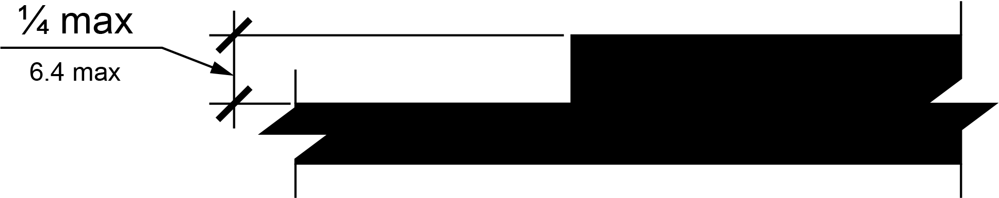
  </figure>
  <figure>
    <figcaption>Figure R302.6.2(b) Beveled change in level</figcaption>
    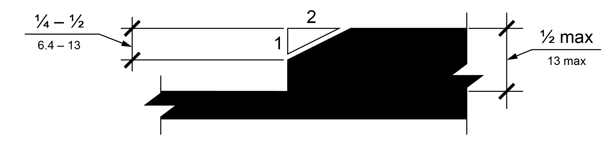
  </figure>

##### R302.6.3 Horizontal Openings

Horizontal openings in ground surfaces, such as those in gratings and joints, other than flangeway gaps (see R302.6.4), shall not allow passage of a sphere larger than ½ inch (13 mm) in diameter. Except where multiple directions of travel intersect, elongated openings are permitted and shall be placed so that the long dimension is perpendicular to the dominant direction of travel.

<figure class="advisory">
  <figcaption>Figure R302.6.3 Horizontal Openings</figcaption>
  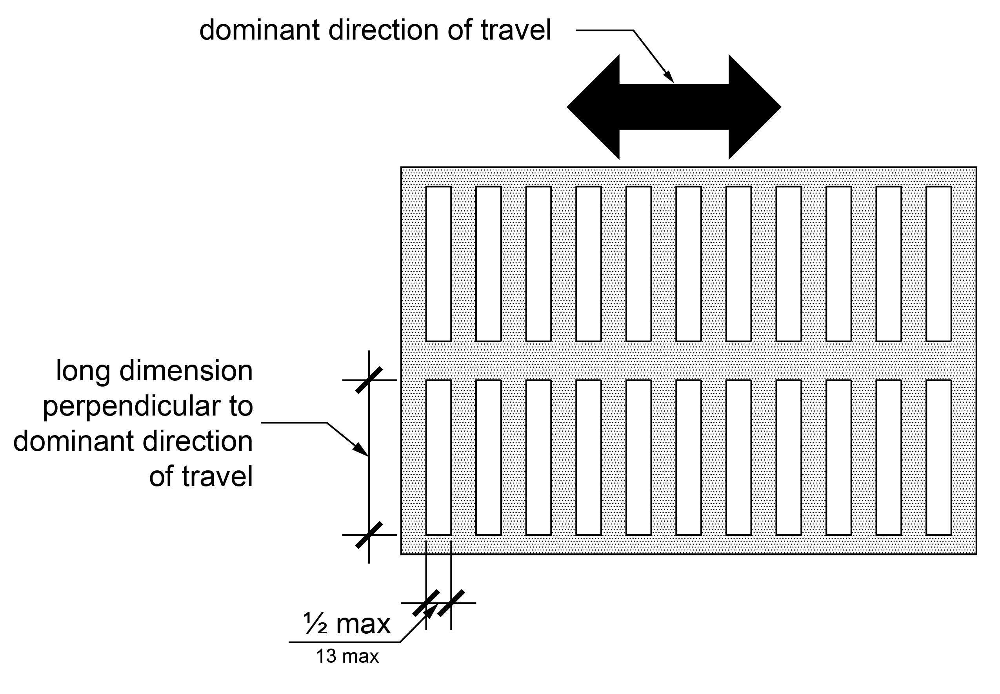
</figure>

##### R302.6.4 Surfaces at Pedestrian At-Grade Rail Crossings

Surfaces at *pedestrian* at-grade rail crossings shall comply with R302.6.4.

###### R302.6.4.1 Surface Alignment

Where a *pedestrian access route* crosses rails at grade, the *pedestrian access route* surface shall be level and flush with the top of rail at the outer edges of the rails, and the surface between the rails shall be aligned with the top of rail.

###### R302.6.4.2 Flangeway Gaps

Flangeway gaps shall comply with R302.6.4.2.

###### R302.6.4.2.1 Flangeway Gaps at Tracks Subject to FRA Safety Regulations

At *pedestrian* at-grade rail crossings that cross tracks that are subject to safety regulations at 49 CFR part 213, issued by the Federal Railroad Administration, flangeway gaps shall be 3 inches (75 mm) wide maximum.

<figure class="advisory">
  <figcaption>Figure R302.6.4.2.1 Flangeway gap at tracks subject to FRA safety regulations</figcaption>
  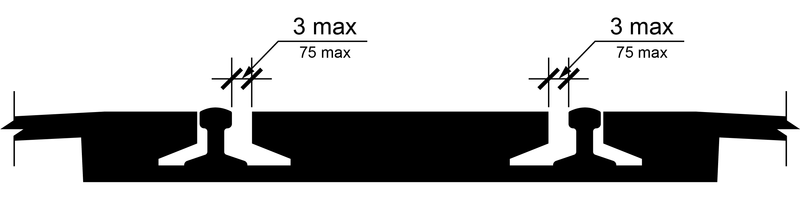
</figure>

###### R302.6.4.2.2 Flangeway Gaps at Tracks _Not_ Subject to FRA Safety Regulations safety regulations

At *pedestrian* at-grade rail crossings that cross tracks that are not subject to safety regulations at 49 CFR part 213, issued by the Federal Railroad Administration, flangeway gaps shall be 2½ inches (64 mm) wide maximum.

<figure class="advisory">
  <figcaption>Figure R302.6.4.2.2 Flangeway gap at tracks <i>not</i> subject to FRA</figcaption>
  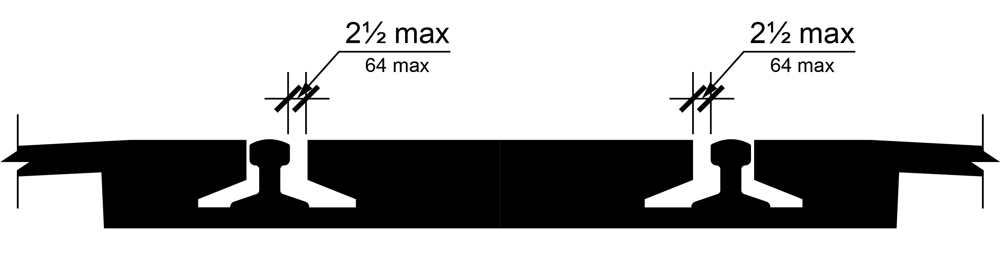
</figure>

### R303 Alternate Pedestrian Access Routes

#### R303.1 General

Alternate *pedestrian access routes* shall comply with R303.

#### R303.2 Signs

Signs identifying alternate *pedestrian access routes* shall be provided in advance of decision points and shall comply with R410. Proximity actuated audible signs or other non-visual means within the *public right-of-way* of conveying the information that identifies the alternate *pedestrian access route* shall also be provided.

#### R303.3 Surface

Alternate *pedestrian access route* surfaces shall comply with R302.6 or shall not be less *accessible* than the surface of the temporarily closed *pedestrian circulation path.*

#### R303.4 Continuous Clear Width

The minimum continuous clear width of alternate *pedestrian access routes* shall be 48 inches (1220 mm) exclusive of the width of any *curb*.

EXCEPTION: Where the alternate *pedestrian access route* utilizes an existing *pedestrian circulation path*, the width shall not be less than the width of the temporarily closed *pedestrian circulation path*.

#### R303.5 Curb Ramp or Blended Transition

Where an alternate *pedestrian access route* crosses a *curb*, a *curb ramp* or *blended transition* complying with R304 shall be provided.

#### R303.6 Detectable Edging of Channelizing Devices

Where a channelizing device is used to delineate an alternate *pedestrian access route*, continuous detectable edging complying with R303.6 shall be provided throughout the length of the route.

EXCEPTION: Where *pedestrians* or vehicles turn or cross, gaps in the detectable edging are permitted.

<figure class="advisory">
  <figcaption>Figure R303.6 Detectable edging of channelizing devices</figcaption>
  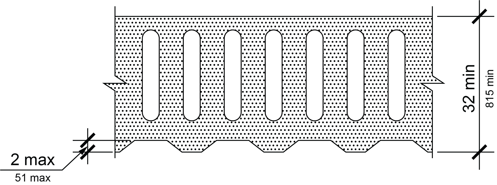
</figure>

##### R303.6.1 Top

The top of the top detectable edging shall be no lower than 32 inches (815 mm) above the walking surface and be free of sharp or abrasive surfaces.

##### R303.6.2 Bottom

The bottom of the bottom detectable edging shall be 2 inches (51 mm) maximum above the walking surface.

#### R303.7 Pedestrian Signal Heads

Where temporary *pedestrian* *signal heads* are provided at a *crosswalk* that is part of an alternate *pedestrian access route*, pedestrian pushbuttons or passive detection devices shall be provided and shall comply with R307.

### R304 Curb Ramps and Blended Transitions

#### R304.1 General

*Curb ramps* and *blended transition*s shall comply with R304 and have *detectable warning surfaces* in accordance with R205.

#### R304.2 Perpendicular Curb Ramps

*Perpendicular curb ramps* shall comply with R304.2 and R304.5.

##### R304.2.1 Running Slope

The *running slope* of a *curb ramp* shall be perpendicular to the curb or gutter *grade break*. The *running slope* of the *curb ramp* shall be 1:12 (8.3%) maximum.

EXCEPTION:  Where the *curb ramp* length must exceed 15 feet (4.6 m) to achieve a 1:12 (8.3%) *running slope*, the *curb ramp* length shall extend at least 15 feet (4.6 m) and may have a *running slope* greater than 1:12 (8.3%).

##### R304.2.2 Cross Slope

The *cross slope* of a *curb ramp* run shall be 1:48 (2.1%) maximum.

EXCEPTION: At *crosswalks*, the *cross slope* of the *curb ramp* run shall be permitted to be equal to or less than the *cross slope* of the *crosswalk* as specified by R302.5.

##### R304.2.3 Grade Breaks

*Grade breaks* at the top and bottom of a *curb ramp* run shall be perpendicular to the direction of the *curb ramp* run. *Grade breaks* shall not be permitted on the surfaces of *curb ramp* runs and landings. Surface slopes that meet at *grade breaks* shall be flush.

##### R304.2.4 Clear Area

A clear area 48 inches (1220 mm) wide minimum by 48 inches long (1220 mm) minimum shall be provided beyond the bottom *grade break* of the *perpendicular curb ramp* run and within the width of the *crosswalk*. At *shared use paths*, the clear area shall be as wide as *the shared use path*. The clear area shall be located wholly outside the vehicle travel lanes, including bicycle lanes, that run parallel to the *crosswalk*. The *running slope* of the clear area shall be 1:20 (5.0%) maximum. The *cross slope* of the clear area shall be as specified by R302.5.

  <figure>
    <figcaption>Figure R304.2.4(a) Clear area for perpendicular curb ramp</figcaption>
    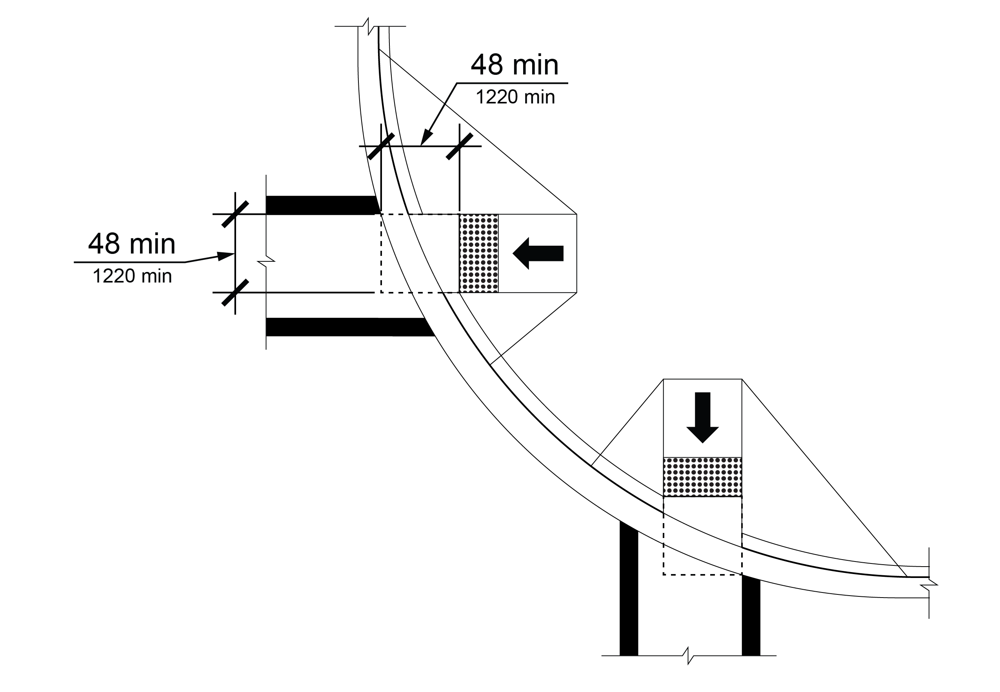
  </figure>
  <figure>
    <figcaption>Figure R304.2.4(b) Clear area for angled curb ramp</figcaption>
    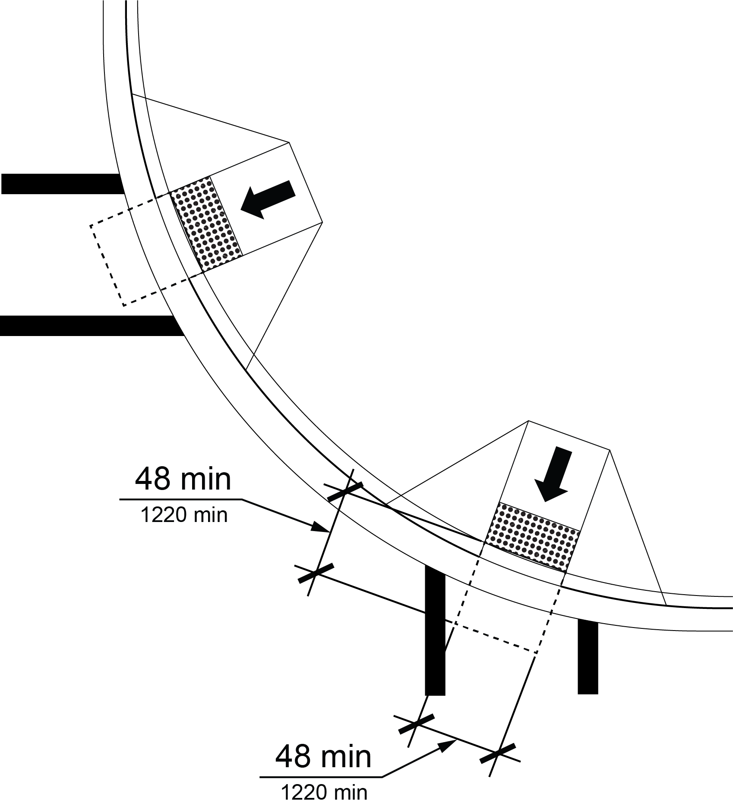
  </figure>

##### R304.2.5 Landing

When a change in direction is necessary to access a *curb ramp* from a *pedestrian access route*, a landing shall be provided at the top of the *curb ramp*. The landing shall be 48 inches (1220 mm) wide minimum by 48 inches (1220 mm) long minimum. At *shared use paths*, the landing shall be as wide as the *shared use path*. Where a landing serves only one *curb* ramp, the landing slope measured perpendicular to the *curb ramp* run shall be equal to or less than the *cross slope* of the *curb ramp* run, and the landing slope measured parallel to the *curb ramp* run shall be 1:48 (2.1%) maximum. Where a landing serves two *curb ramps*, the landing slope in either direction of travel shall not exceed the *cross slope* of the *crosswalk* parallel to the direction of travel as specified by R302.5.

<figure class="advisory">
  <figcaption>Figure R304.2.5 Landing</figcaption>
  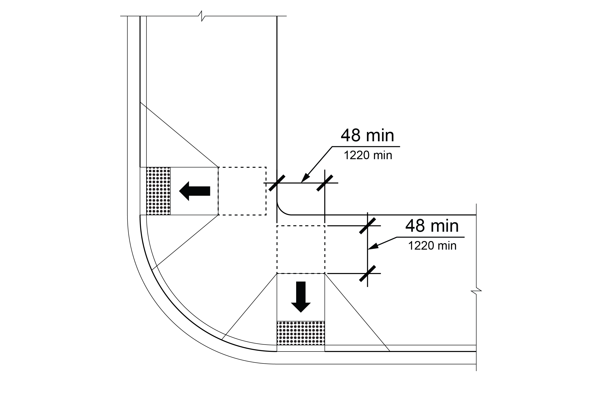
</figure>

##### R304.2.6 Side Treatments

Where a *pedestrian circulation path* crosses the side of a *curb ramp*, the side of the *curb ramp* shall be flared. The slope of the flared side shall be 1:10 (10.0%) maximum, measured parallel to the adjacent *curb line*.

<figure class="advisory">
  <figcaption>Figure R304.2.6 Side treatment</figcaption>
  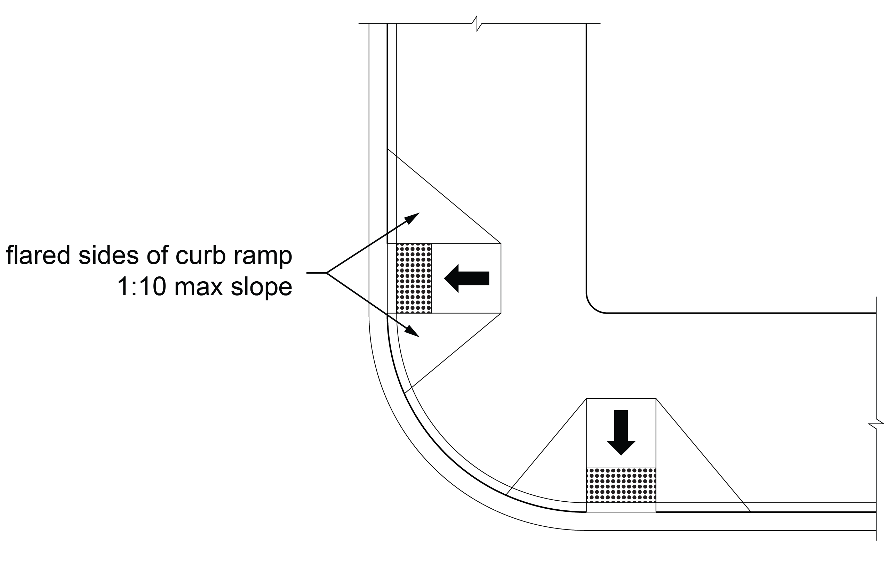
</figure>

##### R304.2.7 Connection to Pedestrian Facilities

*Perpendicular curb ramps* or their landings shall be connected to adjacent *pedestrian facilities* by *pedestrian access routes* complying with R302.  A *transitional segment* may be used in the connection.

#### R304.3 Parallel Curb Ramps

*Parallel curb ramps* shall comply with R304.3 and R304.5.

##### R304.3.1 Running Slope

The *running slope* of the *curb ramp* run shall be parallel to the curb and shall be 1:12 (8.3%) maximum.

EXCEPTION: Where the *curb ramp* run length must exceed 15 feet (4.6 m) to achieve a 1:12 (8.3%) *running slope*, the *curb ramp* run length shall extend at least 15 feet (4.6 m) and may have a *running slope* greater than 1:12 (8.3%).

##### R304.3.2 Cross Slope

The *cross slope* of the *curb ramp* run shall be 1:48 (2.1%) maximum.

##### R304.3.3 Grade Breaks

*Grade breaks* at the top and bottom of a *curb ramp* run shall be perpendicular to the direction of the *curb ramp* run.  *Grade breaks* shall not be permitted on the surfaces of *curb ramp* runs or landings.  Surface slopes that meet at *grade breaks* shall be flush.

<figure class="advisory">
  <figcaption>Figure R304.3.3 Grade breaks</figcaption>
  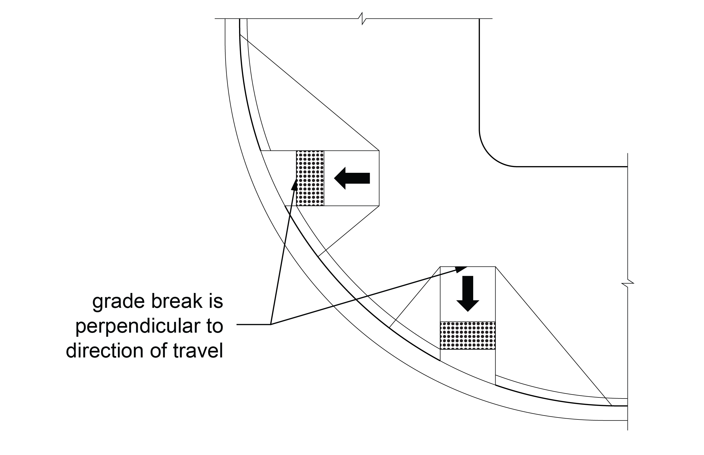
</figure>

##### R304.3.4 Landings

Landings shall be provided at the bottom of *parallel curb ramps*. Landings shall be 48 inches (1220 mm) wide minimum by 48 inches (1220 mm) long minimum.  The slope of the landing, measured parallel to the direction of travel on the *curb ramp* run, shall be permitted to be equal to or less than the slope of the *roadway* or the *cross slope* of the *crosswalk* as specified by R302.5. The *cross slope* of the landing shall be 1:48 (2.1%) maximum measured perpendicular to the direction of travel on the *curb ramp* run.

<figure class="advisory">
  <figcaption>Figure R304.3.4 Landings</figcaption>
  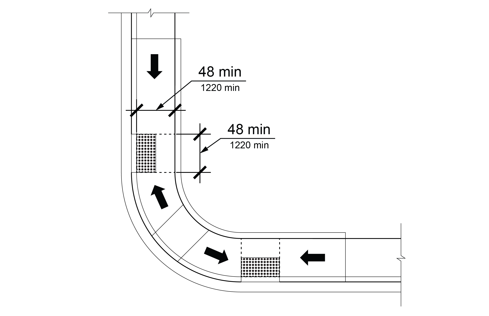
</figure>

#### R304.4 Blended Transitions

*Blended transition*s shall comply with R304.4 and R304.5.

##### R304.4.1 Running Slope

The *running slope* of *blended transition*s shall be 1:20 (5.0%) maximum.

<figure class="advisory">
  <figcaption>Figure R304.4.1 Running slope</figcaption>
  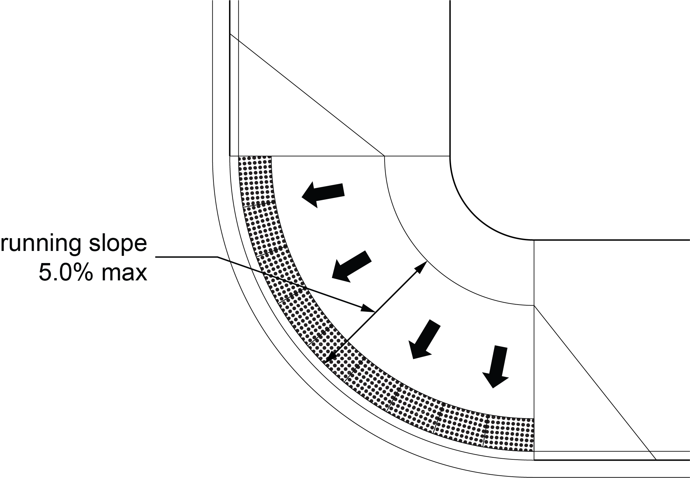
</figure>

##### R304.4.2 Cross Slope

The *cross slope* of *blended transition*s shall be equal to or less than the *cross slope* of the *crosswalk* as specified by R302.5.

##### R304.4.3 Bypass

Where a *blended transition* serving more than one *pedestrian circulation path* has a *running slope* greater than 1:48 (2.1%), a *pedestrian access route* shall be provided so that a *pedestrian* not crossing the *street* may bypass the *blended transition*.

<figure class="advisory">
  <figcaption>Figure R304.4.3 Blended transition bypass</figcaption>
  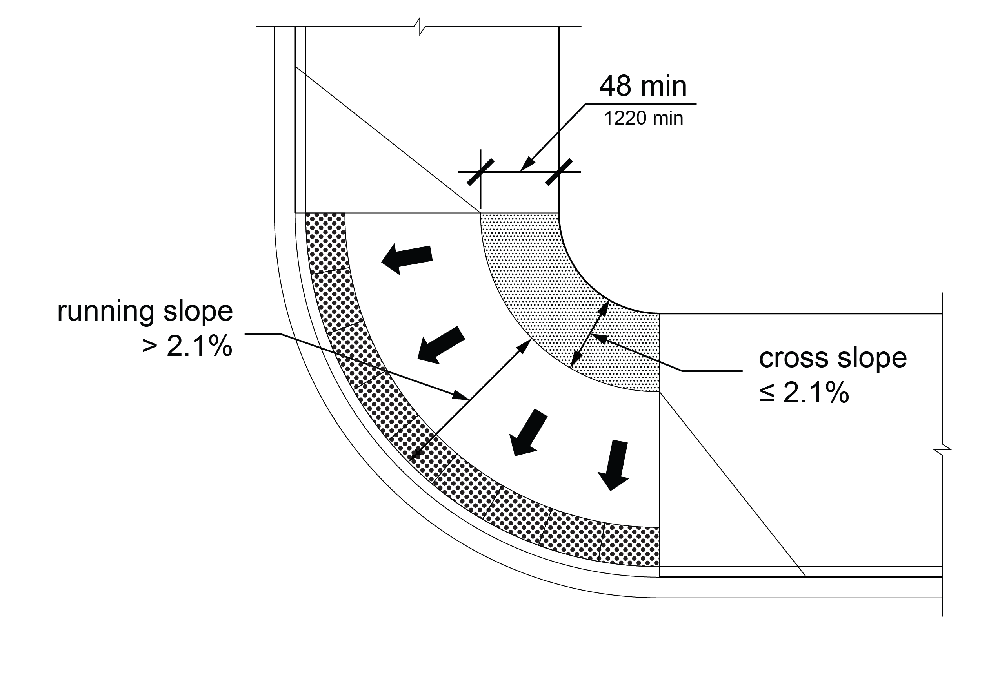
</figure>

#### R304.5 Common Requirements

*Curb ramps* and *blended transition*s shall comply with R304.5.

##### R304.5.1 Width

The width of *curb ramp* runs (excluding any flared sides) and *blended transition*s shall comply with R304.5.1.1 or R304.5.1.2, as applicable.

###### R304.5.1.1 Curb Ramps and Blended Transitions Not on Shared Use Paths

The clear width of *curb ramp* runs (excluding any flared sides) and *blended transition*s not on *shared use paths* shall be 48 inches (1220 mm) minimum.

<figure class="advisory">
  <figcaption>Figure R304.5.1.1 Curb ramps and blended transitions not on shared use paths</figcaption>
  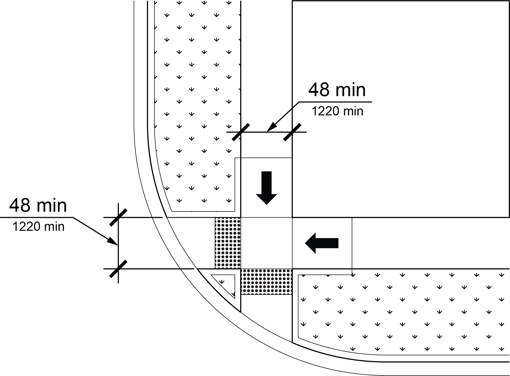
</figure>

###### R304.5.1.2 Curb Ramps and Blended Transitions on Shared Use Paths

On *shared use paths*, the width of *curb ramp* runs (excluding any flared sides) and *blended transition*s shall be equal to the width of the *shared use path*.

##### R304.5.2 Change of Grade

At gutters and *streets* where a change of *grade* occurs adjacent to *curb ramps* and *blended transition*s, the change of *grade* shall comply with the requirements contained in (A) or (B) below:

> A.  The change of *grade* shall not exceed 13.3 percent, or
>
> B.  A transitional space shall be provided at the bottom of the *running slope* of the *curb ramp* run or *blended transition*. The transitional space shall extend 24 inches (610 mm) minimum in the direction of *pedestrian* travel and the full width of the *curb ramp* run or *blended transition*. Transitional spaces shall have *running slopes* of 1:48 (2.1%) maximum and *cross slopes* no greater than the *cross slope* of the *crosswalk* as specified by R302.5.

  <figure>
    <figcaption>Figure R304.5.2(a) Change of grade, maximum slope</figcaption>
    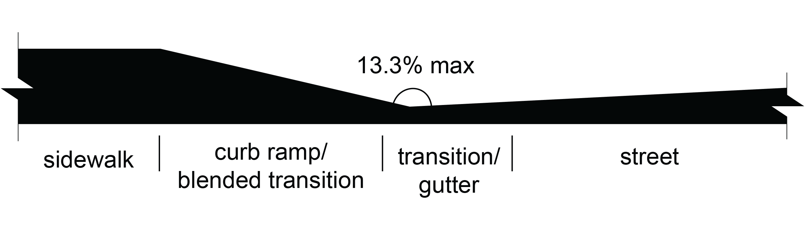
  </figure>
  <figure>
    <figcaption>Figure R304.5.2(b) Change of grade, transition space</figcaption>
    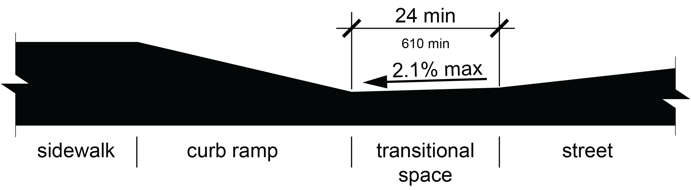
  </figure>

##### R304.5.3 Crosswalks

*Perpendicular curb ramp* runs, *parallel curb ramp* landings, and 48 inches (1220 mm) minimum width of *blended transition*s, except those at *shared use paths*, shall be contained wholly within the width of the *crosswalks* they serve. At *shared use paths*, the full width of a *perpendicular curb ramp* run, *parallel curb ramp* landing, or the *blended transition* shall be contained wholly within the width of the *crosswalk* it serves.

##### R304.5.4 Surfaces

Surfaces of *curb ramps* and *blended transitions* shall comply with R302.6 except that changes in level are not permitted.

### R305 Detectable Warning Surfaces

#### R305.1 General

*Detectable warning surfaces* shall consist of truncated domes in a square or radial grid pattern and shall comply with R305.

##### R305.1.1 Dome Size

The truncated domes shall have a base diameter of 0.9 inches (23 mm) minimum and 1.4 inches (36 mm) maximum, a top diameter of 50 percent of the base diameter minimum and 65 percent of the base diameter maximum, and a height of 0.2 inches (5.1 mm). When *detectable warning surface* tiles are cut to fit, partial domes are permitted along the cut edges.

<figure class="advisory">
  <figcaption>Figure R305.1.1 Dome size</figcaption>
  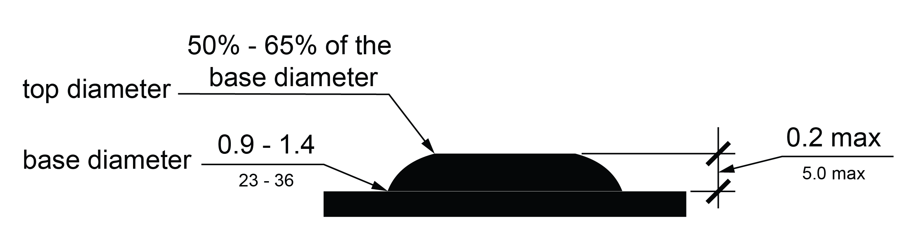
</figure>

##### R305.1.2 Dome Spacing

The truncated domes shall have a center-to-center spacing of 1.6 inches (41 mm) minimum and 2.4 inches (61 mm) maximum, and a base-to-base spacing of 0.65 inches (17 mm) minimum, measured between the most adjacent domes.

EXCEPTIONS: 1. When *detectable warning surfaces* are cut to fit, center-to-center spacing measured between domes adjacent to cut edges shall not exceed twice the normal spacing between domes not adjacent to cut edges.

2\. Dome spacing requirements do not apply at a gap in a *detectable warning surface* at an expansion joint provided that the *detectable warning surface* aligns with both edges of the expansion joint.

<figure class="advisory">
  <figcaption>Figure R305.1.2 Dome spacing</figcaption>
  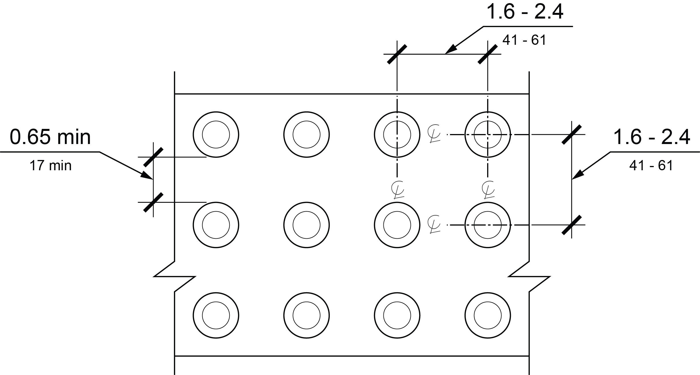
</figure>

##### R305.1.3 Contrast

*Detectable warning surfaces* shall contrast visually with adjacent walking surfaces, either light-on-dark or dark-on-light.

##### R305.1.4 Surface Size

*Detectable warning surfaces* shall extend 24 inches (610 mm) minimum in the direction of *pedestrian* travel. The width of *detectable warning surfaces* shall be as follows:

> A. At *curb ramps* and *blended transition*s, *detectable warning surfaces* shall extend the full width of the *curb ramp* run (excluding any flared sides), *blended transition*, or landing.
>
> B. At cut-through *pedestrian refuge islands*, *detectable warning surfaces* shall extend the full width of the *pedestrian circulation path* opening.
>
> C. At *pedestrian* at-grade rail crossings not located within a *street*, *detectable warning surfaces* shall extend the full width of the *pedestrian circulation path*.
>
> D. Where required at *boarding platform*s, *detectable warning surfaces* shall extend the full length of the unprotected areas of the platform.
>
> E. At boarding and alighting areas at *sidewalk* or *street* level *transit stops* for rail vehicles, detectable warning surfaces shall extend the full length of the unprotected area of the *transit stop*.

  <figure>
    <figcaption>Figure R305.1.4(a) Surface size, perpendicular curb ramp</figcaption>
    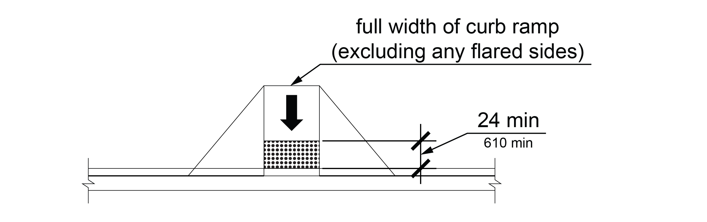
  </figure>
  <figure>
    <figcaption>Figure R305.1.4(b) Surface size, minimum parallel curb ramp</figcaption>
    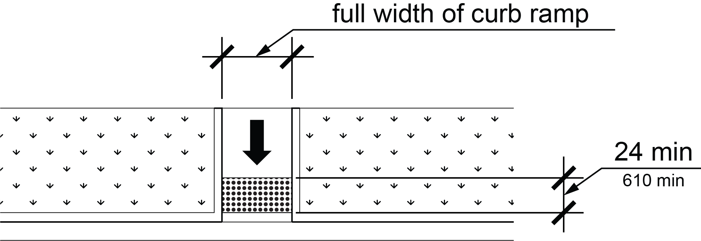
  </figure>

#### R305.2 Location

The location of *detectable warning surfaces* shall comply with R305.2.  Where a concrete border is required for proper installation of a *detectable warning surface*, a concrete border not exceeding 2 inches (51 mm) shall be permitted on all sides of the *detectable warning surface* except between the *detectable warning surface* and the edge of pavement where a setback is already permitted.

##### R305.2.1 Perpendicular Curb Ramps

On *perpendicular curb ramps*, *detectable warning surfaces* shall be located as follows:

> A.   Where the ends of the bottom *grade break* are in front of the back of *curb* or at the edge of pavement where there is no *curb*, the *detectable warning surface* shall be placed at the back of *curb* or no greater than 6 inches (150 mm) from the edge of pavement where there is no *curb*.
>
> B.   Where the ends of the bottom *grade break* are behind the back of *curb* or edge of pavement where there is no *curb* and the distance from both ends of the bottom *grade break* to the back of *curb* or edge of pavement where there is no *curb* is 60 inches (1525 mm) or less, the *detectable warning surface* shall be placed on the *ramp* run at the bottom *grade break*.
>
> C.   Where the ends of the bottom *grade break* are behind the back of *curb* or edge of pavement where there is no *curb* and the distance from either end of the bottom *grade break* to the back of *curb* or edge of pavement where there is no *curb* is more than 60 inches (1525 mm), the *detectable warning surface* shall be placed on the clear area so that both front corners of the *detectable warning surfaces* are at the back of *curb* or no greater than 6 inches (150 mm) from the edge of pavement where there is no *curb*.

  <figure>
    <figcaption>Figure R305.2.1(a) A. Perpendicular curb ramp with returned sides</figcaption>
    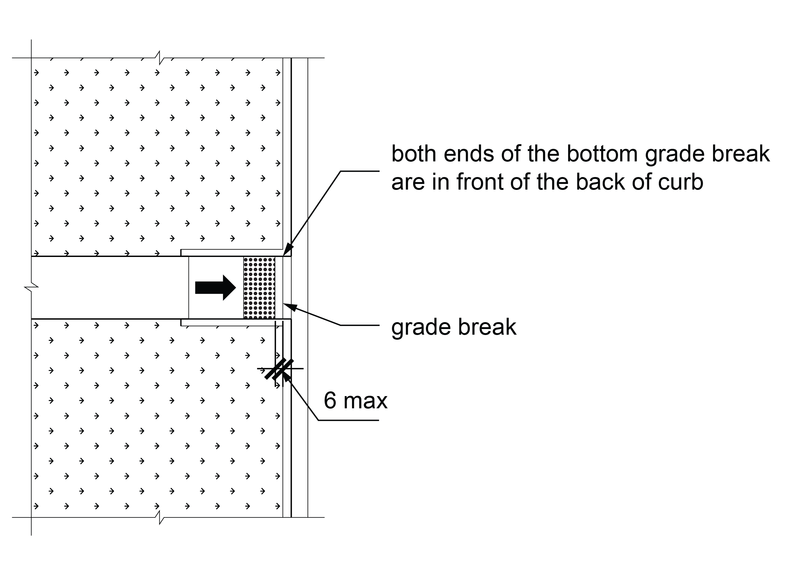
  </figure>
  <figure>
    <figcaption>Figure R305.2.1(b) B. Perpendicular curb ramp at street corner</figcaption>
    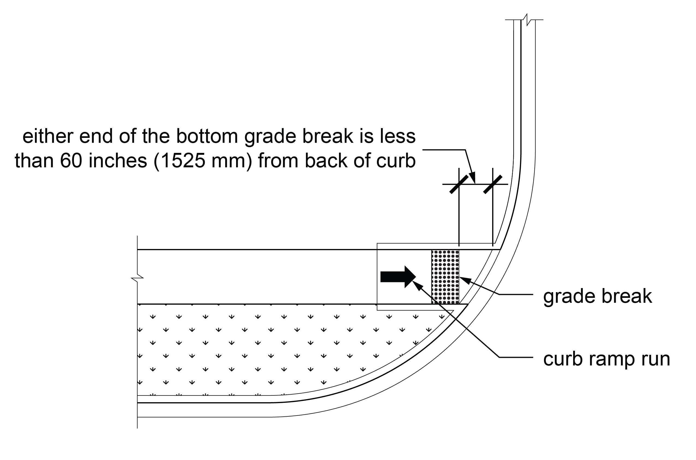
  </figure>
  <figure>
    <figcaption>Figure R305.2.1(c) C. Perpendicular curb ramp</figcaption>
    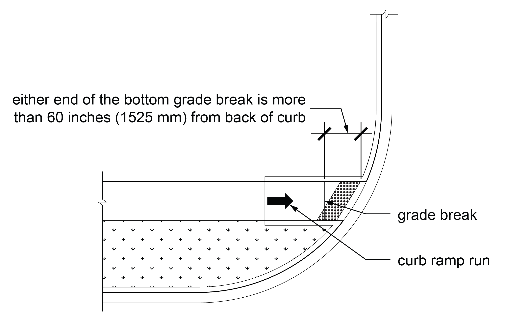
  </figure>

##### R305.2.2 Parallel Curb Ramps

On *parallel curb ramps*, *detectable warning surfaces* shall be located on the landing at either the back of *curb* or the edge of pavement where there is no *curb*.

<figure class="advisory">
  <figcaption>Figure R305.2.2 Parallel curb ramps</figcaption>
  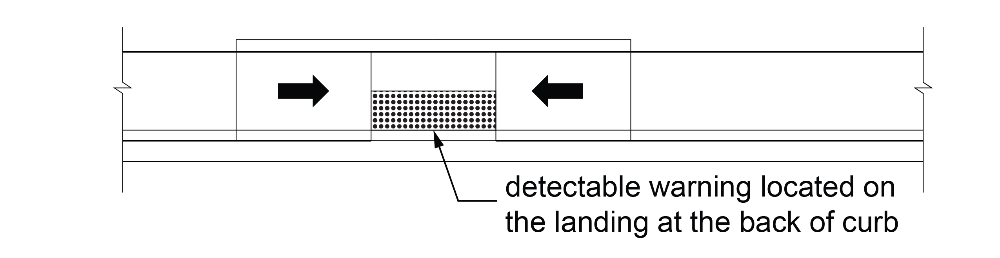
</figure>

##### R305.2.3 Blended Transitions

On *blended transition*s, *detectable warning surfaces* shall be located on the *blended transition* so that both front corners of the *detectable warning surfaces* are at the back of *curb* or no greater than 6 inches (150 mm) from the edge pavement where there is no *curb*.

  <figure>
    <figcaption>Figure R305.2.3(a) Blended transition, street corner</figcaption>
    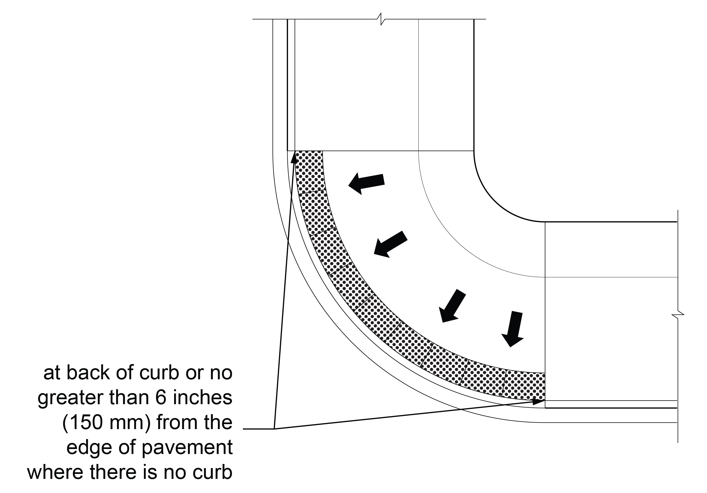
  </figure>
  <figure>
    <figcaption>Figure R305.2.3(b) Blended transition, mid-block crossing</figcaption>
    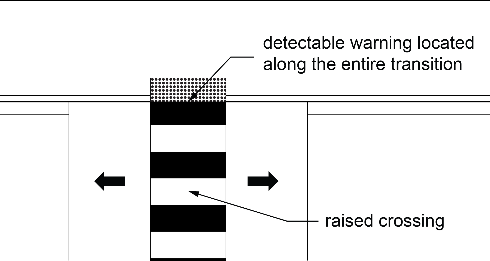
  </figure>

##### R305.2.4 Pedestrian Refuge Islands

At cut-through *pedestrian refuge islands*, *detectable warning surfaces* shall be located no greater than 6 inches (150 mm) from the edges of the *pedestrian refuge island* or at back of *curb* and shall be separated by a 24 inch (610 mm) minimum length of surface in the direction of travel without *detectable warning surfaces*.

<figure class="advisory">
  <figcaption>Figure R305.2.4 Pedestrian refuge islands</figcaption>
  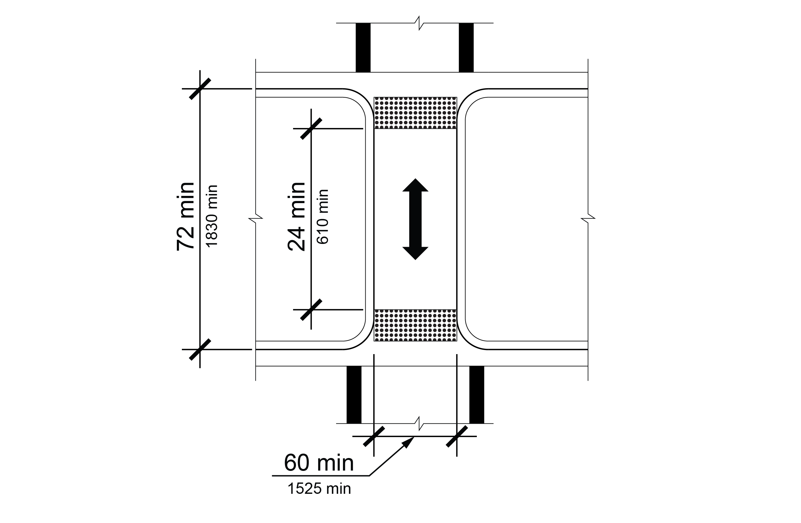
</figure>

##### R305.2.5 Pedestrian At-Grade Rail Crossings

At *pedestrian* at-grade rail crossings not located within a *street*, *detectable warning* *surfaces* shall be located on each side of the rail crossing. The edge of the *detectable warning surface* nearest the rail crossing shall be 6 feet (1.8 m) minimum and 15 feet (4.6 m) maximum from the centerline of the nearest rail. Where *pedestrian* gates are provided, *detectable warning surfaces* shall be located on the side of the gate opposite the rail. *Pedestrian* gates shall not overlap *detectable warning surfaces*.

<figure class="advisory">
  <figcaption>Figure R305.2.5 Pedestrian at-grade rail crossings</figcaption>
  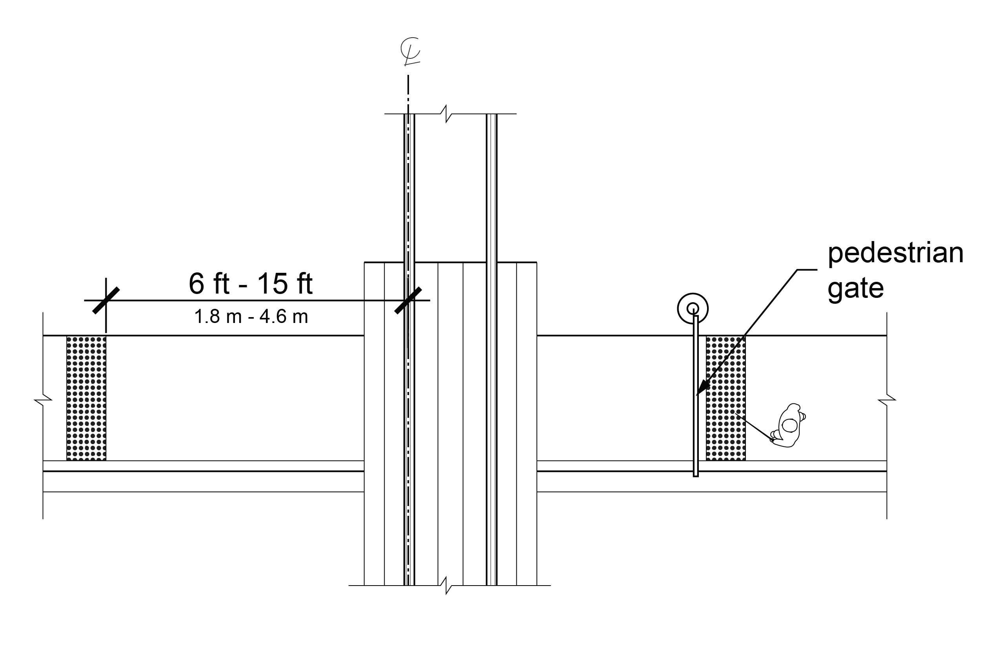
</figure>

##### R305.2.6 Boarding Platforms

At *boarding platform*s for transit vehicles, *detectable warning surfaces* shall be located at the boarding edge of the platform.

EXCEPTION: Where a *curb* is present at the boarding edge of the platform, the *detectable warning surface* may be placed at the back of *curb*.

##### R305.2.7 Sidewalk and Street-Level Rail Boarding and Alighting Areas

At boarding and alighting areas at *sidewalk* or *street*-level *transit stops* for rail vehicles, *detectable warning surfaces* shall be located at the edge of the boarding and alighting area closest to the rail vehicles.

##### R305.2.8 Driveways

Where driveways are controlled with yield or stop control devices or traffic signals, *detectable warning surfaces* shall be provided on the *pedestrian circulation path* where the *pedestrian circulation path* meets the driveway.

### R306 Crosswalks

#### R306.1 General

*Crosswalks* shall comply with R306.

#### R306.2 Pedestrian Signal Phase Timing

Where a traffic control signal with *pedestrian* signal indications is provided at a crosswalk, *pedestrian* signal phase timing shall be based on a *pedestrian* clearance time that is calculated using a *pedestrian* walking speed of 3.5 ft/s (1.1 m/s) or less from the location of the *pedestrian push button* to a *pedestrian refuge island* or the far side of the *traveled way*. The *walk interval* shall be 7 seconds minimum. Where the *pedestrian* clearance time is calculated to a *pedestrian refuge island*, an additional *pedestrian* *push button* or passive detection device shall be provided on the *pedestrian refuge island*.

EXCEPTION: If a passive *pedestrian* detection device is used to automatically adjust the *pedestrian* clearance time based on the *pedestrian's* actual clearance of the *crosswalk*, a faster walking speed may be used.

#### R306.3 Accessible Walk Indication

An *accessible* walk indication complying with R308.2 shall have the same duration as the *walk interval*.

EXCEPTION:  Where the *pedestrian* signal rests in walk, the *accessible* walk indication may be limited to the first 7 seconds of the *walk interval*.  If the *pedestrian* signal is resting in walk and there is sufficient time remaining to provide an *accessible* *walk interval* before the beginning of the *pedestrian change interval*, the *accessible* walk indication may be recalled by a button press.

#### R306.4 Roundabouts

Where *pedestrian circulation paths* are provided at *roundabouts*, they shall comply with R306.4.

##### R306.4.1 Edge Detection

The *street* side edge of the *pedestrian circulation path* at the approach and along the circulatory *roadway* of the *roundabout* shall comply with R306.4.1.1 where not attached to the *curb*, or R306.4.1.2 where attached to the *curb*. *Detectable warning surfaces* shall not be used for *roundabout* edge detection.

###### R306.4.1.1 Separation

Where *pedestrian* crossing is not intended, the *pedestrian circulation path* shall be separated from the *curb*, *crosswalk* to *crosswalk*, with landscaping or other nonprepared surface 24 inches (610 mm) wide minimum.

###### R306.4.1.2 Vertical Edge Treatment

Where *pedestrian* crossing is not intended, a *curb*-attached *pedestrian circulation path* shall have a continuous and detectable vertical edge treatment along the *street* side of the *pedestrian circulation path*, from *crosswalk* to *crosswalk*. The bottom edge of the vertical edge treatment shall be 15 inches (380 mm) maximum above the *pedestrian circulation path*.

##### R306.4.2 Crosswalk Treatments

Each multi-lane segment of the *roundabout* containing a *crosswalk* shall provide a *crosswalk* treatment consisting of one or more of the following: a traffic control signal with a *pedestrian* *signal head*; a *pedestrian hybrid beacon*; a *pedestrian* actuated rectangular rapid flashing beacon; or a raised crossing.

#### R306.5 Channelized Turn Lanes

*Crosswalks* at multi-lane channelized turn lanes shall provide treatments consisting of one or more of the following: a traffic control signal with a *pedestrian* *signal head*; a *pedestrian hybrid beacon*; a *pedestrian* actuated rectangular rapid flashing beacon; or a raised crossing.

### R307 Pedestrian Push Buttons and Passive Pedestrian Detection

#### R307.1 General

*Pedestrian* *push buttons* and passive *pedestrian* detection devices shall comply with R307.  *Operable parts* of *pedestrian* *push buttons* shall comply with R403.

#### R307.2 Activation

*Pedestrian* *push buttons* and passive detection devices shall activate the *accessible pedestrian signals* and, where applicable, the *walk interval*.

#### R307.3 Extended Push Button Press

Where an extended *push button* press is used to provide any additional features, a *push button* press of less than one second shall actuate only the *pedestrian* timing and any associated *accessible* walk indication, and a *push button* press of one second or more shall actuate the *pedestrian* timing, any associated *accessible* walk indication, and any additional features. If additional crossing time is provided by means of an extended pushbutton press, a sign so indicating shall be mounted adjacent to or integral with the pedestrian push button.

#### R307.4 Location

*Pedestrian* *push buttons* shall be located no greater than 5 feet from the side of a *curb ramp* run or the edge of the farthest associated *crosswalk* line from the center of the intersection. *Pedestrian* *push buttons* shall be located between 1.5 and 10 feet from the edge of the *curb* or pavement.

##### R307.4.1 Two Pedestrian Push Buttons on Same Corner

Where two *pedestrian* *push buttons* are provided on the same corner, they shall be 10 feet or more apart. 

EXCEPTION: In *alterations*, where technically infeasible to provide 10 feet separation between *pedestrian* *push buttons* on the same corner, a *pedestrian* *push button* information message complying with R308.3.2 shall be provided. 

#### R307.5 Push Button Orientation

The face of the *push button* shall be parallel to its associated *crosswalk*. 

#### R307.6 Audible and Vibrotactile Walk Indications for Pedestrian Signal Heads

*Pedestrian* *push buttons* or passive detection devices shall activate audible and *vibrotactile* walk indications complying with R308.

#### R307.7 Audible and Vibrotactile Indication for Pedestrian Activated Warning Devices Without a Walk Indication

Where a *pedestrian* *push button* or a passive detection device is provided for *pedestrian activated warning devices*, such as rectangular rapid flashing beacons, the *pedestrian* *push button* or passive detection device shall activate a speech message that indicates the status of the beacon in lieu of an audible walk indication. The speech message volume shall comply with R308.4. Where a *pedestrian* *push button* is provided, it shall not include *vibrotactile* features indicating a *walk interval*.

#### R307.8 Locator Tone

*Pedestrian* *push buttons* shall incorporate a locator tone complying with R307.8.

##### R307.8.1 Duration

Locator tones shall have a duration of 0.15 seconds or less and repeat at one-second intervals except when another audible indication from the same device is active.  When another audible indication from the same device is active, the locator tone shall be silenced.

EXCEPTION: A locator tone may be silenced if a passive detection system activates the locator tone when a *pedestrian* is within a 12-foot radius of the *pedestrian* *push button*.

##### R307.8.2 Locator Tone in Response to Ambient Sound

Pedestrian *push button locator tones* shall be intensity responsive to ambient sound and shall be audible 6 to 12 feet from the *push button*, or to the *building* line, whichever is less. The *push button locator tone* shall be louder than ambient sound up to a maximum volume of 5 dBA louder than ambient sound. Automatic volume adjustment in response to ambient traffic sound level shall be a maximum volume of 100 dBA.

##### R307.8.3 Locator Tone and Audible Beaconing

Where audible beaconing is used, the volume of the *push button locator tone* during the *pedestrian change interval* of the called *pedestrian* phase shall be increased and operated in one of the following ways:

> A. The louder audible walk indication and louder locator tone comes from the far end of the *crosswalk*, as *pedestrians* cross the *street*;
>
> B. The louder locator tone comes from both ends of the *crosswalk*; or
>
> C. The louder locator tone comes from an additional speaker that is aimed at the center of the *crosswalk* and that is mounted on a *pedestrian signal head*.

##### R307.8.4 Locator Tone and Traffic Control Signal in Flashing Mode

When the traffic control signal is operating in a flashing mode, *pedestrian* *push button locator tones* shall remain active, and the *pedestrian* *push button* shall activate a speech message that communicates the operating mode of the traffic control signal. Where traffic control signals or *pedestrian hybrid beacons* are activated from a flashing or dark mode to a stop-and-go mode by *pedestrian* actuations, a speech message communicating the operating status of the traffic control signal is not required.

#### R307.9 Tactile Arrow

*Pedestrian* *push buttons* shall have a tactile arrow with high visual contrast that is aligned parallel to the direction of travel on their associated *crosswalks*.

### R308 Accessible Pedestrian Signal Walk Indications

#### R308.1 General

*Accessible pedestrian signal* walk indications shall comply with R308.

#### R308.2 Audible and Vibrotactile Walk Indications

*Accessible pedestrian signals* shall have an audible and *vibrotactile* walk indication during the *walk interval* only.  The audible walk indication shall be audible from the beginning of the associated *crosswalk*. Following the audible and *vibrotactile* walk indication and during the *pedestrian change interval*, *accessible pedestrian signal*s shall revert to the *pedestrian* *push button locator tone*.

#### R308.3 Audible Walk Indications

Audible walk indications shall comply with R308.3.

##### R308.3.1 Percussive Tone

Where an *accessible pedestrian signal* is provided at a single crossing or where two *accessible pedestrian signal*s are 10 feet or greater from each other at a corner, the audible walk indication shall be a percussive tone and repeat eight to ten ticks per second with multiple frequencies and a dominant component at 880 Hz.

##### R308.3.2 Speech Walk Message

In *alterations*, where it is technically infeasible to provide 10 feet separation between *pedestrian* *push buttons* on the same corner, the audible walk indication for each signal shall be a speech walk message that complies with R308.3.2.

###### R308.3.2.1 Speech Information Message when Walk Interval is Not Timing

Where speech *push button* information messages are made available at a pretimed signal or by actuating the *accessible* *pedestrian* *push button* or passive detection device, they shall only be actuated when the *walk interval* is not timing. They shall begin with the term "Wait," followed by intersection identification information modeled after: "Wait to cross Broadway at Grand." If information on intersection signalization or geometry is also given, it shall follow the intersection identification information.

###### R308.3.2.2 Speech Walk Message during Pedestrian Phasing Concurrent with Vehicular Phasing

Speech walk messages that are used at intersections having *pedestrian* phasing that is concurrent with vehicular phasing shall be patterned after the model: "Broadway. Walk sign is on to cross Broadway."

###### R308.3.2.3 Speech Walk Message during Exclusive Pedestrian Phasing

Speech walk messages that are used at intersections having exclusive *pedestrian* phasing shall be patterned after the model: "Walk sign is on for all crossings."

###### R308.3.2.4 Speech Walk Message and Pilot Light

If a pilot light is used at an *accessible pedestrian signal* location, each actuation shall be accompanied by the speech message, "Wait."

#### R308.4 Volume

Audible walk indications shall be louder than ambient sound up to a maximum volume of 5 dBA louder than ambient sound. Automatic volume adjustment in response to ambient traffic sound level shall be a maximum volume of 100 dBA.

EXCEPTION: Where audible beaconing is provided in response to an extended *push button* press, the beaconing can exceed 5 dBA louder than ambient sound.

#### R308.5 Vibrotactile Walk Indication

The *pedestrian* *push button* shall vibrate during the *walk interval*.

### R309 Transit Stops and Transit Shelters

#### R309.1 Transit Stops

*Transit stops* shall comply with R309.1.

##### R309.1.1 Boarding and Alighting Areas

Boarding and alighting areas at *sidewalk* or *street*-level *transit stops* must serve each *accessible* vehicle entry and exit and shall comply with R309.1.1 and R309.1.3.

###### R309.1.1.1 Dimensions

Boarding and alighting areas shall have a clear length of 96 inches (2440 mm) minimum, measured perpendicular to the face of the *curb* or *street* edge, and a clear width of 60 inches (1525 mm) minimum, measured parallel to the *street*.

<figure class="advisory">
  <figcaption>Figure R309.1.1.1 Dimensions</figcaption>
  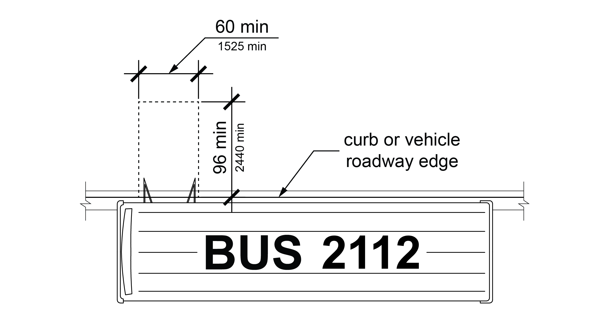
</figure>

###### R309.1.1.2 Slope

The slope of boarding and alighting areas measured parallel to the *street* shall be the same as the *grade* of the *street*. The slope of boarding and alighting areas measured perpendicular to the *street* shall be 1:48 (2.1%) maximum.

##### R309.1.2 Boarding Platforms

*Boarding platform*s at *transit stops* shall comply with R309.1.2 and R309.1.3.

###### R309.1.2.1 Platform and Vehicle Floor Coordination

*Boarding platform*s shall be positioned to coordinate with vehicles in accordance with the applicable requirements in 49 CFR parts 37 and 38.

###### R309.1.2.2 Slope

The slope of the *boarding platform* measured parallel to the track or *street* shall be the same as the *grade* of the track or *street.* The *slope* of the *boarding platform* measured perpendicular to the track or *street* shall be 1:48 (2.1%) maximum.

##### R309.1.3 Common Requirements

Boarding and alighting areas and *boarding platform*s shall comply with R309.1.3.

###### R309.1.3.1 Surfaces

The surfaces of boarding and alighting areas and *boarding platform*s shall comply with R302.6.

###### R309.1.3.2 Connection to Existing Pedestrian Circulation Paths

In *alterations,* boarding and alighting areas and *boarding platform*s shall be connected to existing *pedestrian circulation paths* by *pedestrian access routes* complying with R302.

#### R309.2 Transit Shelters

*Transit shelters* shall comply with R309.2.

##### R309.2.1 Connection to Boarding and Alighting Areas

*Transit shelters* shall be connected by *pedestrian access routes* complying with R302 to boarding and alighting areas complying with R309.1.1 or *boarding platform*s complying with R309.1.2.

<figure class="advisory">
  <figcaption>Figure R309.2.1 Connection to boarding and alighting areas</figcaption>
  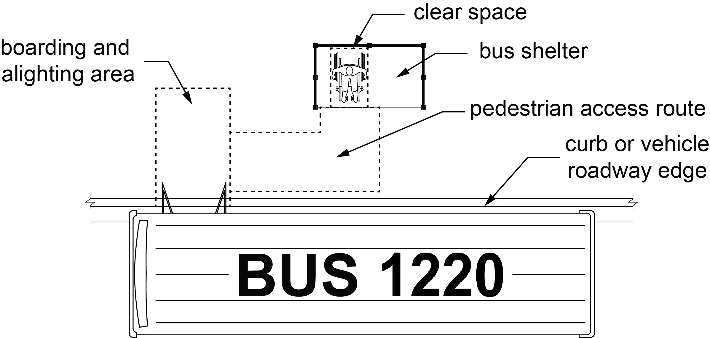
</figure>

##### R309.2.2 Clear Space

*Transit shelters* shall provide a minimum clear space complying with R404 entirely within the shelter. Where seating is provided within *transit shelters*, the clear space shall be located either at one end of a seat or so as to not overlap the area within 18 inches (455 mm) from the front edge of the seat.

##### R309.2.3 Environmental Controls

Where provided, environmental controls within *transit shelters* shall be proximity-actuated.

##### R309.2.4 Protruding Objects

Protruding objects within *transit shelters* shall comply with R402.

### R310 On-Street Parking Spaces

#### R310.1 General

On-street parking spaces shall comply with R310.

#### R310.2 Parallel On-Street Parking Spaces

Parallel on-street parking spaces shall comply with R310.2.

##### R310.2.1 Dimensions

Parallel on-street parking spaces shall be 24 feet (7.3 m) long minimum and 13 feet (4.0 m) wide minimum.  Parallel on-street parking spaces shall not encroach on the *traveled way.*

EXCEPTIONS: 1. Where parallel on-street parking spaces are *altered* but the adjacent *pedestrian circulation path* is not, any *accessible* parallel on-street parking spaces provided may have the same dimensions as the adjacent parallel on-street parking spaces if they are provided nearest the *crosswalk* at the end of the block face or nearest a midblock *crosswalk*, and a *curb ramp* or *blended transition* is provided serving the *crosswalk*.

2\.  In *alterations*, where providing parallel on-street parking spaces with the dimensions specified in R310.2.1 would result in an available right-of-way width less than or equal to 9 feet (2.7 m), measured from the *curb line* to the right-of-way line, the *accessible* parallel on-street parking spaces may have the same dimensions as the adjacent parallel on-street parking spaces if they are provided nearest the *crosswalk* at the end of the block face or nearest a midblock *crosswalk*, and a *curb ramp* or *blended transition* is provided serving the *crosswalk*.

  <figure>
    <figcaption>Figure R310.2.1(a) Dimensions</figcaption>
    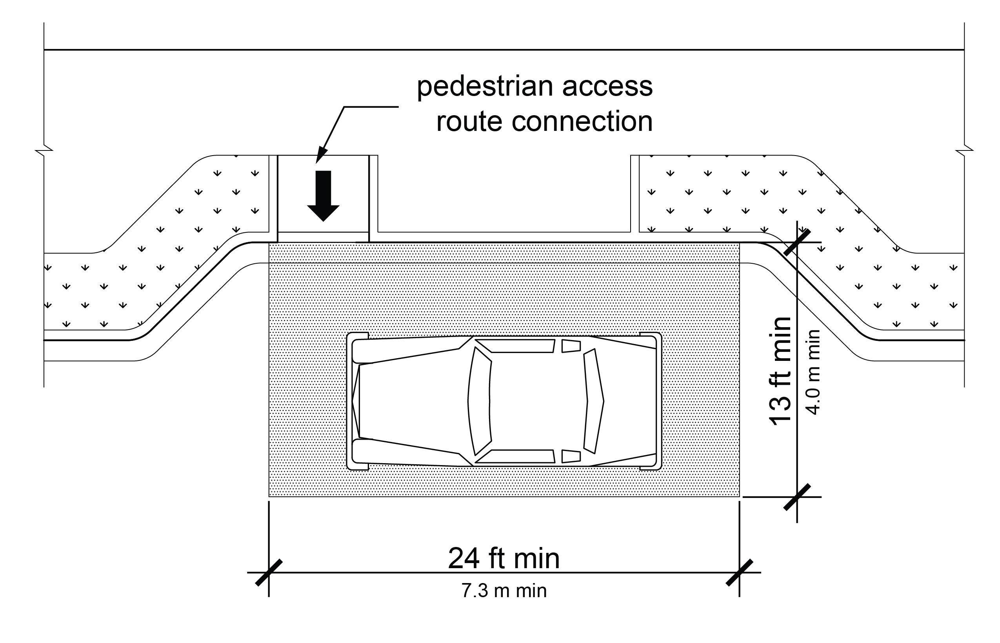
  </figure>
  <figure>
    <figcaption>Figure R310.2.1(b) Exception 1</figcaption>
    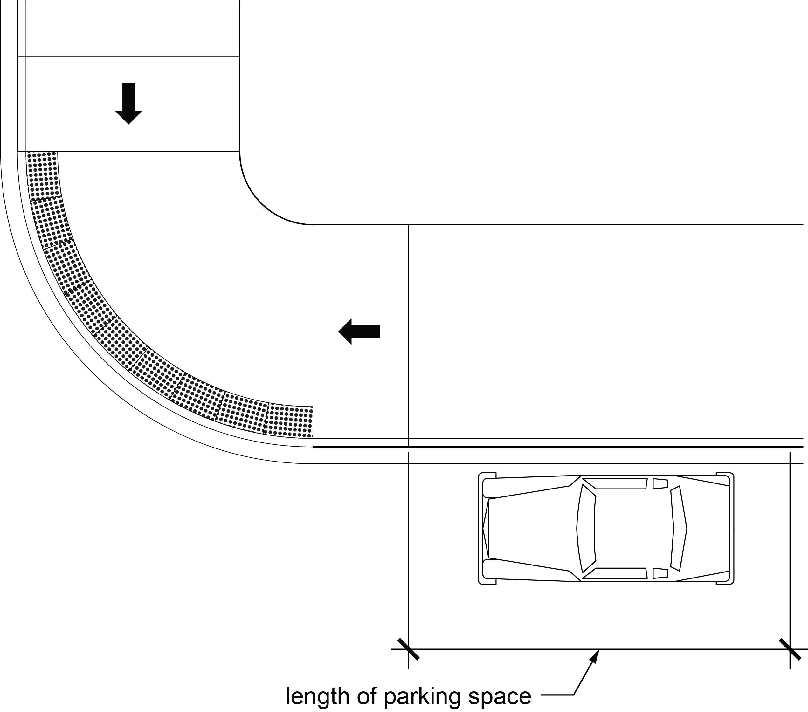
  </figure>
  <figure>
    <figcaption>Figure R310.2.1(c) Exception 2</figcaption>
    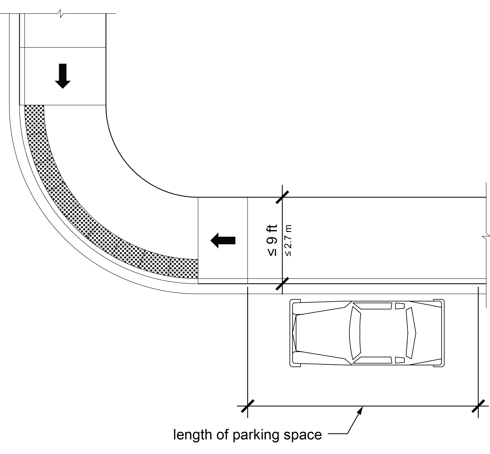
  </figure>

##### R310.2.2 Pedestrian Access Route Connection

Parallel on-street parking spaces shall connect to *pedestrian access routes*. Where *curb ramp*s and *blended transitions* are used, they shall not reduce the required width or length of the parking spaces and shall be located at either end of the parking space. Where two or more *accessible* parallel on-street parking spaces complying with the dimensions specified in R310.2.1 are contiguous on a block face, each *accessible* parallel on-street parking space shall have an independent connection to the *pedestrian access route*. *Curb ramps* and *blended transitions* shall be provided in accordance with R203.6.1.3 and shall comply with R304. *Detectable warning surfaces* are not required on *curb ramps* and *blended transitions* used exclusively to connect *accessible* on-street parallel parking spaces to *pedestrian access routes*.

EXCEPTION: In *alterations*, where parallel on-street parking spaces are provided in accordance with Exception 1 or 2 to R310.2.1, the parallel on-street parking space shall be connected to the *curb ramp* or *blended transition* serving the *crosswalk* by a *pedestrian circulation path* complying with R302.6, except that changes in level are not permitted.

##### R310.2.3 Surfaces

Surfaces of parking spaces shall comply with R302.6, except that changes in level are not permitted.

##### R310.2.4 Clearance Adjacent to Parking Spaces

The center 50 percent of the length of the *sidewalk*, or other surface, adjacent to an *accessible* parallel parking space shall be free of obstructions, including parking identification signs, parking pay meters, and parking pay stations, and shall comply with R302.6.

<figure class="advisory">
  <figcaption>Figure R310.2.4 Clearance adjacent to parking spaces</figcaption>
  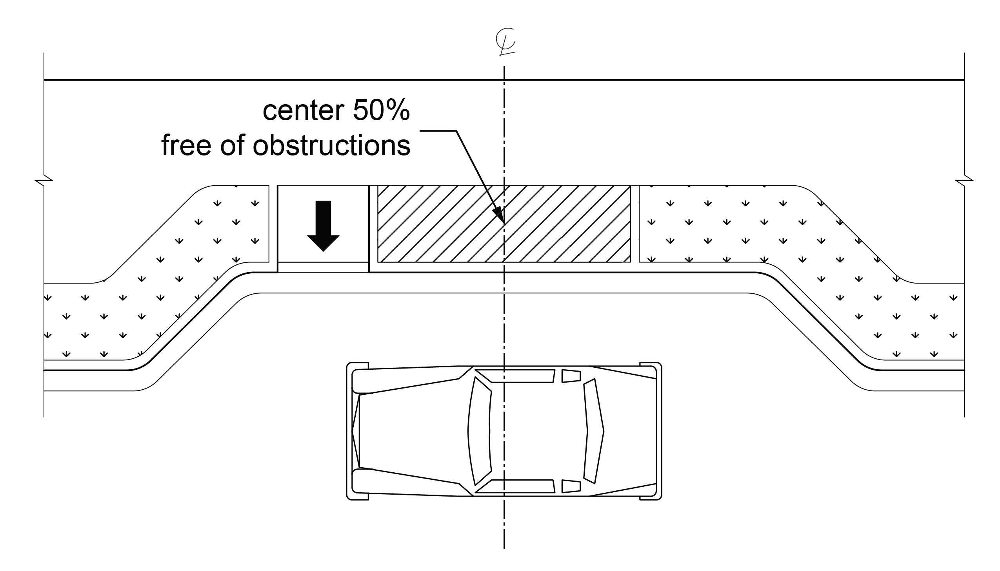
</figure>

##### R310.2.5 Identification

Parallel on-street parking spaces shall be identified by signs displaying the International Symbol of Accessibility complying with R411. Signs shall be 60 inches (1525 mm) minimum above the ground surface measured to the bottom of the sign.

#### R310.3 Perpendicular Parking Spaces

Perpendicular parking spaces shall comply with R310.3.

<figure class="advisory">
  <figcaption>Figure R310.3 Perpendicular parking spaces</figcaption>
  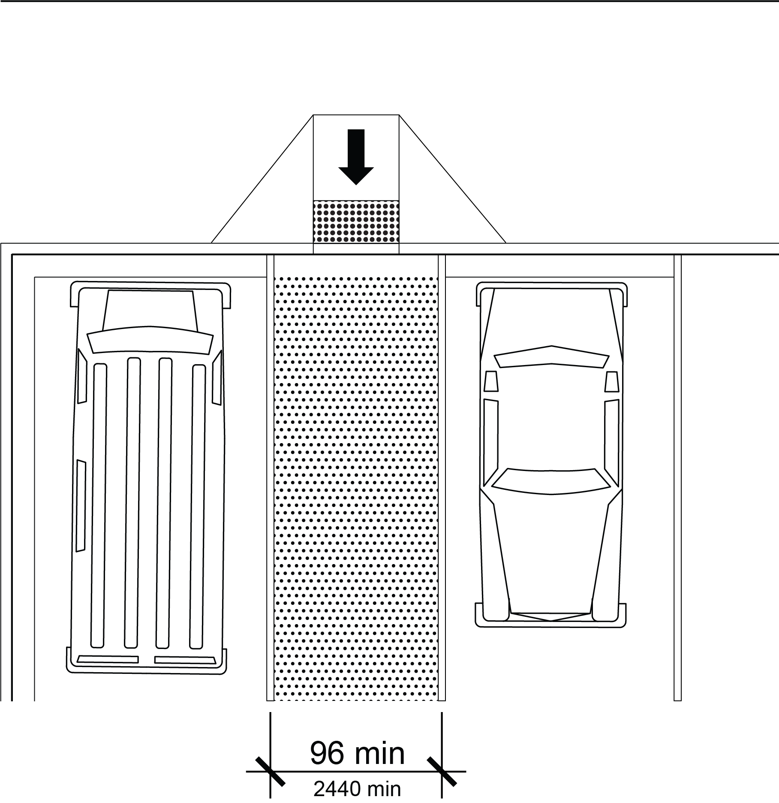
</figure>

##### R310.3.1 Access Aisles

Perpendicular on-street parking spaces shall have adjacent access aisles 96 inches (2440 mm) wide minimum extending the full length of the parking space. One access aisle shall be permitted to serve two parking spaces where front and rear entry parking are both permitted. Where an access aisle serves only one parking space and parking is restricted to either front entry or rear entry orientation, the access aisle shall be located on the passenger side of the vehicle.

#### R310.4 Angled Parking Spaces

*Accessible* angled parking spaces shall comply with R310.4.

<figure class="advisory">
  <figcaption>Figure R310.4 Angled parking spaces</figcaption>
  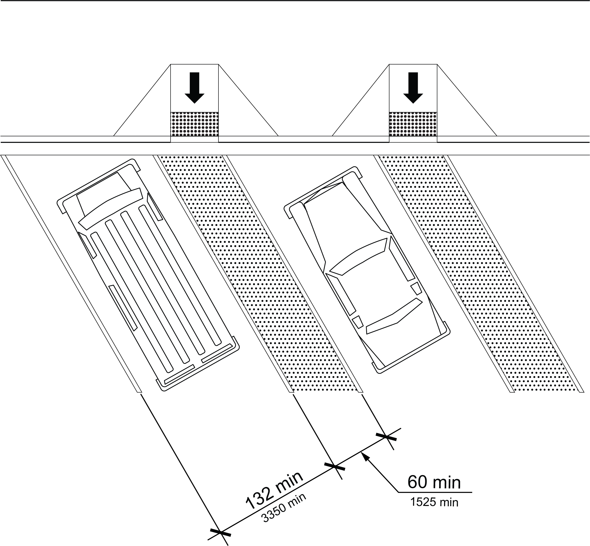
</figure>

##### R310.4.1 Width

The width of an angled parking space shall be 132 inches (3350 mm).

##### R310.4.2 Access Aisles

Each angled on-street parking space shall have an adjacent access aisle 60 inches (1525 mm) wide minimum extending the full length of the parking space on the passenger side.

#### R310.5 Common Requirements for Perpendicular and Angled Parking Spaces

Perpendicular and angled parking spaces shall comply with R310.5

##### R310.5.1 Access Aisle Markings

The access aisle surface shall be marked to discourage parking in the access aisle.

##### R310.5.2 Access Aisle Location

Access aisles shall be located at the same level as the parking space they serve and shall not encroach on the *traveled way*.

##### R310.5.3 Pedestrian Access Route Connection

Access aisles shall connect to *pedestrian access routes*. Where *curb ramps* and *blended transitions* are used, they shall not reduce the required width or length of access aisles and parking spaces. *Curb ramps* and *blended transitions* shall be provided in accordance with R203.6.1.4 and shall comply with R304. A *detectable warning surface* is not required on a *curb ramp* or *blended transition* used exclusively to connect on-street parking access aisles to *pedestrian access routes*.

EXCEPTION: In *alterations*, the access aisle may connect to an existing *pedestrian circulation path* in accordance with R202.2.

##### R310.5.4 Surfaces

Surfaces of parking spaces and access aisles serving them shall comply with R302.6, except that changes in level are not permitted.

##### R310.5.5 Identification

Perpendicular or angled on-street parking spaces shall be identified by signs displaying the International Symbol of Accessibility complying with R411. The signs shall be located at the head of the parking space. Signs shall be 60 inches (1525 mm) minimum above the ground surface measured to the bottom of the sign.

#### R310.6 Parking Meters and Parking Pay Stations

Parking meters and parking pay stations that serve *accessible* parking spaces shall provide *operable parts* complying with R403. The clear space required by R403.2 shall be located so that displays and information on parking meters and pay stations are visible from a point located 40 inches (1015 mm) maximum above the center of the clear space in front of the parking meter or parking pay station.

### R311 Passenger Loading Zones

#### R311.1 General

*Accessible* *passenger loading zones* shall comply with R311.

<figure class="advisory">
  <figcaption>Figure R311.1 Passenger loading zone</figcaption>
  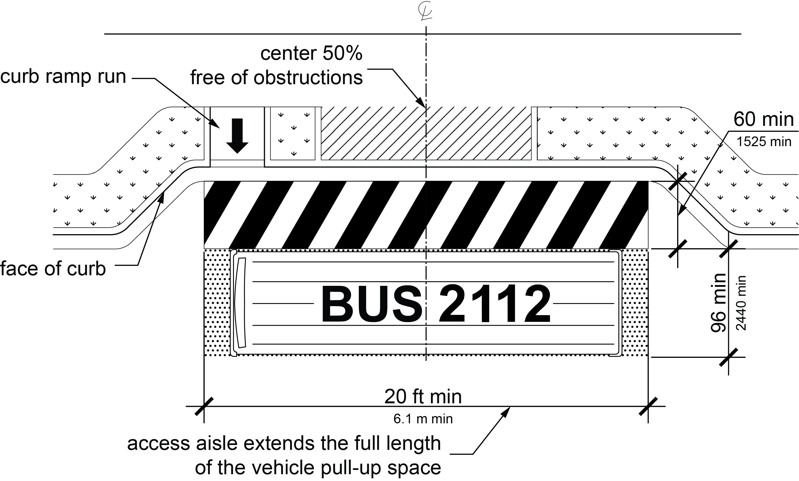
</figure>

#### R311.2 Vehicle Pull-Up Space

*Accessible* *passenger loading zones* shall provide a vehicular pull-up space that is 96 inches (2440 mm) wide minimum and 20 feet (6.1 m) long minimum.

#### R311.3 Access Aisle

Vehicle pull-up spaces shall have adjacent access aisles complying with R311.3 that are 60 inches (1525 mm) wide minimum extending the full length of the vehicle pull-up space. Access aisles shall be at the same level as the vehicle pull-up space they serve and shall not encroach on the *traveled way*.

##### R311.3.1 Clearance Adjacent to Passenger Loading Zone

The center 50 percent of the length of the *sidewalk*, or other surface, adjacent to an *accessible* *passenger loading zone* shall be free of obstructions and comply with R302.6.

##### R311.3.2 Marking

Access aisle surfaces shall be marked to discourage parking in them.

#### R311.4 Surfaces

Surfaces of vehicle pull-up spaces and the access aisles serving them shall comply with R302.6, except that changes in level are not permitted.

#### R311.5 Pedestrian Access Route Connection

Access aisles shall connect to *pedestrian access routes.* Where *curb ramps* and *blended transition*s are used, they shall be provided in accordance with R203.6.1.4 and comply with R304, and shall not reduce the required width or length of access aisles. *Detectable warning surfaces* are not required on *curb ramps* and *blended transitions* used exclusively to connect access aisles to *pedestrian access routes*.

EXCEPTION: In *alterations*, the access aisle may connect to an existing *pedestrian circulation path* in accordance with R202.2.
